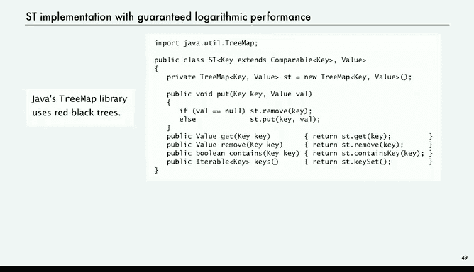
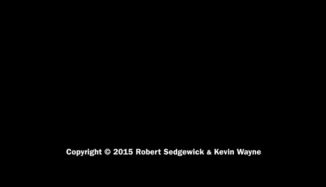

# 015：性能分析 🧮

在本节课中，我们将要学习如何分析二叉搜索树（BST）实现的性能。我们将探讨其在不同数据输入顺序下的表现，理解其理论上的时间复杂度，并介绍一种能保证高效性能的工业级实现——红黑树。

---

## 性能分析概述

上一节我们介绍了二叉搜索树的实现，本节中我们来看看其性能表现。分析BST的性能比其他数据结构更复杂，因为其成本高度依赖于一个相当复杂的因素：**键被插入的顺序**。

## 输入顺序对性能的影响

BST的性能表现取决于键的插入顺序。我们考虑几种典型情况：

*   **最佳情况**：如果树是**完美平衡**的，性能最优。
*   **典型情况**：例如从文本中读取单词，键的输入顺序通常是随机的。在这种情况下，树会保持**大致平衡**。
*   **最坏情况**：如果键是**按顺序插入**的（例如已排序的键），那么BST会退化为一个链表，性能极差。

以下是不同情况下的性能对比：
*   完美平衡树：搜索成本为 `log₂ N` 次比较。
*   随机顺序键：搜索成本约为 `1.39 log₂ N` 次比较，仅比完美平衡差约40%。
*   顺序插入键：搜索成本可能高达 `N` 次比较。

## 随机键模型下的性能

当键以随机顺序插入时，我们可以对性能进行数学分析。虽然证明过程涉及离散数学，超出了本课程范围，但结论是明确的。

可以证明，对于N个随机顺序的键，构建一棵二叉搜索树的平均比较次数约为 `2 N ln N`（或 `1.39 N log₂ N`）。这意味着对于树中的任何键，**搜索或插入的时间与 `log N` 成正比**。

因此，在随机键模型下，BST实现了对数级的性能，同时保持了线性的内存使用，并且对集合大小没有硬性限制。这一切都得益于二叉树数据结构。

## 实证测试验证

我们可以通过实证测试来验证上述数学分析。例如，运行一个频率计数器程序处理大量键值对。

测试表明，即使处理十亿级别的数据，程序也只需几分钟，其运行时间的倍增比约为2。这证实了BST方法在此类应用中的可扩展性假设。

与之前我们讨论过的二次时间复杂度（如简单数组或链表实现）相比，BST的对数级性能是巨大的进步。没有这种算法，处理海量数据的问题将无法解决。

## 工业级实现：平衡树

然而在实践中，键的输入顺序可能并非随机。如果键已排序，BST的运行时间将退化为平方级。因此，基础的BST并非工业级强度。

幸运的是，自20世纪60年代以来，人们已经开发了**平衡树**算法。它们只比BST稍微复杂一点，通过执行简单的变换来**保证树的平衡**。

一种著名的实现是**红黑树**。在红黑树中，链接被标记为红色或黑色，并遵循两条规则：
1.  没有两个红色链接连续出现。
2.  从根节点到所有空链接的路径上，黑色链接的数量相同。

维护这些规则并不十分困难，却能保证树几乎完全平衡。无论键以何种顺序插入，红黑树都能**保证所有符号表操作都具有对数级性能**。

Java的 `TreeMap` 库正是基于红黑树构建的。可以证明，红黑树的所有操作都保证使用少于 `2 log₂ N` 次比较，这是一个非常了不起的结果。

## 总结与对比

本节课中我们一起学习了BST的性能分析及其工业级解决方案。

*   **二叉搜索树（BST）**：提供了一个相当简单的符号表实现，在随机键输入下通常是高效的。
*   **散列（Hashing）**：另一种实现方式，更为复杂，也可以很高效，但它不支持有序操作，并且具有不同的性能特征。
*   **红黑树**：BST的一个变种，它能**保证高效性能**，是符号表的工业级实现。

回到我们最初的基本问题：**我们能否仅以对数级的额外成本实现关联数组？** 答案是肯定的。

试想一下，即使你要在**一万亿**个客户中搜索，也只需要不到80次比较。即使搜索**宇宙中的所有原子**，也只需要大约200次比较，并且我们可以保证这一点。用Bob的话说，这** truly awesome**（太棒了）。