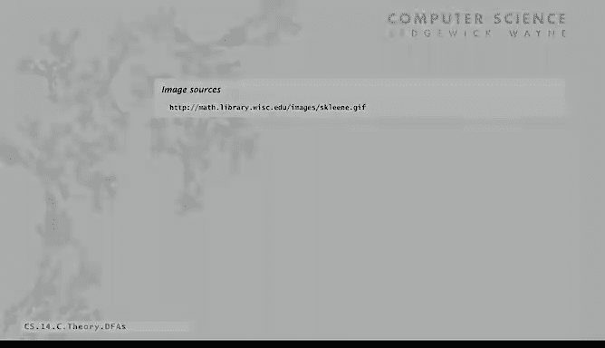
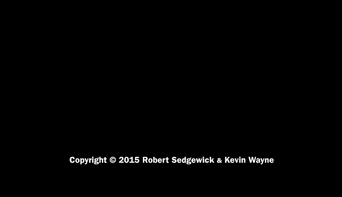

# 018：确定性有限自动机 🧠


在本节课中，我们将学习一种名为“确定性有限自动机”的简单抽象机器。我们将了解它的定义、工作原理，以及它如何与正则表达式相关联，用于解决模式匹配问题。

---

## 确定性有限自动机（DFA）的定义

确定性有限自动机是一种为解决模式匹配问题而设计的抽象机器。它有一个输入带，上面可以放置任意长度的字符串。DFA从左到右读取输入带上的每个字符，且每个字符只读一次。读取完整个字符串后，如果它“识别”这个字符串，就会点亮“是”灯；否则点亮“否”灯。因此，每个DFA都定义了一个语言，即它识别的那组字符串。

---

## DFA的构成与工作原理

上一节我们介绍了DFA的基本概念，本节中我们来看看它的具体构成和运行规则。

一个DFA包含以下几个部分：
*   **有限个状态**：在状态图中用圆圈表示，每个状态标记为“Y”（是）或“N”（否）。
*   **状态间的转移**：用箭头表示，每个箭头都用一个符号（字符）标记。
*   **起始状态**：有一个特殊的状态作为起点，通常用一个从外部指向它的箭头表示。

以下是DFA的运行规则：
1.  从起始状态开始。
2.  读取下一个输入符号。
3.  根据当前状态和读取的符号，沿着对应的箭头转移到下一个状态。
4.  重复步骤2和3，直到读完所有输入。
5.  最终停留的状态决定了结果：如果是“Y”状态，则识别该字符串；如果是“N”状态，则不识别。

让我们通过一个例子来理解这个过程。考虑以下字符串和DFA状态图（假设状态图显示：起始状态为左，读‘B’到中，读‘B’到右，读‘A’保持在右，读‘B’回到左等）。

**示例字符串：** `B B A A B A B B`

1.  起始状态（左），读‘B’ -> 转移到中间状态。
2.  中间状态，读‘B’ -> 转移到右侧状态。
3.  右侧状态，读‘A’ -> 保持在右侧状态。
4.  右侧状态，读‘A’ -> 保持在右侧状态。
5.  右侧状态，读‘B’ -> 转移到起始状态（左）。
6.  起始状态（左），读‘B’ -> 转移到中间状态。
7.  中间状态，读‘A’ -> 保持在中间状态。
8.  中间状态，读‘B’ -> 转移到右侧状态。
9.  右侧状态，读‘B’ -> 转移到起始状态（左）。

读取完毕，最终状态为起始状态（标记为‘Y’），因此该DFA识别此字符串。

**另一个示例字符串：** `B A A B B A B`

1.  起始状态（左），读‘B’ -> 转移到右侧状态。
2.  右侧状态，读‘A’ -> 保持在右侧状态。
3.  右侧状态，读‘A’ -> 保持在右侧状态。
4.  右侧状态，读‘B’ -> 转移到起始状态（左）。
5.  起始状态（左），读‘B’ -> 转移到中间状态。
6.  中间状态，读‘A’ -> 保持在中间状态。
7.  中间状态，读‘B’ -> 转移到右侧状态。

读取完毕，最终状态为右侧状态（标记为‘N’），因此该DFA不识别此字符串。

---

## 用程序模拟DFA

DFA的运行规则非常简单，我们可以编写一个Java程序来模拟任何DFA的运行。这有助于我们更好地理解它，并用于生成示例和测验题目。

以下是模拟DFA所需的核心数据结构和逻辑：

**实例变量：**
*   `startState`：起始状态。
*   `boolean[] isAccepting`：布尔数组，指示每个状态是否为接受（“Y”）状态。
*   `ST<Character, Integer>[] next`：符号表数组。对于每个状态，都有一个符号表，映射输入字符到下一个状态编号。

**构造函数：**
从文件中读取DFA的描述（状态数、字母表、起始状态、转移表等），并填充上述数据结构。

**识别方法 `recognize(String input)`：**
```java
public boolean recognize(String input) {
    int state = startState;
    for (int i = 0; i < input.length(); i++) {
        char c = input.charAt(i);
        state = next[state].get(c); // 根据当前状态和字符查找下一个状态
    }
    return isAccepting[state]; // 返回最终状态是否为接受状态
}
```

**测试客户端：**
可以创建一个DFA对象，从标准输入读取字符串，并打印该DFA是否识别它。例如：
```
% java DFA example.dfa
B B A A B A B B
Yes
B A A B B A B
No
```

通过这样简单的程序，我们就能模拟这个抽象机器的运行。这种将抽象概念具体化为可执行程序的能力，是理论计算机科学中的一个关键思想。

---

## DFA与正则表达式的等价性 🧩

之前我们介绍了正则表达式，它定义了一组字符串（语言）。现在我们又看到了DFA，它也定义了一组字符串。一个自然而重要的问题是：这两种描述语言的方式有什么关系？

**克林定理**指出：正则表达式和确定性有限自动机在描述语言的能力上是**等价**的。

这意味着：
1.  对于任何正则表达式，都存在一个DFA，它识别与该正则表达式匹配的完全相同的一组字符串。
2.  对于任何DFA，都存在一个正则表达式，它匹配与该DFA识别的完全相同的一组字符串。

这是一个深刻而重要的结论。它的一个直接应用是，为我们解决正则表达式模式匹配问题提供了一种方法：**我们可以根据给定的正则表达式，构造出等价的DFA，然后用程序模拟这个DFA的运行，来判断一个字符串是否匹配该正则表达式。**

克林定理的证明是构造性的，它给出了从正则表达式构建对应DFA的算法。在接下来的课程中，我们将进一步探讨这个构造过程。

---

## 总结





本节课中我们一起学习了确定性有限自动机。我们了解了DFA的定义、构成部件（状态、转移、起始状态）及其基于简单规则运行的工作原理。我们还看到如何用程序模拟DFA，并认识了**克林定理**——它揭示了DFA与正则表达式在定义语言能力上的等价性。这个定理是连接理论（正则表达式）与机器（自动机）的桥梁，并为解决模式匹配问题提供了重要的算法基础。