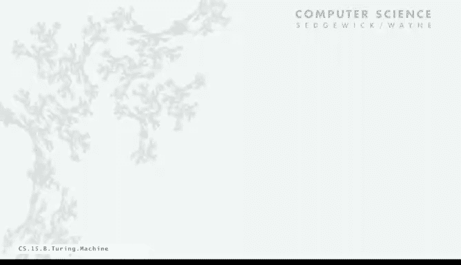
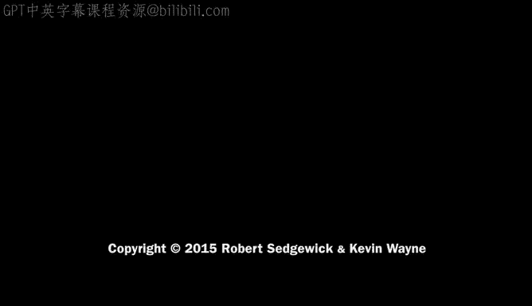

# 022：计算简化模型 💻


在本节课中，我们将扩展上一讲讨论的抽象机器模型，从非常简单的机器出发，尝试建立一个能帮助我们以最基本方式理解计算的模型。

## 概述

我们的目标是建立一个能涵盖所有已知计算过程的计算模型，并使其尽可能简单。以两个数字相加的机械过程为例，这个过程是离散的、局部的，并且具有状态。这些正是图灵希望其机器具备的基本特征。

上一讲我们讨论了**确定性有限自动机**，它是一个解决模式匹配问题的抽象机器。它有一个输入带，机器从左到右读取每个字符一次，如果识别出特定字符串则点亮“是”灯，否则点亮“否”灯。每个DFA定义了一个它所能识别的字符串集合。

然而，DFA的能力有限，无法完成我们想要的所有计算。因此，本节我们将介绍图灵提出的等效模型——**图灵机**。

## 图灵机简介

图灵机类似于DFA，但功能更强大。它也是一个抽象计算模型，同样在一条长度无限的带上指定字符串。与DFA的关键区别在于：
*   图灵机不仅可以**读取**带上的字符，还可以**写入**字符。
*   图灵机可以**向左或向右移动**，而不仅限于一个方向。
*   图灵机可以**停机**，并将计算结果留在带上。

这是一个非常简单的抽象机器，仅比DFA多了这些额外能力。

## 图灵机与DFA的异同

以下是图灵机与DFA的详细比较：

**相似之处：**
*   两者都是符号计算模型。
*   输入都位于一条带上，是一个有限字符串（但带本身可以无限长）。
*   都有有限数量的状态。
*   状态转换由当前状态和输入符号决定。

**不同之处：**
*   **读写能力**：DFA只能从带上读取符号；图灵机可以读取和写入符号。
*   **移动方向**：DFA只能向右移动（每读一个符号就右移一格）；图灵机可以向左或向右移动。
*   **带的性质**：DFA的带是有限的（即输入字符串）；图灵机的带在两端都被认为是无限的。
*   **计算步骤**：对于长度为 `n` 的字符串，DFA最多只能进行 `n` 次状态转换；图灵机的状态转换次数没有限制。
*   **输出**：DFA只能输出“是”或“否”；图灵机除了可以输出“是/否”，还能在带上留下计算结果，这赋予了它更强大的能力。

两者的基本原理非常相似，现在让我们来看一个例子。

## 示例：二进制减一器

这是一个具有三个状态的图灵机，可以对带上给定的二进制数执行减一操作。

在我们的表示法中，`#` 符号代表带上的空白格。我们假设无论走到哪里，左右两端都有无限的 `#`。输入是一个写在带上的二进制数。

机器从标记为 `R` 的状态开始（从无处进入的箭头表示起始点）。磁带头位于最左边非空白符号（本例中为 `1`）上。

以下是该机器的工作原理：
1.  **状态 R（向右扫描）**：此状态会一直向右移动，直到找到一个空白格。如果看到 `0` 或 `1`，就写入相同的符号并保持在同一状态（向右移动）。这是一种简化表示：如果看到符号 `x`，写入 `x` 并保持状态，我们通常省略绘制此转换。
2.  **找到空白**：当在状态 `R` 看到空白 `#` 时，写入 `#` 并转换到中间状态（标记为 `L`，意味着之后向左移动）。
3.  **状态 L（向左处理）**：在此状态，如果看到 `0`，则写入 `1` 并保持状态（向左移动）。这实际上是将遇到的 `0` 都变成 `1`。
4.  **遇到第一个 1**：当在状态 `L` 看到第一个 `1` 时，写入 `0` 并转换到停机状态 `H`。

**模拟过程**：假设输入是二进制数 `1010`（即十进制10）。
*   从最左边的 `1` 开始，状态 `R` 向右扫描，经过 `0`、`1`、`0`，直到遇到右边的空白 `#`。
*   遇到 `#` 后，进入状态 `L` 并左移。
*   左移时，首先遇到的符号是 `0`（原数最右边的位），将其改为 `1`，继续左移。
*   接着遇到 `1`，将其改为 `0`，然后进入停机状态 `H`。

最终留在带上的结果是 `1001`，即二进制9，成功实现了 `10 - 1 = 9`。

**注意一个缺陷**：如果输入是 `0`（二进制 `0`），机器在状态 `L` 会一直向左寻找 `1`，但由于全是空白，它将永不停止，陷入无限循环。要修复此错误，我们需要添加规则：如果在状态 `L` 看到空白 `#`，则直接停机（或进行溢出处理）。这说明了图灵机程序也可能存在“Bug”。

## 示例：二进制加一器

理解了减一器后，我们来看看功能相反的加一器。其目标是给一个二进制数加一。

**策略**：从数字最右端开始扫描，将所有连续的 `1` 改为 `0`，直到遇到第一个 `0`，将其改为 `1`，然后停机。

**模拟过程**：假设输入是 `100111`（即十进制39）。
1.  向右扫描找到最右端的空白。
2.  向左移动，遇到 `1` 则改为 `0` 并继续左移。
3.  遇到第一个 `0` 时，将其改为 `1`，然后停机。

最终结果是 `101000`，即十进制40，成功实现了加一。这个机器甚至能处理全为 `1` 的数（如 `111`），将其变为 `1000`，实现了进位和数位增长。

## 构建二进制加法器

现在，我们可以将减一器和加一器的思想结合起来，构建一个能计算 `x + y` 的图灵机。我们的策略不追求效率，只关注“能否完成计算”。

**计算 `x + y` 的计划**：
1.  假设带上初始内容为 `x` + `y`（例如 `101+110`）。
2.  **循环执行以下操作，直到 `y` 变为 0**：
    *   将 `y` 减一。
    *   将 `x` 加一。
3.  当 `y` 被减到 0 时，擦除 `+` 号和 `y` 原来位置的残留符号。
4.  带上剩下的就是 `x + y` 的结果。

这个策略的原理是：每将 `y` 减一，就将 `x` 加一，重复 `y` 次后，`x` 的值就变成了原始的 `x + y`。

通过组合减一和加一模块，并添加清理步骤，我们可以用一个仅包含6个状态的图灵机来实现二进制加法。这证明了图灵机模型确实能够执行我们关心的基本计算任务。

## 用Java模拟图灵机

就像我们为DFA编写模拟程序一样，我们也可以为图灵机编写Java模拟程序。图灵机是一种简单的抽象设备，我们应该能够模拟它。

主要挑战在于模拟**无限长的磁带**。DFA的带是有限的，而图灵机的带是双向无限的。

**解决方案：使用两个栈**
我们可以用两个栈来模拟双向无限的磁带：
*   **左栈**：存储磁带头当前位置**左侧**的所有符号。
*   **右栈**：存储磁带头当前位置**右侧**的所有符号（栈顶元素就是磁带头当前指向的符号）。

我们假设栈底之外是无限的空白符 `#`。

**基本操作实现：**
*   **读**：如果右栈为空，则返回空白符 `#`；否则，弹出右栈栈顶元素并返回。
*   **写**：在执行“读”操作之后，总是紧接着执行一次“写”。将需要写入的字符推入右栈栈顶。
*   **右移**：
    *   如果右栈为空，则向左栈推入一个空白符 `#`。
    *   否则，弹出右栈栈顶元素，并将其推入左栈。
    *   此时，新的右栈栈顶就是移动后磁带头下方的符号。
*   **左移**：
    *   如果左栈为空，则向右栈推入一个空白符 `#`。
    *   否则，弹出左栈栈顶元素，并将其推入右栈。

```java
// 简化的磁带模拟伪代码概念
class Tape {
    Stack left;
    Stack right;

    char read() {
        if (right.isEmpty()) return '#';
        else return right.pop(); // 弹出并返回
    }

    void write(char c) {
        right.push(c); // 写入当前头位置
    }

    void moveRight() {
        char c = (right.isEmpty()) ? '#' : right.pop();
        left.push(c);
    }

    void moveLeft() {
        char c = (left.isEmpty()) ? '#' : left.pop();
        right.push(c);
    }
}
```

**图灵机模拟程序结构**：
有了用栈模拟磁带的基础设施后，编写模拟图灵机的Java代码就很容易了，只需扩展DFA模拟程序的结构。
1.  **状态与动作**：用一个数组记录每个状态对应的动作（如 `H`alt, `L`eft, `R`ight, `Y`es, `N`o）。
2.  **状态转换表**：用一个符号表数组（例如 `HashMap` 数组）记录每个状态下，针对每个输入字符，下一步应转移到哪个状态。
3.  **输出字符表**：用另一个符号表数组记录每个状态下，针对每个输入字符，应写入什么字符。

模拟过程如下：
*   从起始状态开始，将输入字符串全部推入右栈。
*   只要当前状态的动作不是 `H`（停机），就循环执行：
    *   从磁带上 `read()` 一个字符。
    *   根据**当前状态**和**读到的字符**，查询**输出字符表**，得到要 `write()` 的字符。
    *   查询**状态转换表**，得到下一个状态。
    *   根据下一个状态的动作标记（`L` 或 `R`），调用 `moveLeft()` 或 `moveRight()`。
*   当进入动作标记为 `H`、`Y` 或 `N` 的状态时，停机并输出相应结果。

通过提供图灵机的完整描述（状态数、字母表、起始状态、每个状态的动作、转换表和输出表），这个Java程序可以模拟任何图灵机在任何输入上的运行。这正是我们研究图灵机行为所用的工具。

## 总结

本节课中，我们一起学习了：
1.  **图灵机的基本概念**：一个比DFA更强大的抽象计算模型，具备读/写、双向移动和无限磁带的能力。
2.  **图灵机的构成**：通过有限状态、状态转换规则（包含读/写字符对和移动方向）来定义。
3.  **图灵机的能力**：通过**二进制减一器**、**加一器**和**加法器**的实例，我们看到了图灵机如何执行具体的计算任务，证明了其计算能力足以覆盖我们熟悉的基本运算。
4.  **图灵机的模拟**：我们探讨了如何使用**两个栈**来模拟图灵机的无限磁带，并概述了用Java程序模拟任意图灵机运行的方法。





图灵机虽然结构简单，但其能力却极为深刻，为我们理解计算的本质奠定了基础。在接下来的课程中，我们将进一步探讨这种能力究竟有多强大。