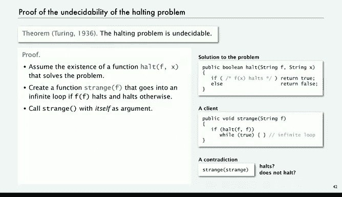

# 024：可计算性 🧠


在本节课中，我们将要学习计算机科学中一个深刻且反直觉的概念：可计算性。我们将探讨是否存在计算机永远无法解决的问题，并通过著名的“停机问题”来证明这一点。理解这些概念对于认识计算机能力的边界至关重要。

---

## 所有计算机都是等价的

上一节我们介绍了图灵机的概念。但故事的另一部分是，所有我们能想象到的计算机在计算能力上都是等价的。这意味着任何一台通用计算机（如现代电脑）都能模拟另一台计算机（如图灵机）的行为。

然而，现在我们面临一个核心问题：**哪些问题是我们可以解决的？是否存在我们无法解决的问题？**

为了引入这个话题，我将描述一个非常简单的谜题，称为“波斯特对应问题”。

---

## 波斯特对应问题 🧩

波斯特对应问题是一类基于卡片的谜题。以下通过一个例子来说明。

假设我们有 `n` 种不同类型的卡片，并且每种类型的卡片数量不限。每张卡片由一个**顶部字符串**和一个**底部字符串**来定义。

我们需要回答的问题是：给定这 `n` 种卡片，**是否存在一种卡片的排列方式，使得所有卡片顶部的字符串连起来，与所有卡片底部的字符串连起来完全相同？**

让我们看几个例子。

### 示例一：有解的卡片组

假设我们有四种类型的卡片（编号0-3），每种卡片数量无限：
*   卡片0：顶部 `A`， 底部 `ABA`
*   卡片1：顶部 `BA`， 底部 `A`
*   卡片2：顶部 `B`， 底部 `BA`
*   卡片3：顶部 `AB`， 底部 `B`

我们需要从这些卡片堆中任意选取卡片进行排列，使得顶部和底部的字符串序列相同。

在这个例子中，答案是肯定的。一种解法如下：
1.  选取卡片0：顶部 `A`， 底部 `ABA`。
2.  选取卡片3：顶部 `AB`， 底部 `B`。现在顶部是 `AAB`， 底部是 `ABAB`。
3.  选取卡片0：顶部 `A`， 底部 `ABA`。现在顶部是 `AABA`， 底部是 `ABABABA`。
4.  选取卡片2：顶部 `B`， 底部 `BA`。现在顶部是 `AABAB`， 底部是 `ABABABABA`。
5.  选取卡片1：顶部 `BA`， 底部 `A`。最终，顶部和底部都形成了9个字符的字符串 `AABABABA`。

因此，这组卡片存在解。

### 示例二：无解的卡片组

现在考虑另一组卡片：
*   卡片0：顶部 `A`， 底部 `B`
*   卡片1：顶部 `B`， 底部 `A`

这组卡片显然无解，因为你甚至无法匹配第一个字符。每张卡片的顶部和底部第一个字符都不同，因此无法开始匹配。

### 问题的复杂性

我的同事安德拉·佩尔设计了一组更复杂的卡片。这组卡片实际上存在一个以卡片0开始的解，但找到它并不容易。

这就引出了核心问题：**你能编写一个程序，输入一组卡片的定义，然后输出是否存在一个满足条件的排列吗？**

初看起来，这似乎并不比其他编程任务困难多少。也许我们可以把它布置成一个编程作业。

然而，令人惊讶的事实是：**不可能编写出这样的程序**。我们可以证明这一点。这意味着我们可以给你一个你**绝对无法完成**的任务。当然，我们不会对学生这么“残忍”，但有些老师可能会。

---

## 另一个不可解问题：停机问题 ⏸️

为了理解为什么波斯特对应问题不可解，我们先来看一个更著名的不可能问题：**停机问题**。这个问题因艾伦·图灵的研究而闻名。

我们的目标是：编写一个Java程序，它读入一个给定的Java静态方法 `F` 的代码和一个输入 `x`，然后判断 `F(x)` 的执行是否会导致无限循环（即不“停机”）。

### 示例分析

例如，考虑以下函数：
```java
public static void f(int x) {
    while (x != 1) {
        if (x % 2 == 0) x = x / 2;
        else x = 3 * x + 1;
    }
}
```
这就是著名的“考拉兹猜想”。我们之前在递归讲座中讨论过。**没有人知道这个函数对于所有输入 `x` 是否会停机**。人们已经研究了极长的序列，但无法证明它总是会停止。

至少这些例子表明，编写一个能分析任意Java函数并判断其是否停机的程序，可能极具挑战性。

接下来我们将讨论一个证明：**即使不考虑考拉兹猜想，编写这样的程序也是不可能的**。这被称为**停机问题的不可判定性**。

---

## 可计算性与不可判定性 📊

我们定义：
*   一个答案是“是”或“否”的问题，如果**不存在**能解决它的图灵机（即保证最终进入“是”状态或“否”状态），那么这个问题就是**不可判定的**。
*   反之，如果存在一个能解决它的图灵机，那么这个问题就是**可计算的**。

图灵在他证明图灵机通用性的同一篇论文中，也证明了**停机问题是不可判定的**。

这具有非常深远的影响：
1.  它证明了存在我们**无法计算**的东西。
2.  由于通用性，这意味着**没有任何计算机**能解决这个问题。
3.  更糟糕的是，存在**许多**计算机无法解决的问题。

如果我们要用计算机解决问题，就必须理解这个概念。

---

## 热身：说谎者悖论 🤥

在探讨停机问题证明之前，我们先看一个逻辑谜题：“**说谎者悖论**”，它可以追溯到古希腊哲学家。

假设我们将所有语句分为两类：**真**和**假**。
*   “2加2等于4”是真。
*   “2加2等于99”是假。
*   “地球是圆的”是真。
*   “地球是平的”是假。

现在考虑这个语句：**“本语句是假的。”**

*   如果我们把它归为“真”，那么它说自己是假的，这就矛盾了。
*   如果我们把它归为“假”，那么它说自己是假的，这反而意味着它是真的，又矛盾了。

我们该如何处理这种情况？困难的根源在于**自我指涉**——一个语句指向自身。我们从中得出的逻辑结论是：**你无法将所有语句都标记为真或假**。这里就有一个无法被标记的语句。

我们做了一个假设（所有语句非真即假），而“本语句是假的”这个语句的存在，**反驳**了这个假设。这就证明了该假设不成立。

我们将要进行的停机问题证明，其思路与此类似，只是更复杂一些。

---

## 停机问题不可判定的证明 🔍

现在，我们使用Java程序的形式来证明停机问题的不可判定性（根据通用性原理，这与在图灵机上证明是等价的）。

### 第一步：假设存在解决方案

我们**假设**存在一个名为 `halt` 的函数。它接收一个函数 `F` 的代码（字符串形式）和一个输入 `x`，并解决停机问题。

```java
// 假设存在的“神奇”函数
public static boolean halt(String fCode, String x) {
    // 此处包含极其聪明的代码，能分析F和x
    // 如果 F(x) 停机，返回 true
    // 如果 F(x) 无限循环，返回 false
    return ...; // 假设它能正确工作
}
```
这个函数非常神奇，它能对任何函数 `F` 和任何输入 `x` 做出判断。

### 第二步：构造一个“奇怪”的函数

基于这个假设的 `halt` 函数，我们构造一个新的函数 `strange`：

```java
public static void strange(String fCode) {
    // 调用我们假设存在的halt函数，判断 fCode(fCode) 是否停机
    if (halt(fCode, fCode)) {
        // 如果 halt 说 fCode(fCode) 会停机...
        // 那么 strange 就进入无限循环（与halt的判断相反）
        while (true) { } // 无限循环
    } else {
        // 如果 halt 说 fCode(fCode) 不会停机...
        // 那么 strange 就立即停机（与halt的判断相反）
        return;
    }
}
```
`strange` 函数的行为与 `halt` 的判断**相反**：如果 `F(F)` 停机，`strange` 就循环；如果 `F(F)` 不停机，`strange` 就停机。

### 第三步：引发矛盾

现在，我们让 `strange` 函数以**它自己的代码**作为输入来运行。即，我们考虑 `strange(strange)` 是否会停机。

让我们分析两种情况：

1.  **情况A**：假设 `strange(strange)` **停机**。
    *   查看 `strange` 函数的代码：只有当 `halt(strange, strange)` 返回 `false`（即判断 `strange(strange)` 不会停机）时，它才会执行 `return` 语句而停机。
    *   但我们的假设是它停机了，这意味着 `halt(strange, strange)` 必须返回 `false`。
    *   然而，`halt` 函数返回 `false` 表示它判断 `strange(strange)` **不会停机**。
    *   这与我们“它停机了”的假设**矛盾**。

2.  **情况B**：假设 `strange(strange)` **不会停机**（无限循环）。
    *   查看 `strange` 函数的代码：只有当 `halt(strange, strange)` 返回 `true`（即判断 `strange(strange)` 会停机）时，它才会进入 `while (true)` 循环而不停机。
    *   但我们的假设是它不停机，这意味着 `halt(strange, strange)` 必须返回 `true`。
    *   然而，`halt` 函数返回 `true` 表示它判断 `strange(strange)` **会停机**。
    *   这与我们“它不停机”的假设**矛盾**。

### 结论

无论我们假设 `strange(strange)` 停机还是不停机，都会导致逻辑矛盾。这个矛盾的唯一根源，就是我们最初的假设——**存在一个能正确解决停机问题的 `halt` 函数**。



因此，这个假设是错误的。**这样的 `halt` 函数不可能存在**。也就是说，**停机问题是不可判定的**，没有程序能解决它。

这个证明对于不熟悉逻辑的人来说可能有些烧脑，但你可以逐步检查每一步。它本质上是“说谎者悖论”在计算机程序上的一个巧妙扩展。

---

## 总结 📝

本节课中我们一起学习了计算机科学的核心极限之一：可计算性。

1.  我们首先通过**波斯特对应问题**引出了“是否存在计算机无法解决的问题”这一疑问。
2.  接着，我们定义了**可计算问题**（存在图灵机/计算机能解决）和**不可判定问题**（不存在这样的计算机）。
3.  然后，我们回顾了**说谎者悖论**，理解了自我指涉如何导致逻辑矛盾。
4.  最后，我们深入剖析了**停机问题不可判定性的证明**。通过假设存在解决方案，然后构造一个行为相反的“奇怪”函数，并让其自我指涉，最终推导出逻辑矛盾，从而证明解决方案不可能存在。


这个结论意义深远：它明确指出了计算机能力的**固有边界**。并非所有问题都能通过算法解决。认识到这一点，是理解计算理论、评估问题难度以及探索人工智能边界的基础。