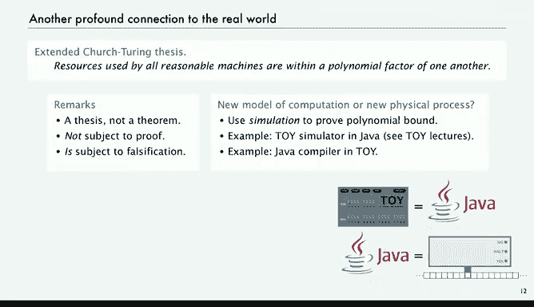
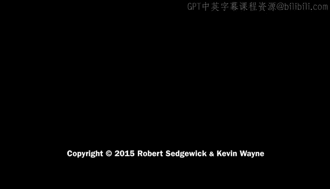

# 026：合理问题

在本节课中，我们将要学习计算复杂性理论的基础，特别是探讨“高效”算法与“难解”问题之间的区别。我们将从图灵关于可计算性的工作出发，转向一个更实际的问题：在现实世界中，哪些问题是我们可以高效解决的？

图灵关于可计算性的工作，真正教会我们区分了那些我们可以计算的事物，以及那些我们绝对无法用任何可以想象的计算机计算的事物。当时，我们完全没有关注计算的效率问题，即计算事物的难度。今天，我们将要探讨这一部分内容。

## 从可计算性到计算效率

上一节我们介绍了图灵工作所解决的基本问题，例如什么是通用计算机，以及数字计算机是否存在能力极限。我们通过停机问题等例子发现了这种极限。

本节中，我们来看看一个不同但同样根本的问题：在我们实际能在宇宙中建造的机器上，是否存在我们能做的事情的极限？这就是今天讲座的重点。

这个问题最初由哥德尔在一封所谓的“丢失的信件”中向冯·诺依曼提出，约翰·纳什也在另一封给美国国家安全局的“丢失的信件”中提出了类似问题。当然，这两封信后来都被找到了。早期的突破性工作来自迈克尔·拉宾和达纳·斯科特，他们引入了非确定性概念。但真正核心的问题是在20世纪70年代由迪克·卡普、史蒂夫·库克以及独立地由伦纳德·莱文提出的。与上一讲不同，这个问题至今仍未解决，我们不知道答案，也不知道谁会给出答案。这是一个引人入胜的背景：如此重要的问题在首次提出数十年后仍然悬而未决。

## 一个著名的难题：旅行商问题

为了开始思考这个问题，让我们从一个众所周知的难题开始，它被称为旅行商问题。

问题的描述是：给定N个城市，以及每对城市之间的距离，同时给定一个阈值距离M。问题是：是否存在一条经过所有城市并返回起点的旅行路线，其总长度小于M？

这个问题可能有不同的表述方式，但我们暂时先考虑这个特定的版本。

显然，我们可能会做所谓的“穷举搜索”，即尝试所有N!种城市排列顺序，以寻找长度小于M的路线。可以想象，对于非常大的N，即城市数量非常多时，这种方法将无法工作。这正是我们要讨论的这类问题。

那么，这个问题到底有多难呢？以下是最近在互联网博客上找到的一些摘录。

有人说：“如果想游览美国最大的100个城市，最短路线距离是多少？”当然，如果你能解决给定阈值M的问题，就可以使用二分搜索找到最短距离。所以在很多方面，这是等价的问题。因此，我相信有一个简单的答案。有人想帮忙吗？快速谷歌搜索没有揭示任何信息。

然后下一条说：“我认为没有替代手动操作的方法。谷歌搜索这些城市，拿出你的地图，开始工作，这应该不会超过一个小时。”编辑：“我没有意识到这是一个标准化问题。”好吧，它可能是一个标准化问题，但这里还需要另一个编辑。“编写程序来解决这个问题，对于一个普通程序员来说需要5到10分钟。”好吧，也许比那多一点，但你们肯定都能编写程序来解决这个问题。

然而，程序需要运行的时间很长很长。嗯，我的Garmin导航仪或许能解决这个问题，或者我现在的手机地图应用。然后有一个编辑说：“嗯，可能不行。”呃。“在我看来，需要有人编写一个分布式计算程序来解决这个问题。这类事情应该不会那么难吧，真的有那么难吗？”

## 从“超级计算机”的角度分析

为了从正确的角度思考这个问题，我想让你想象一个巨大的计算设备。我们试着想象我们能想象到的最强大的计算机，称之为“超级计算机”。

它拥有宇宙中每个电子上的一个处理器。这是试图想象我们能拥有的最大计算机。假设每个处理器（宇宙中每个电子上都有一个）都拥有我们今天所知的最快超级计算机的能力。并且让它们都工作宇宙寿命那么长的时间。

你取最快的超级计算机，在宇宙的每个电子上放一个，并让它们工作宇宙的寿命那么长。这只是保守估计，如果你愿意，可以使用其他估计值。

假设宇宙中有10^79个电子。也许一台超级计算机每秒执行10^13条指令，或者10^20条，随你怎么说。宇宙的年龄以秒计大约是10^17，也许低估了，可能是10^30，但我们先用这些数字。

然后我们说，好吧，假设我们使用尝试所有城市排列并寻找最短路径的算法，超级计算机能用这种算法解决它吗？答案是：差得远。100的阶乘大于10^157。如果你拥有宇宙中每个电子上的超级计算机，并运行宇宙的年龄那么长的时间，你大约能达到10^109的计算量。所以，不仅用超级计算机无法通过那种方法解决这个问题，你还需要10^48台超级计算机。

这是一个难题，你无法用那种方法的计算机解决它。当你思考本讲座的主题时，这是一个非常重要的教训。关键在于，当你的问题规模导致所需时间呈指数级增长时，技术变革是无关紧要的。指数增长是如此巨大，以至于任何你可能想到的技术进步都完全无济于事。

因此，我们面临这样的问题：我们能否解决这个问题？是否有更好的计算机？这就是我们想要探讨的问题，它与我们使用的技术真的无关。

## 多项式时间算法与高效性

那么，哪些算法能用于解决实际问题？为了开始探讨这个问题，就像我们处理可计算性问题时一样，我们将使用一个非常简单的计算模型。

我们将要思考的是多项式时间算法的概念。多项式时间意味着运行时间小于某个常数A乘以N的B次方。我们在讨论实际应用问题时，谈到过需要比N^2或N^3等更快的解决方案，这些都很好。但出于此目的，我们甚至对N^100也感兴趣，因为我们想要避免的是指数时间。指数时间肯定不是多项式时间，其运行时间与C^N成正比，其中C是大于1的常数。

因此，我们的区分在于多项式时间和指数时间。同样，具体的计算机通常无关紧要，因为当你在一台计算机上模拟另一台计算机时，通常只使用一个多项式因子。这被称为扩展的丘奇-图灵论题，我们稍后会讨论。

在本讲座的上下文中，我们想说，如果一个算法无论输入是什么，都保证在多项式时间内运行，那么它就是高效的。

我们将使用“高效”这个词，并寻找高效算法，或者寻找存在高效算法解决的问题。

在本讲座之外，我们可能会说“保证多项式时间”或有时只说“多项式时间”。我们希望确保它对所有输入都是多项式时间，但为简便起见，我们将只使用“高效”一词。

并理解我们正在将这类算法与那些可能很慢、可能需要指数时间的算法区分开来。

我们面临的基本问题是：我们有很多实际问题，我们想知道是否能找到高效算法。这似乎是一个我们应该能够回答的合理问题，这就是我们的主题。

你可以反过来问：哪些问题我们可以在实践中解决？那些就是我们已知存在高效算法的问题。如果我们有一个想要解决的问题，并且我们有一个高效算法，那么在本讲座中，我们将认为这些问题是我们能够着手实现算法并解决的。

另一方面，如果我们能证明不存在高效算法来解决某个问题，我们将称之为“难解的”。这与我们在可计算性中所做的类似：我们可以谈论能用图灵机解决的问题，以及不能用任何图灵机解决的问题（即可计算性与不可计算性）。我们希望有相同的理念，在难解问题和已知高效算法的问题之间进行类似的区分。

我们希望能有一种简单的方法来判断是否存在难解问题，这就是我们今天要讨论的内容。

## 四个基本问题示例

例如，排序不是难解的，我们有算法保证在某个多项式时间内运行。即使我们有更快的算法，如N log N，只要它是任何多项式，对于本讲座来说就足够了。

但对于旅行商问题，例如，没有人知道高效算法，但我们也没有证据证明不存在高效算法。这就是我们想要讨论的问题。

为了开始，我们将讨论四个基本的基础问题。

第一个问题可能在中学就熟悉：线性方程组求解。我们有一些未知值，以及这些值必须同时满足的一些方程。变量是实数。这是一个三个方程和三个变量的例子，你在学校学过如何求解。在这种情况下，解是x1等于1/2，x2等于1/2。所以x1 + x2等于1，3x1 + 15x2等于18乘以1/2等于9，另一个方程你可以检查加起来等于1/2。你可能熟悉高斯消元法，它可以解决这个问题。

有一个类似的问题叫做线性规划。同样，变量是实数，但现在我们要使它们必须满足的方程变为不等式。这里有四个不等式和三个未知数（实际上是六个不等式和三个未知数）。我们有一堆变量和一些不等式，我们希望它们同时满足这些不等式。在这种情况下，最下面的不等式说解都应该是正值，它们都是实数。然后你可以代入这些值，检查该解是否满足那些不等式。这被称为线性规划。我们如何得到那个解？

还有一个问题叫做整数线性规划，这是相同的问题，只是变量必须是0或1，即两个值之一。这是整数线性规划。

另一个问题叫做可满足性问题。现在我们的变量是布尔值，要么为真要么为假。然后我们有一些必须同时满足的布尔和（析取）方程。例如，“非x1 或 x2”为真，等等。这是一个例子，然后有一个解：第一个方程满足是因为x2为真，第二个方程满足是因为x0为假，所以“非x0”为真，最后一个满足是因为x1为真。同样，给定方程，找出解，这就是问题。

## 问题的可解性现状

这些问题非常相似，实际上都是非常重要的解决问题模型，具有许多实际应用。我们经常将实际问题表述为这些形式之一，然后解将告诉我们在某种实际情况下需要做什么。每一个都有很多很多应用。

因此，一个相当合理的问题是：我们是否有解决这些问题的高效算法？它们看起来如此相似，情况如何？随着计算的出现，人们开始研究使用计算机解决这些问题，并且很难判断哪些是易处理的，哪些有高效算法。

对于线性方程组求解，答案是肯定的。事实上，高斯消元法本身在这个模型中并不完全适用，因为数字是实数，在计算机中用比特表示。但通过适当的修改，高斯消元法可以保证在多项式时间内解决这个线性方程组问题，无论输入是什么。

对于线性规划，答案也是肯定的，但这是在问题首次提出数十年后才得出的。这个问题开放了很长时间，人们争论是否存在线性规划的多项式时间算法。然后在20世纪80年代，椭球算法是一个惊人的智力壮举，它证明了线性规划可以在多项式时间内解决。实际上，自那以后，这一思想得到了发展，一旦这个想法为人所知，其他多项式时间算法也被开发出来，这些算法在实际情况下确实有用且实用，现在是我们计算基础设施的重要组成部分。

但对于整数线性规划，没有人知道多项式时间算法，也没有人知道是否存在这样的算法。对于可满足性问题，情况相同：没有已知的多项式时间算法，也没有人知道是否存在。

这些都是相当合理、相似、有趣且重要的实际问题，而我们不知道答案。这就是基本问题：我们能否为整数规划和可满足性找到高效算法？或者我们能否证明不存在这样的算法？这些就是我们在本讲座中要讨论的问题。

## 难解性的定义与目标

因此，核心思想是难解性。让我们先给出定义，然后再进一步讨论。

我们说，如果一个算法的运行时间对所有输入都保证是某个多项式，那么它就是高效的。

如果一个问题没有高效算法来解决它，即我们可以证明不存在保证多项式时间的算法，我们就称其为难解的。

反之，如果我们有一个高效算法，那么问题就是易处理的。

当然，我们感兴趣的是知道一个问题是否易处理或难解。

同样，图灵通过识别一个我们可能想要解决的问题，并证明不可能解决它，从而教会了我们关于计算的一些根本性知识。然后，通过了解这一点，我们可以看到其他相关的问题可以归约到那个问题，帮助我们更多地理解计算。

因此，一个相当合理的问题是：我们能否为难解性做类似的事情？

对于图灵，我们有可判定和不可判定。现在我们有易处理与难解。所以第一个问题是：不仅整数线性规划和可满足性，还有许多许多问题，我们不知道解决它们的高效算法。所以首先出现的问题是：我们能否证明其中之一是难解的？这是我们面临的关键问题，也是我们接下来要开始奠定基础的内容。

## 扩展的丘奇-图灵论题

这是与现实世界的一个深刻联系，类似于丘奇-图灵论题，被称为扩展的丘奇-图灵论题。其思想是：丘奇-图灵论题说，我们建造的任何计算设备都将具有与图灵机相同的能力。而这个论题说，所有合理机器所使用的资源将在彼此的多项式因子之内。

当然，你可以构想出某种机器，它对简单任务也需要大量时间。但人们已经开发的合理计算模型和设计的机器总是在多项式因子之内。同样，这是一个论题，不是一个定理，它不受证明的约束。也许有人能想出一台计算机，无法在任何其他计算机上以多项式时间模拟，但问题是：这是一个新的计算模型，还是关于宇宙的新发现？

我们总是使用模拟来证明多项式界限。例如，我们稍后将看一个像你计算机处理器一样的简单机器，并编写一个Java程序来模拟该机器的操作，或者你可以编写一个称为编译器的程序，将Java程序翻译成该机器语言。这证明了这些事物是等价的，并且这些计算的成本肯定以多项式为界，这很容易证明。同样，对于人们已经开发的每一个合理的机器模型，这一直都是正确的。

这验证了关注指数时间与多项式时间算法之间区别的合理性。因此，在一台机器上的多项式时间，在我们能想到的所有机器上都将是多项式时间。这与一台机器上的指数时间完全不同。这确实使我们能够严格地研究效率，就像我们能够严格地研究可计算性一样。这就是我们在本讲座中要前进的方向。

## 总结

本节课中，我们一起学习了计算复杂性理论的基础。我们从图灵的可计算性概念出发，引入了计算效率的问题。我们通过旅行商问题看到了指数时间算法的不可行性，并定义了“高效”算法为多项式时间算法。我们考察了线性方程组求解、线性规划、整数线性规划和可满足性这四个重要问题，了解了它们当前的可解性状态。最后，我们介绍了扩展的丘奇-图灵论题，它为我们严格研究计算效率提供了理论基础。核心问题——是否存在本质上难解的问题——仍然悬而未决，这为后续的学习留下了悬念。