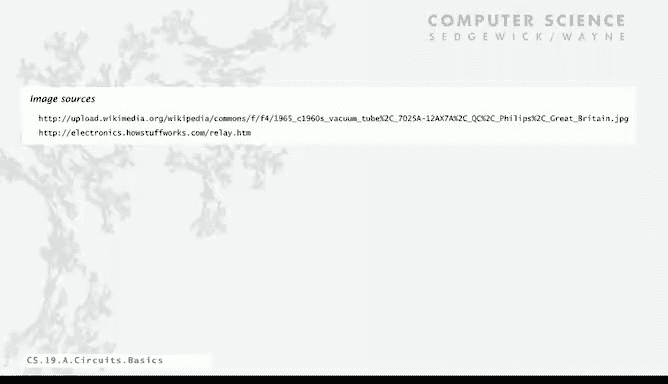

# 040：基础构件 🧱

在本节课中，我们将开始探讨计算机是如何构建的。你会惊讶地发现，我们计算机的基本底层机制其实非常简单。我们将从描述一些基础构件开始，这些正是我们描述构建计算机的电路所需的元素。

## 组合电路与数字电路

首先，我们将讨论组合电路。具体来说，这是一种数字电路。这意味着电路中的所有信号都是0或1，并且没有反馈回路。在计算的早期，人们考虑的是模拟电路，它们完全不同且信号是连续的。但如今，一切都是数字化的，并且没有反馈。与之相对的是带有循环的电路，这将是下一讲的内容。因此，本讲的重点是无反馈，所有信号都是0或1，稍后我们会对此进行更具体的说明。

那么，为什么我们要使用这种电路呢？事实是，它们非常精确、非常可靠，我们可以用它们做很多事情。它们是通用的，可以很快，也可以很便宜。这一优势已经持续了几十年，这就是为什么我们所有的计算机都是用这种电路构建的。

## 基本抽象：开关与导线

我们使用的基本抽象极其简单：一切要么是“开”，要么是“关”。我们之前讨论过这一点，因为这很容易将这些“开/关”的抽象概念映射到物理世界，比如开关是开还是关，或者是否连接到电源。

然后，我们有一个叫做“导线”的东西，它传播“开”或“关”的值。因此，导线无疑是电路中的一个基本抽象。

此外，我们一开始还会讨论一种叫做“开关”的东西，我们用它来控制值通过导线的传播。这就是我们工作的基本抽象，我们将详细讨论它们，然后用它们来构建更复杂的电路。

事实上，如今我们拥有的任何内部装有计算机的设备，都将是这样一种数字电路，包括你汽车里的刹车系统。但特别地，我们想要讨论的是微处理器或计算机的中央处理单元。

## 导线的表示

关于导线，我们将使用一个非常简单的表示方法：一根导线要么是“开”（连接到电源），要么是“关”（未连接到电源）。

我们将电源连接点画为电路中的黑点。任何有黑点的地方都以某种方式连接到了电源。当我们想表示一根导线的值时，我们会把它画粗。因此，粗线是连接到点的线，我们将其解释为值1。细线没有连接到电源，它们是“关”的，我们将其解释为值0。

如果我们将任何导线连接到一根“开”的导线上，那么那根导线也会变成“开”，反之亦然。这是一个相当直观和自然的表示。在实际电路中，电源连接点会遍布各处，你可以把它想象成连接到电源的另一层的穿透点。

通常，当我们绘制电路时，我们认为信息是从顶部和左侧流向底部和右侧的。我们尽量遵守这些惯例，以便更容易理解电路中发生了什么。当然，从电气角度讲，我们画东西的方向并不重要，但你会发现这个惯例有助于理解，让理解电路行为变得稍微容易一些。这就是导线。

## 核心构件：受控开关

我们构建一切的基本单元被称为“受控开关”。它是一种控制信息通过导线传播的方式。

最简单的案例涉及两个连接。我们称其中一个为“控制端”，它是顶部的输入；另一个连接是输出。在这个图中，中间的灰色圆圈就是开关。它有一个控制输入。如果控制输入是“关”，那么输出就是“开”。在这种情况下，输出导线连接到电源，开关是“关”的，因此它不影响从左侧电源到右侧输出的连接。

但开关的主要特点是，如果你将控制输入打开，它就会阻断从电源到输出的连接。这就是受控开关：通过将控制输入关闭或打开，我们可以控制输出端发生什么。稍后我们会讨论实现这一点的不同方式，但这是构建我们计算电路的基本抽象。

更一般的情况涉及三个连接，其中不是连接到电源，而是可能有一根导线穿过，它可能是另一个开关的输出。在这种情况下，如果控制端是“关”的，那么输出就连接到输入。左侧的输出连接到右侧的输出，即连接到左侧的输入。如果控制端是“关”的（如顶部所示），那么输入是“关”，输出也是“关”；如果控制端是“关”但输入是“开”（如底部所示），那么输出也是“开”。数据输入为“关”，输出为“关”；数据输入为“开”，输出为“开”——前提是控制端为“关”。

但如果控制端为“开”，就像之前一样，它会阻断从左侧数据输入到输出的连接。输出总是零。数据输入为“关”，输出为“关”；数据输入为“开”，输出也为“关”。

受控开关只是横跨一根导线，如果它内部有电源，就会阻断连接。这就是我们的基本抽象。令人惊讶的是，几乎所有东西都是基于此构建的，我们稍后会详细讨论。

## 物理实现示例：继电器

这是一个理想化的模型，实际上来源于真实集成电路中的“传输晶体管”。其中穿过的导线是一种材料，而横切它的导线是另一种材料。它们具有这样的物理特性：如果你打开控制端，它会在物理上阻断左侧输入和右侧输出之间的连接。

我们不会担心这些物理细节，我们将使用这个抽象模型，因为实际上有很多不同的方法来构建这样的受控开关。

作为一个物理示例，让你了解现实世界中的基础，我们来谈谈“继电器”。这实际上是最早用于构建计算设备的受控开关之一。

继电器是一种物理设备，它用磁铁控制一个开关。它有我们刚刚讨论过的三个连接：输入、输出和控制端，但它利用电磁力来拉动一个触点，从而切断电流。这是我们的示意图：从上到下，我们有一根表示控制线的导线，它停在那里——这就是我们如何知道它是一根控制线。横穿而过的是可能被切换的导线。

如果控制端是“关”的，那么顶部附近的黑色方块表示一个关闭的磁铁，并且有一个弹簧将触点压下，以确保我们有一个从左到右的连接。控制端为“关”，所以在示意图顶部是0。然后，如果左侧导线是“关”，右侧也是“关”；如果左侧是“开”，右侧也是“开”，如右侧小图所示。

但现在，如果控制端为“开”，磁铁会拉起触点并断开连接。如果这样做了，控制端为“开”，那么右侧的连接就是0，无论输入是什么。这就是继电器的概念，是受控开关的一种物理实现。

## 抽象的力量与技术无关性

这又是我们的第一层抽象。实现开关有很多不同的方法，但仅仅思考导线中开关的抽象概念，这是一个将我们从物理世界分离出来的模型，我们可以开始在逻辑世界中工作，假设这些东西按照我们刚刚指定的方式运行。

我们做的唯一假设是，我们有这些开关，并且导线按照我们描述的方式直观地连接。开关实际上是如何实现的并不重要。实际上，我们将要研究的基本设计是在几十年前开发的，并且通过许多不同的开关技术一直有效。这就是抽象的全部目的：我们拥有导线中受控开关的概念，用它来构建我们的计算机。从PDP-8到EDVAC，再到微处理器和计算机，我们讨论过的所有计算机都是基于受控开关的概念构建的。

物理器件确实决定了性能，这是一个我们不涉及的话题，那是一个工程学话题。当然，如果你得到一个更小的开关、更快的开关、功耗更低的开关，你就会得到一台更好的计算机，这很重要。关键在于，有了新技术，由于我们只依赖于那一个抽象，我们几乎可以立即得到一台更快的新计算机。我们不必改变设计，因为它都建立在那简单的抽象之上。如果你有更好的开关，你就有更好的计算机。实际上，当你听说科学家开发了新技术意味着计算机将更快时，通常真正意味着有人找到了更好的开关。

这就是我们讨论过的摩尔定律的基础——计算机将定期变得更大更快——是因为开关变得更小、更快、更好。

为了强调技术无关性这个观点，你可以在网上找到各种人们使用开关的例子，比如顶部那个依赖气压的气动开关，或者依赖水压的开关。如今你可以使用继电器。虽然你不会用这些技术来构建一个有十亿个字的计算机，但它们证明了技术并不重要。人们已经用这类技术构建了整个计算机。实际上，正如我提到的，继电器是一个现实世界的例子，它是最早的计算设备之一。然后是真空管，它比继电器更快、更便宜、更小。接着是晶体管，最终是集成电路。

我们有两种不同的材料相互交叉，实现了一个受控开关。如今人们谈论原子厚度的晶体管，实际上晶体管的概念就是我们受控开关的概念。事实上，在过去的几十年里，大多数计算机都是用所谓的VLSI（超大规模集成电路）构建的。正如我一直说的，这是通过在基底上沉积不同类型的材料来实现的。在这个图中，蓝线是连接线，而红线和绿线与开关有关。某些交叉线就是受控开关。

## 从图纸到物理电路

在物理世界中，关键的挑战是制造这些能够可靠工作的电路。开关必须每次都工作，导线必须每次都连接。可能会有数十亿根导线和控制端，这实际上是一个小电路，稍后我们会看一个更大的。但我们更感兴趣的是抽象世界。我们只是想理解可能包含数十亿根导线和受控开关的电路行为。这就是我们接下来几讲要讨论的内容。

但我想从一开始就给大家留下深刻印象的是，如今，电路和电路图纸之间并没有太大的区别。实际上，自从VLSI出现以来，构建计算机实际上就是指定一个电路图纸，然后将其送到制造工厂，工厂利用该图纸在基底上制作这些具有不同材料的几何器件。但从设计的角度来看，我们感兴趣的是图纸。

我们看待电路的方式始终牢记这一点：我们总是在思考我们所看的电路元件所占用的空间，以及它如何直接从逻辑世界转换到抽象世界，因为电路就是一张图纸。

## 构建抽象层的重要性

即使有了这些简单的抽象——我们只讨论了几个：我们的点是电源连接，横跨线的小标签是受控开关，导线可能交叉也可能连接——即使有了这套非常简单的抽象，其中发生的行为也可能变得相当复杂。我们给你一张用这些抽象构建的图纸，要立即弄清楚哪些导线连接了，哪些没有，并不容易。这就是为什么我们需要小心地构建我们的抽象层，以真正理解电路行为。

我们将从头开始，用开关构建小型器件，然后用那些小型器件构建更大的器件。这将是我们如何设计完整计算机的一个非常关键的部分。

---

**本节课总结**：在本节课中，我们一起学习了数字电路的基本构件。我们从组合电路和数字信号的概念出发，介绍了“开/关”这一核心抽象。我们详细探讨了导线如何表示0和1，并深入学习了构建一切的基础单元——**受控开关**。通过继电器的例子，我们看到了抽象概念如何映射到物理实现，并强调了技术无关性以及抽象层在管理复杂电路设计中的重要性。这些简单的构件，最终将组合成功能强大的计算机。