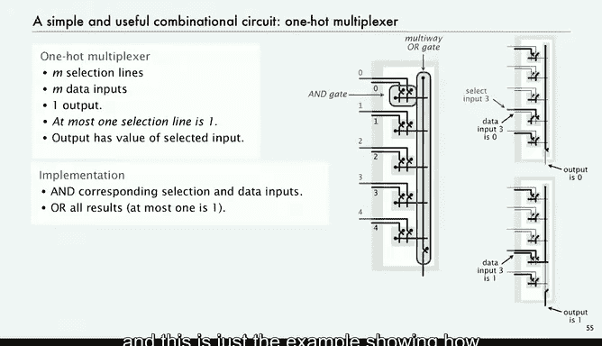

# 044：算术逻辑单元

在本节课中，我们将学习计算机的核心计算部件——算术逻辑单元。我们将了解ALU如何作为一个组合电路模块工作，它如何执行不同的运算，以及如何通过控制线选择所需的输出结果。课程将从模块化设计的角度出发，解释总线、控制线等概念，并详细介绍“单热多路复用器”这一关键子电路的工作原理。

算术逻辑单元是一个大型组合电路，占据了任何计算机芯片实际面积的相当一部分。

接下来我们将要研究它。我们将再向上移动一层抽象，其基本思想是，我们的电路（计算机）被组织成对应于计算机功能单元的模块。

我们知道需要一个存储器、一个寄存器、一个程序计数器、一个指令寄存器以及一个执行所有计算的ALU。

这样的模块数量并不多，并且正如我们一直在做的，这些大型电路是由更小的电路构建而成的。

我们需要通过所谓的“总线”将模块连接起来。通常，总线是为字中的每一位提供一根导线，这就是我们在模块之间传递信息的方式。

此外，我们还有称为“控制线”的单根导线，用于控制电路的行为。

我们遵循一些约定，以便更容易理解电路的功能。通常，我们将总线输入放在顶部，并从左侧连接它们。

我们将总线输出放在底部，并从右侧引出任何连接。

但通常这些总线必须贯穿整个电路，因为不同的部件都需要连接到它们。

我们还有控制线，通常用蓝色表示，它们也贯穿整个电路。

在下一讲中，我们将看到几个模块的例子。

但我们的第一个例子是ALU。重申一下，这些约定的全部目的是使电路易于理解。我们的设计规则并非旨在制造最高效的电路；我们试图在两节课内让你理解计算机的工作原理，因此我们将尽可能去除令人困惑的细节。

这就是ALU的样子。它是一个模块，这是一个8位ALU，因此它在顶部接收两个8位输入总线，在底部有一个8位输出总线，并且为每个功能都有三条控制线。

这个ALU有三条控制线。我们将省略左右移位器电路，你可以在细节中看到它们。这就是整个电路的样子。

每个功能都有一个对应的电路，它们并行计算所有值。

这是我们的加法器电路，一个8位加法器。还有一个8位异或电路，它直接使用了随堂测验中的异或门，每位一个。

还有一个8位与电路，就是每位使用一个与门。

这些都是组合电路，它们总是在计算输入值的函数。

然后我们还有控制线，但问题是：当需要选择期望的输出时，我们如何操作？当加法控制线激活时，我们希望看到加法电路的结果；当异或控制线为1时，我们希望看到那个结果，依此类推。

答案是，我们使用一个称为“单热多路复用器”的小型子电路或小开关，我们将在下一张幻灯片中讨论它。其目的是选择正确的结果并将其传送到输出总线。这就是位于计算机核心的计算器的完整设计。我们已经在计算机内部勾选了一个非常重要的模块，下次我们还将完成几个模块。

单热多路复用器的概念是：它有M个选择输入，M个数据输入，以及恰好一个输出。有一个前提条件：最多只有一个选择线为1。

最终，这些线来自一个解码器，因此我们可以确保这一点。但我们不会考虑所有可能的输入情况：要么它们全为0，要么恰好有一个为1。

该电路的功能仅仅是使输出等于被选中的输入值。

例如，在这种情况下，选择输入3为开，数据输入3为0，因此输出将为0。所有其他数据输入都被忽略。如果数据输入3为1，那么输出将为1。

这是一个非常容易实现的电路，你或许能猜到如何实现。我们只需将选择输入和数据输入的每一对相加。如果所有选择线都为0，那么所有与门的输出都是0，然后电路的输出就是0，因为它连接到一个或门。但如果其中一条选择线为1，那么与门将根据数据输入是0还是1，输出0或1。最多只有一个这样的输出会是1。如果其中一个是1，那么或门将输出1。这是一个非常简单的电路，但很有用。在我们的ALU中，这个电路被嵌入到ALU的每一位中。数据输入是运算的结果，可能是加法、异或或与运算的结果。选择输入或选择线用于选择要进行的运算。

因此，它仅用与门和一个多路或门构建而成。

这只是一个展示与门在这些情况下如何工作的例子。

正如上一张幻灯片所示，我们在ALU中使用了这些电路。

它们在下一讲我们将讨论的主存储器中也扮演着重要角色。

现在再次强调，重要的是要注意，这看起来像一个开关，但实际上并不是一个开关。数据输入和输出数据之间并没有直接的电气连接；只是它们的值相同。我们称之为类似虚拟选择开关。理解这一点很重要，因为认为存在实际电气连接的想法是具有误导性的。

以上就是本讲的总结。在本讲中，我们讨论了一些组合电路模块，它们各自在我们CPU电路的设计中扮演着关键角色。我们从仅仅由受控开关和连接开关的导线这个想法开始，逐步构建了这一切。

下次，我们将讨论如何使用带有反馈的时序电路来构建寄存器和存储器。我们将讨论如何连接模块，然后讨论如何控制这些连接以构建一个完整的CPU，就像你计算机中的那样。

