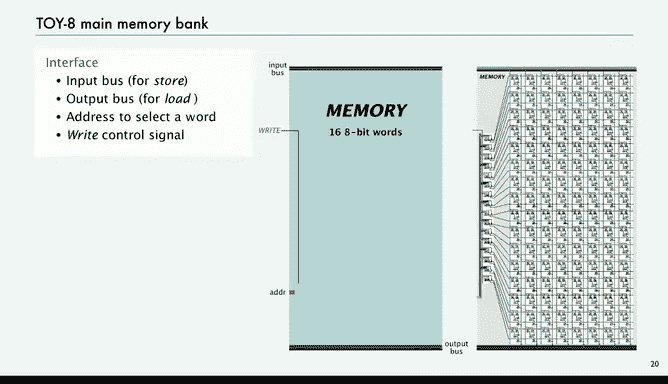

# 046：位、寄存器与内存

## 概述
在本节课中，我们将学习计算机中记忆功能的基础。我们将从组合逻辑电路出发，探讨如何通过引入反馈回路来构建能够“记住”信息的时序电路。核心在于理解一种称为“触发器”的基本记忆单元，并以此为基础构建寄存器和内存。

---

## 从组合电路到记忆电路
上一讲我们介绍了组合逻辑电路，它们根据输入信号计算并输出结果。然而，这些电路无法记住过去的状态。

本节中，我们将探讨一个非常重要的概念：如何构建能够存储信息的电路。幸运的是，正如我们使用开关作为组合电路的基础一样，也存在一个非常微小的组件，可以作为所有具有记忆功能的电路的基础。

## 时序电路与反馈
时序电路是一种包含反馈回路的电路。就像在计算机程序中引入循环会大大增加复杂性一样，在电路中引入反馈也会使其行为变得复杂。因此，我们必须非常谨慎地引入反馈。

我们使用时序电路的核心目的是实现**记忆**功能。这正是一台计算器和一台计算机之间的本质区别。幸运的是，与组合电路类似，我们只需要一组很小的基本抽象概念：开和关、传输信号的导线、控制信号传播的开关，以及一个称为**触发器**的新组件。触发器是一个带有反馈的简单电路，能够记住一个值。

## 反馈回路的稳定性
如果电路中存在回路，其行为将取决于开关操作的顺序，因此我们需要对此进行严格控制。以下是一个最简单的例子：两个开关互相阻塞。

这两个开关连接到电源点，并且彼此阻塞。我们关注从这个单元输出的导线上的值。电路的状态由哪个开关先动作决定。例如，如果底部的开关先动作，从而阻塞了底部电源点到输出的通路，那么状态将是0，输出线为低电平。如果顶部的开关先动作，那么左侧的电源点连接到输出，输出为1。

关键在于，一旦电路进入这两种状态之一，它就会保持该状态。状态被设定后就不会改变。但问题是，这依赖于哪个开关先动作这种随机事件。即使时间差极小，总会有一个开关先动作，一旦发生，电路就进入这个稳定状态。

这就是我们记忆电路的基本构建模块。这是一个我们能想象到的最小的、能记住“哪个开关先动作”的电路。

## 可控的记忆单元：SR触发器
接下来，我们将添加一些控制，以便决定哪个开关先动作，从而利用电路能记住状态这一特性。我们99.99%的电路反馈都存在于这种紧密的小型记忆位中。原因是，如果存在更大的反馈回路，可能会导致不可预测的行为。

我们将使用一个历史术语：**SR触发器**。其思想是为开关添加控制线，以设定状态，即决定哪个开关先动作。

*   **R线**（复位）将状态设置为0。
*   **S线**（置位）将状态设置为1。
*   输出称为**Q**，始终可用。

从组件角度看，它是两个交叉耦合的或非门。这就是一个触发器。

以下是其工作原理：
*   如果R为高电平（1），S为低电平（0），则R会阻塞左侧的电源点，这意味着右侧的电源点接通。即使之后R变为低电平，左侧的电源点仍被阻塞。这就像是底部的开关先动作了，我们通过将R置1来强制实现这一点，输出Q为0。
*   如果S为高电平（1），则像是顶部的开关先动作，将左侧电源点连接到输出，使电路进入状态1。即使之后S变为低电平，它仍保持该状态。

我们不会同时将R和S置为高电平，因此无需担心那种情况。通过R线和S线，我们可以控制反馈回路中存入什么值，这就是具有记忆功能的电路的本质。

## 构建可控的记忆位
现在，我们将实现一个能提供更精确控制的记忆位。我们希望在一个输入线上提供数据值，而不是直接操作R和S控制线。

我们将为每个记忆位设置一个控制线（称为“写使能”线），当该线有效时，才允许触发器中的值发生实际改变。触发器的值始终作为输出可用。

如果我们想将触发器的值设置为1，就在输入线上放1，然后短暂地打开写使能线，时间刚好足够触发器翻转。然后立即关闭写使能线。

具体实现如下：
*   当输入为1且写使能有效时，通过与门使S变为1，从而将触发器值设为1。同时，另一个与门（其第二个输入是输入的反相信号）会阻塞，确保R始终为0。
*   当输入为0时，情况相反：R变为1，S变为0。当写使能脉冲到来时，触发器值被设为0。

这就是我们的基本记忆单元。你给它一个输入值和一个写使能脉冲，它就会记住该输入值，直到下一次收到写使能脉冲，并且输出值始终可用。我们的计算机电路中充满了这样的记忆位。

## 应用：时钟电路
记忆位的一个应用是构建驱动计算机的时钟电路。

我们假设可以从物理世界获得一个规律的开/关脉冲信号（时钟信号）。我们对该信号做两个假设：
1.  高电平（1）的持续时间刚好足够触发一个触发器。
2.  脉冲之间的间隔足够长，足以让最长的触发器链稳定下来。

我们将这个物理时钟信号连接到一个记忆位。这个记忆位的输出及其反相信号，将为我们提供驱动计算机所需的“取指”和“执行”信号。

具体连接如下：记忆位的输出Q作为“取指”信号，其反相信号作为“执行”信号。然后，我们将这个反相信号反馈回触发器的输入。由于写使能线由时钟脉冲驱动，每次时钟滴答时，触发器的值就会改变。它记住上一次时钟滴答时的值，并改变为新值。

这个仅包含一个记忆位的电路非常有用，它实现了控制CPU的取指-执行序列。实际上，我们使用一个稍复杂的版本，通过将“取指”/“执行”信号与时钟信号进行“与”操作，来生成“取指写”和“执行写”脉冲，确保在特定时刻才改变电路状态。

## 从位到寄存器
当然，我们大多数记忆电路更为复杂。让我们看看寄存器。

一个寄存器就是一组位。例如，一个4位寄存器。我们的惯例是：输入在顶部，输出在底部，中间有蓝色的控制线。输入总线承载输入值（例如0101），输出总线显示当前存储在记忆位中的值（例如1100）。

如果我们给出一个写使能脉冲，输入总线上的值就会被载入记忆位，并出现在输出总线上。实现非常简单：只是一系列连接到总线的记忆位，由同一个写使能脉冲控制所有位。

在Toy-8计算机中，程序计数器（PC）就是一个4位寄存器。当前指令寄存器（IR）是一个8位寄存器。处理器寄存器（R）也是一个8位寄存器。它们都是这种结构：由记忆位序列、总线和写使能脉冲构成。

## 从寄存器到内存
我们可以扩展同样的思想来构建一个内存库。在Toy-8的例子中，我们有2^n个字（n是地址位数）。例如，一个4字、每字6位的内存。

我们需要提供n位的地址输入、一个输入总线和一个输出总线。内存库的特性是：当写使能脉冲有效时，输入总线上的内容会被载入选中的字，并且该字的值会出现在输出总线上。它本质上是一行行的寄存器，但使用地址来选择其中一行进行操作。

实现如下：
*   对于每个内存字（例如4个字，每个字6位），我们有一排记忆位。
*   在左侧，我们有一个解码器（Demux）。它接收地址位和写使能信号，输出一系列选择线。只有与给定地址对应的那条选择线会变为高电平。
*   为了读取，我们需要收集被选中字的输出值。我们使用一个高大的“或”门（实际上是“线或”逻辑），将每个位上所有字（通过选择线控制）的输出汇集起来，送到输出总线。

在Toy-8中，这就是我们主内存的实现。它有16个8位字，总共128个位。解码器有16个输出，因为它接收4位地址。除此之外，其设计与上述完全相同：输入总线、输出总线、地址选择线和写使能控制信号。

## 总结
本节课中，我们一起学习了计算机记忆功能的基础。我们从简单的交叉耦合或非门构成的触发器出发，逐步构建了计算机中的几个核心组件：
1.  **时钟电路**：使用单个触发器记忆位，生成驱动计算机的取指-执行周期信号。
2.  **寄存器**：由一组触发器构成，用于临时存储数据，如程序计数器、指令寄存器和通用寄存器。
3.  **主内存**：由大量触发器构成的阵列，通过地址解码和选择逻辑，实现数据的存储与读取。

这些组件共同构成了计算机存储体系的基础，从最小的记忆位到庞大的内存系统，其设计思想一脉相承。