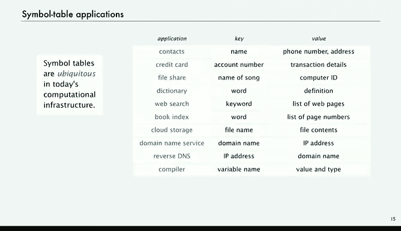

# 计算机科学：算法、理论和机器：P11：接口与客户端 🧩

在本节课中，我们将要学习符号表。符号表是一种经典的数据类型，拥有众多应用。其经典的数据结构及其变体能够带来显著的性能提升，这对于我们计算基础设施的性能至关重要。

我们将遵循与上一讲相同的基本结构：首先给出API，然后提出如何实现这些API以获得高性能的挑战，最后探讨能帮助我们解决这个问题的经典数据结构。

## 从白名单到符号表

上一讲中，我们讨论了鲍勃和爱丽丝使用归并排序和二分查找的白名单过滤器来维护客户账户。爱丽丝指出，每当添加新客户时，都必须对整个列表重新排序，这很麻烦。此外，他们还需要处理交易，并将各种信息与客户关联起来。归根结底，仅使用归并排序和二分查找的API是不够的，我们需要一个更灵活的API，这就是符号表的意义所在。

以电话簿为例，为什么它现在过时了？因为它不支持某些操作。例如，它不支持更改给定姓名对应的号码（号码已经印刷好了）。另一个更重要的操作是，如果需要为给定号码添加一个新姓名怎么办？你必须等到明年的电话簿。或者，如果你想删除一个姓名及其关联的号码呢？在现代系统中，我们只需在数字设备上操作即可。但我们之前提出的归并排序和二分查找方案存在同样的问题：不支持添加或删除姓名的操作。而符号表则提供了这种灵活性。顺便提一下，符号表正是你数字设备中用于管理电话号码等系统的基础。

## 关联数组抽象

这个想法被称为关联数组抽象，是一个非常古老的概念。其核心思想是想象使用数组，但不强制索引必须在0到数组大小减1之间，而是想象我们可以使用字符串值作为索引。那么，电话簿就可以是这样的：有一个名为`phoneNumbers`的数组，然后在方括号内使用字符串（而不是受限于特定范围的整数）作为索引，接着我们可以以类似的方式为数组分配其他字符串。

实际上，在爱丽丝的例子中，交易可能是一个包含日期、金额、供应商等信息的字符串。在某些编程语言（不是Java）中，确实可以编写这样的代码，而支撑这种代码的底层实现，正是我们今天要讨论的符号表。

另一个当今网络中常见的例子是，你想将字符串与URL关联起来，反之亦然。这是一个非常基础的抽象：我们讨论的是使用键来访问关联的值。键和值可以是任何类型的数据。最简单的客户端代码就是：将键放在方括号内，然后赋值。这就是关联数组抽象。反之，我们也可以将IP地址与字符串键关联起来。这是一个非常灵活的抽象。那么问题来了：我们如何在Java中将其实现为一个数据类型？这就是我们今天要考虑的。

## 符号表抽象数据类型

让我们像上一讲定义栈和队列那样，来定义这个抽象数据类型。

符号表是一种抽象数据类型，其值是一组键值对的集合。我们假设所有键都是不同的，这个假设并不严格，稍后会看到。

基本操作包括：
*   **插入/更新**：将给定键与给定值关联。如果键不在表中（表中没有任何值与此键关联），则将此键值对添加到表中。如果键已在表中，则只更改其值，就像操作数组一样。
*   **查找**：返回与给定键关联的值。这类似于在赋值语句右侧使用关联数组表达式。
*   **检查存在性**：测试给定键是否在表中。
*   **迭代**：遍历表中的所有键，并获取键值对。

有时，做出额外的假设很有用。在本讲中，我们将使用一个在应用中非常常见且有用的假设：**键是可比较的**。也就是说，它们处于一个全序关系中，我们可以比较一个键是小于、等于还是大于另一个键。这对于许多常见键类型（如我们所有例子中使用的字符串，或整数、浮点数等）都成立。在这种情况下，当你遍历键时，可以免费获得排序功能，迭代会按顺序进行，这非常有用。

与栈和队列一样，我们不希望在客户端代码中对键值对的数量有任何限制，这是一个根本性的放宽假设，将使代码更有用。

为了简化几个实现中的代码，我们将假设：如果一个键不在表中，则默认与特殊值`null`关联。

这实际上是一个非常古老的概念在现代术语中的表述。过去不仅有电话簿，还有字典（键是单词，值是定义）；电话簿（键是姓名，值是电话号码）；电视节目表（键是时间和频道，值是电视节目）；百科全书（键是术语，值是文章）。如今，你可以将键视为搜索时输入的内容，而值就是你得到的结果。

这就是符号表抽象数据类型。甚至在计算尺时代或更早，人们通过查书来评估函数值（如正弦或余弦函数），所有这些都已被符号表所取代。

## 基准示例

让我们设定一个基准示例来测试我们的实现。我们将使用以下场景：标准输入上有一个字符串序列（可能非常长，达到数十亿或更多），我们想要计算标准输入中每个字符串出现的频率。有很多理由需要这样做。因此，我们的键是字符串，值是整数。对于每个字符串，我们将保存一个整数，记录我们看到该字符串的次数。

这是一个简单的例子：我们读取一些键，例如“it”，第一次看到它，就将值1与键“it”关联。接着是“was”、“the”、“best”……现在我们有了四个条目，然后是六个。当我们再次看到“it”时，这是第二次看到它，于是将与“it”关联的值从1改为2，依此类推。

算法是：遍历标准输入中的字符串，在符号表中查找。如果之前见过，就将出现频率加1（表示又看到了一次）；如果没见过，就将其放入表中，并设置值为1。这将是我们的基准示例。我们将查看实现此功能的客户端代码，然后看看能否在实际应用中支持该客户端代码。

## 参数化API

在编写代码之前，我们必须再次查看参数化API。我们将像处理栈和队列一样使用泛型，但稍微复杂一些，因为我们有两个想要使用占位符类型名称的东西：键和值。我们同样会在尖括号内使用它们，然后在客户端代码中替换为实际类型。

在尖括号内，我们使用泛型术语`Key`和`Value`。还有一个额外的复杂性：对于我们即将考虑的实现，我们假设键是可比较的。这意味着无论`Key`是什么类型，该数据类型都实现了`compareTo`方法。这样我们就可以按键对符号表排序，并执行其他依赖于键有序的操作。这使我们能够支持更广泛的实现类别，并保证良好的性能，稍后会看到。

我们的构造函数创建一个符号表，同样不涉及大小、最大数量、容量等。符号表应该能够在客户端代码中容纳任意数量的值，且不受限制。

操作包括：
*   `put(Key key, Value val)`：将键与值关联。如果符号表中没有与该键关联的值，则创建包含该键值对的新条目；否则，将与键关联的值更改为新值。
*   `get(Key key)`：获取键对应的值。如果键不存在，则返回`null`。
*   `contains(Key key)`：检查键是否存在。根据我们的约定（不存在则返回`null`），这很容易实现：调用`get`并检查结果是否为`null`。
*   迭代：遍历表中的键，我们稍后会讨论。

## 迭代与For-Each循环

让我们花点时间讨论迭代。这对于任何集合（甚至是栈和队列）都适用，我们可以用多种方式实现，但Java有专门用于遍历集合的语言支持，称为for-each结构。

例如，如果你有一个栈，你可以写：`for (String s : stack)`。这是一种特殊的for循环语法，用于遍历栈中的每一项并打印它。遍历栈的顺序由实现中的代码决定，但我们此刻关注的是它如何简化客户端代码。

对于任何类型的数据集合，能够遍历其中的每一项都是有用的。实现决定了遍历顺序。我们喜欢它，因为它能显著简化客户端代码。这就是API中`implements Iterable`的意义。实际上，我们教材和网站上的下推栈实现就实现了`Iterable`，这意味着客户端代码可以对该数据类型使用for-each结构。

我们希望有一个性能规范：像栈的其他操作一样，每个项的遍历时间是常数时间。

那么，在栈实现中需要什么代码来实现这个迭代器呢？这处于我们期望你编写的代码类型的边界。目前答案是：我们已经为栈和队列实现了它，所以你不需要自己实现。你可以在教材中阅读如何为集合类型实现迭代器。我们的实现满足每个条目常数时间的性能规范。现在，我们可以直接使用它。但我真正想强调的是：在客户端代码中，如果你使用像栈、队列或符号表这样的集合，请使用迭代，它使客户端代码更容易理解。

## 为什么使用有序键？

我们花点时间考虑一下为什么使用有序键，这似乎增加了复杂性。一个原因是，对于许多应用来说这很自然。客户端程序倾向于使用的键是数字、字符串、日期和时间等。即使你使用颜色和长度，键中也存在自然顺序。

有了这个自然顺序，就可以扩展API。我们可以提供客户端可能期望的操作，例如“按排序顺序给我键”，或者更重要的“找到最小的键”。在许多应用中，API中拥有此类操作非常重要。因此，考虑利用键顺序的实现是有意义的。

在当前上下文中，我们对顺序感兴趣的原因是，它使我们能够开发出具有**保证效率**的实现。归并排序和二分查找就是例子。在本讲中，我们将研究一种利用键的顺序来保证高效性能的数据结构。

## 客户端示例

现在让我们看一个客户端示例。我们想要做的是：获取标准输入中的行（字符串），按排序顺序输出，并删除所有重复项。键类型将是字符串，我们将标准输入中的一行作为字符串。在这种情况下，我们将忽略值，我们不需要值，我们只是对键进行排序。

这是一个非常简单的符号表客户端。我们调用符号表`st`（暗示我们将要使用的数据结构）。我们构建一个新的符号表，其键是字符串，值是整数（但我们不会使用这个值）。当标准输入中还有另一行时，我们只需将该行放入符号表，并给它一个值0（因为我们必须给它某个值）。然后，我们使用for-each结构遍历符号表中的键，并打印出每一个。这就是一个客户端，用非常简单的客户端代码完成了这个任务。

这是一个热身。下面是一个更有趣的例子，也是我们的基准：频率计数器示例。现在我们要计算标准输入中单词的出现频率。所以我们的键类型仍然是字符串，而值类型是整数，表示我们看到该单词的次数。这就是我一开始解释并举例的客户端。

现在，我们再次构建一个键为字符串、值为整数的符号表。当标准输入不为空时，我们读取一个字符串，用`st.contains()`检查它是否在符号表中。如果在，那么我们就`put`到符号表中，键不变，新值是旧值加一。这样做的效果是通过加一来更改与该键关联的值（如果我们之前见过这个字符串）。否则，我们在符号表中放入一个新条目，将该键与1关联，表示我们是第一次看到它。最后，我们可以按排序顺序打印出键及其关联的出现频率。同样，这是一个非常简单的客户端代码，在许多应用中都有用。

第三个例子更复杂一些，但也没复杂多少，而且很有用。你可能想要的是标准输入中单词的索引。这是什么意思呢？我们的键是一个字符串，是标准输入中出现的一个单词，但对于值，我们可能想知道该单词出现的所有位置。例如，在一本书中，你可能想知道它出现在哪些页码上；或者在一个网页字符串中，你想知道单词出现的位置。

这是一个索引示例。考虑到我们已经开发的数据结构，这并不比频率计数器复杂多少。它是定义适当抽象的有用性的一个很好的例子。现在，我们的符号表将把一个字符串与一个整数队列关联起来。

我们将创建一个新的符号表，将字符串键与整数队列关联。同样，我们将遍历标准输入中的每个字符串，但现在我们将保留一个索引`i`，表示我们读取第`i`个键时的位置。然后，我们读取一个字符串。如果符号表不包含该键，那么我们将其放入，并关联一个新的队列（创建一个新队列）。之后（或者如果键已经存在），我们将获取与该键关联的队列（如果之前不存在，我们已经创建了一个队列；如果存在，就有一个队列）。然后，我们调用该队列的`enqueue`方法，将`i`放入队列末尾。就这样。在这种情况下，我们通过获取队列并调用`enqueue`方法来更改符号表中的条目。

当我们遍历时，可以打印出每个键，然后打印出从符号表中获取的与该键关联的队列（这是一个队列），并且有一个`toString`方法可以打印出整个内容。现在，对于我们的示例测试文件，我们得到一个索引，显示每个单词出现的位置。你可以在各种应用中看到它的实用性。再次强调，我们的重点是：通过这个API，我们拥有一个非常灵活的数据类型，它为我们完成复杂任务提供了简单的客户端代码。你可能会想象，解决这样的索引问题需要相当多的代码。

## 总结

总而言之，符号表无处不在，存在于你使用的计算机和设备中，从信用卡账号到网络搜索，再到云存储。在各种情况下，你都有一个键来指示你想要什么，还有一个值就是你想要的东西。这些东西必须表现良好，它们是互联网上路由器进行路由等一切操作的基础（当它需要将某物路由到某处时，必须知道在哪里，并且必须在表中查找该值）。计算基础设施中的许多其他情况也涉及符号表。这是一个非常基础的数据类型。

因此，鲍勃和爱丽丝，或者任何想要有效使用计算机的人，都需要一个好的符号表实现，这就是我们接下来要考虑的内容。