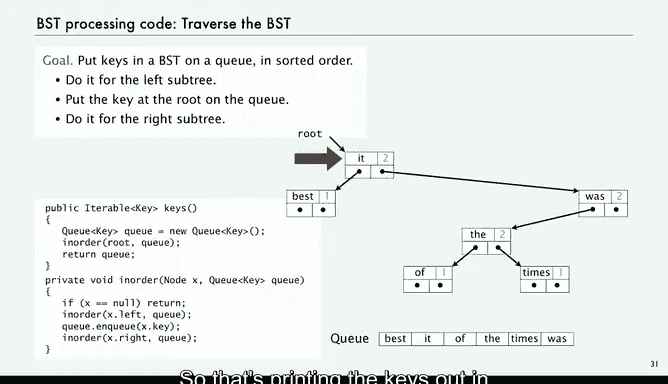

# 普林斯顿大学《计算机科学：算法、理论和机器｜Computer Science： Algorithms, Theory, and Machines》中英字幕 - P13：13_04_04_二叉搜索树.zh_en - GPT中英字幕课程资源 - BV1Ct42177Y6

The data structure that we're going to use to develop efficient implementation for symbol tables is called a binary search tree。

 It's a classic fundamental data structure that every computer scientist should know。

So now what we're going to do is add two links， add another links so that we have a doubly linked data structure and actually this again I showed with one link how many things you can get with two links you can get lots of different things there's a doubly linked list and what we're going to talk about in this lecture is called a binary tree you can implement general trees circular lists。

 the general case is extremely complicated to study so again the adding a second link gives us the flexibility to do a lot of things with the data structure but also the responsibility to keep things under control and again from the point of view of a particular object these structures kind of look the same。

 but they can get to be quite complicated。So maintenance and restricting what we do is a very important part of working with a link structure like this。

Okay， so let's look at a binary search tree， it's a simple doubly linked data structure that uses comparable keys and two links。

 it's a recursive data structure that has distinct comparable keys in its order in a very specific way。

So a BST binary search tree is either null， or it's a reference to a BST node the root。In a BST node。

 it's a data type that has references to a key， a value， and two BSTs， a left subre and a right subt。

So this is an extension of our linked list data type。

 we're going to use a private class that has the information， we're going to have a key in a value。

 and then our links are references to other nodes， one of them is called left and the other one is called right。

And then to make our client code a little bit more succinct。

 we're going to have a constructor that takes a key in value as an argument and sets up the key in value fields。

The key characteristic of the binary search tree is that it's ordered。

 and this is the definition of the ordering within the data structure。

 all the keys in the left subte of each node are smaller than its key and all the keys in the right subte of each node are larger than its key。

Since the keys are distinct， we don't have to worry about equality。

So this is an example of a binary search tree。It's a root is a reference to a node。

 that node's got a key， in this case， the word it。We've got alphabetical order of the keys。

 they have values associated， so it has the value of two associated with it。

On the left is another binary search tree in this case it's just got one node。

 on the right is another binary search tree that's got four nodes。

 All the keys on the left are before it in the alphabet and alphabetical ordering。

 all the keys on the right are after it in the alphabetical ordering， and more than that。

 the trees on the left and the right also satisfy that property。

So and recursively all the way down the data structure。

 so V has a smaller key to its left and a larger key to its right。That's a binary search tree。

 and that's going to be the basis of our symbol table implementation。As with linked lists。

 we'll look at the code that we use to process trees before looking at the symbol table implementation just to get used to working with a data structure of this sort。

So what are the standard operations that we're going to want to perform we' going to want to do a search in the tree。

 we're going to want to add a new key value pair and we're going to want to traverse the tree visit every node in order of the keys also we want to be able to remove a given key that one's a little more complicated and we're not going to address it in this lecture。

 but that's not so difficult and covered in algorithms course。

So let's look at the code required to implement these sorts of operations。All right， so search。

 we want to find the value associated with a given key in a BST or return null if it's not there。

So all we use is a recursive method that mirrors this recursive data structure。

If the given key is less than the key at the current node， go left。If it's greater， go right。呃。

If it's equal， you found it。That's this code。 So our。

Data type operation is going to be called get and we'll call a recursive routine that takes an extra argument。

 which is the tree that you're searching it， so we call a recursive routine for the root。

So now here's our recursive routine， it takes a node and a key， and it's like binary search。

 except that we have to account for the fact that we're working in this recursive data structure。

 not an array。If the node that were given is null， then we say no， we didn't find anything。

Now we do the comparison of the key that we had as argument with the key in the current node。

If it's less， then we just go to the left， recursively call this routine for the node on the left or the tree on the left。

If it's greater， we go to the right， recursively call the routine for the node of the tree on the right。

 Otherwise， it's equal。 return the value that we're supposed to return。 And that's it。

 That's search in a binary search tree。So here's an example。

 suppose that we're searching for the string THE in this tree。

So we start by checking comparing TheE against it， in this case it's greater， so we move right。

 and so now we're comparing THE against what it's less， so we go left。

And then we compare it against the， and that's a search hit， so we just return the value。Okay。

 so what about if the key is not in the tree， so let's look at the code for searching and finding that it's not there and then associating a new value with it。

So again， we're going to use the same basic idea if it's less， go left， if it's greater， go right。u。

That's the code。If it's the value already there， then we just changed the value。

 that's all we're supposed to do in that case。 so now if we're supposed to put a new value with V if it's greater。

 we go to the right， it's less we go to the left。And then we just change the value。

 that's the search it。That's associated a new value。

 so that's easy to do the search and change the value。

 So the code for adding a new key is a little more complicated。

 but if you think about it recursively， it's not so bad。

So what we're going to do is search for the key if it's not in the tree we're going to wind up on nu link in that case we're going to create a new node and return the link to that node every time we go down the tree。

When we come back up， we're going to assign the link to a node that we just went down and in one case it'll be a new node。

So here's what the code looks like， and you want to study this to be sure they understand it's a little bit subtle。

 but not so complicated if you think of it recursively。

So let's suppose we're putting new key worst and associatedsociating with the value1 so in this search it's greater so we go right and worse now it's greater so we go right so now we're wind up on null so in this case we executed the code x dot right equals put of x do right key value and we're on this call to put a x that right key value in that thing that call found a null so it's going to create a new node and then what does it do with that node。

It returns a reference to that node。 So if we look at x dot right equals put of x do right key value。

 put of x dot right key value is a reference to the new node。

 and that's what it assigns in the right link of the node that contains was。

It's also true as we go up the tree we're reassigning links the same links that we went down。

 but that's no real extra cost with this recursive setup we're able to implement insertion just by adding a line to the recursive put routine this code is subtle and it's worthy of study。

 but the bottom line is it's quite easy to add a new node。

The third thing that we want when using a binary search tree as underlying data structure is code that can traverse the tree and give us the keys in sorted order。

So what we're going to do is put them on a queue and we'll see why in just a second this is a very simple recursive method。

 we put them on the queue for the left subte and then we put the key at the root on the queue and then we do it for the right subte。

And how do we convince ourselves that this is going to work well the way we do for any recursive method？

If they're in order on the left， once we've done it on the left。

 we know that those are all smaller than the key at the root so we can put the key at the root on and have them in order。

 including the root。 and then if they're going to be an order in the key in the right。

 we just do it for the right and we can be convinced that we get all the keys in the binary search tree in order。

So。Here's our top level routine， we're going to build a queue and return that cu in this routine called keys and it's got this return type of iterable key so that what that means is that it implements the iterable data type for Java that supports the for each。

And how does that work well we made Q iterable so that a client of our this keys routine can use for each with that because what'll happen is it'll use the queue which is iterable。

 so this enables clients of our symbol table for example， to iterate through keys。

 just because we put them on a queue， client doesn't need to know that。

And then that leads to all we do is call this simple recursive routine for the binary search tree that's referenced by root。

So it takes a reference to a node with a root and our Q as arguments affect as nu just return。

 otherwise recursively call itself for the left， put the key at the root on the Q。

 and then recursively call itself for the right。This is an extremely simple implementation of this basic facility so here's our example。

 so first thing we do is go left and then this the left is null and then it puts the key at the root which is best on the queue and then the right is null so it goes back up to the root and out the top level called the same method for the right subree。

And now we have to go left。Go left again now we have null so we just print that then go back and now this is print the key at that node。

 having done its left subte and now go do its right subte which is just one node and now we go back and now we've done the left subte of that node and we're done because it's right subte is null。

So that's printing the keys out in sorted order for that simple example。

So now we've implemented the basic methods that we need for using a binary search tree as an underlying data structure for symbol table。

 we can search， change of value， add a node and traverse the keys in sorted order。

 so next we'll look at the symbol table ADT implementation in full detail。

