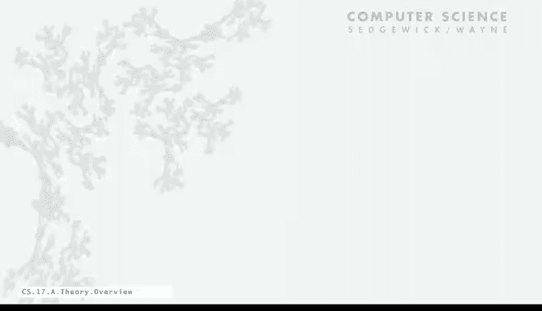
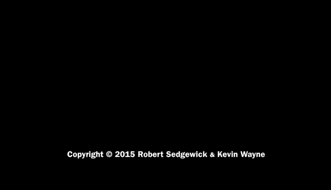

# 普林斯顿大学《计算机科学：算法、理论和机器｜Computer Science： Algorithms, Theory, and Machines》中英字幕 - P16：16_05_02_概述_1.zh_en - GPT中英字幕课程资源 - BV1Ct42177Y6

For the next several lectures， we're going to talk about theoretical computer science。

In many scientific disciplines， people working in the discipline maybe can dismiss theory as something。

 maybe not relevant to what they do daily for computer science， that's not really true。

 Theory is an integral part of our discipline， and everyone should have a basic understanding of the type that we're going to talk about in the next couple of lectures。

We'll begin with a brief overview of the basic issues。

We're going to be talking about very fundamental questions relating to computation。

 like what can a computer do？Or if we have limited resources， what can we do with a computer？

This very general approach that mathematicians and computer scientists have used over the last five or six decades actually。

 first of all， we don't want to talk about specific machines or problems。

 we want to consider what's called abstract machines that have very minimal capabilities and want to see some examples of that in this lecture。

So this is an example of a machine that we'll see at the end and we'll consider very general classes of problems。

 so the idea is to come up with the simplest machine that shares the characteristics of the actual machines that we use and the classes of problems that embody the classes of problems that we care about and try to say general statements。

And the surprising outcome of this approach is that we're going to have sweeping and very relevant statements about all computers。

 it's quite actually an amazing outcome that we'll get to in the next couple of lectures。

 and it doesn't matter whether it's a supercomputer or a new laptop or your phone or an old PC or an old mainframe or even one of the first computers。

 all these computers。Share the same basic properties that we'll be able to articulate really quite precisely。

So in general， there's a question of why study theory， even Yogi Bra had a comment on it。

 in theory there's no difference between theory and practice in practice there is。

 and we'll see that right away in this lecture。Certainly for theoretical computer science。

 we get a very deep understanding of computation that actually is the foundation of all the modern computers that we use。

 It really helps us understand the natural world and there's philosophical implications as well。

In practice， there's all kinds of practical tools that have evolved out of the theoretical studies。

 so when you do web search you need the theory of pattern matching。

 which is very related to these basic computational questions。

 circuits that we use to build computers or compilers that we use to translate from one programming language to another。

 cryptography is based on theory， data compression and many。

 many other fields have evolved from the basic understanding that we get from theoretical studies。

So in this lecture we're going to talk at both levels。

 we'll talk a little bit about theoretical questions， a little bit about practical questions。

 and end up with some basic questions about computation。

So one thing we're going to talk about I already mentioned is the idea of abstract machines。

So what an abstract machine is is really a mathematical model of computation。

 actually for the lecture， we have kind of a graphical model that mimics what you might imagine a real machine。

So there's different types of machines， they have different capability。

 each machine is defined by very specific rules for taking input and producing output。This lecture。

 we're going to talk about the simplest kind of abstract machine called a deterministic finite automaton。

And that's pictured at left and we'll look detail right， and we'll look at details in a minute。

There's another idea called a formal language， formal language is just a set of strings over on the right we have an example of a set of strings。

 so that's the set of English language palindromes say。

 does the thing read the same forward and backwards？

So that's a specific rule that characterizes this set of strings。

 reads the same forward and backwards， and you could have many other。

 imagine many other types of rules， if you can articulate the rules then you're defining a set of strings。

 a set of strings as a formal language。So we're going to talk about a particular set of rules called regular expressions today。

 those turn out to be very useful in many applications。In this lecture。

 we're going to address some basic questions related to these abstractions。For example。

 we might want to know， is a given string in the language defined by a given regular expression or not？

That already is an interesting question to approach。And we might say， well， if we had a computer。

 could we answer this question in particular could a simple computer like a DFA answer this question already with these very simple models we come to interesting questions with useful practical applications。

 that's what most of this lecture is about。

