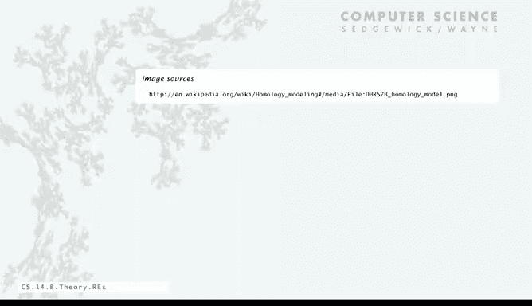

# 计算机科学：算法、理论和机器：P17：正则表达式 🧩

在本节课中，我们将要学习**正则表达式**。正则表达式是解决**模式匹配问题**的重要工具。模式匹配问题的核心是判断一个给定的字符串是否属于某个特定的字符串集合（或称“语言”）。我们将通过多个领域的例子来理解其应用，并学习其基本语法和规则。

## 模式匹配问题示例

正则表达式与一个被称为“模式匹配”的重要问题相关。我们想知道，一个给定的字符串是否属于一个给定的字符串集合，或者说，它是否在某个特定的“语言”中。

以下是来自计算生物化学的一个例子。一种表示氨基酸的方式是使用列出的字符之一：C、A、V、L、I。蛋白质是氨基酸的序列，即由这些字母组成的字符串。有一种特定类型的蛋白质被称为C2H2型锌指结构域签名，它由以下特定规则明确定义：
*   它以C开头。
*   接着是2、3或4个任意氨基酸。
*   然后是另一个C。
*   接着是恰好3个氨基酸。
*   然后是这九个特定氨基酸之一：L、I、V、M、F、Y、W、C或X。
*   接着是8个氨基酸。
*   然后是H。
*   接着是3、4或5个氨基酸。
*   最后以H结尾。

规则相当复杂，但生命本身就是复杂的。因此，我们可能会问：给定一个蛋白质，它是否遵循这些规则？它是否属于C2H2型锌指结构域？

例如，有一个蛋白质字符串：`C V L I C P G C K R Y Y D Q H I R I H`。让我们检查它是否遵循规则：
*   以C开头 ✅
*   接着是三个氨基酸（V L I）✅
*   然后是另一个C ✅
*   接着是恰好三个氨基酸（P G C）✅
*   下一个字母是Y，属于允许的九个之一 ✅
*   接着是八个氨基酸（K R Y Y D Q H I）✅
*   下一个是H ✅
*   接着是三个氨基酸（R I H）✅
*   最后是H ✅

因此，这个字符串属于该规则定义的语言。显然，我们需要能够针对各种蛋白质回答这类问题。

这是第一个例子。

以下是来自商业计算的另一个例子。假设你想定义什么是电子邮件地址。它可能是一系列字母，后跟一个`@`符号，再跟另一个非空的字母序列，接着是一个点`.`，可能重复任意次，最后以`.edu`、`.com`、`.org`、`.gov`或其他合法的后缀结尾。

那么，你可以问以下哪些是电子邮件地址：
*   `princeton.edu` ✅ 符合规则。
*   `not an email address` ❌ 没有`@`符号或点。
*   `nobody@princeton` ❌ 没有以`.edu`或`.com`等结尾。
*   `cs@princeton.edu` ✅ 符合规则。

实际上，精确指定什么是合法的电子邮件地址可能变得相当复杂，这个例子只是为了说明指定规则并不总是那么容易。

挑战在于，我们需要为所讨论的字符串集合开发一个精确的描述，这对于许多此类问题都是如此。我们很快将看到一种方法。

这是来自基因组学的第三个例子。核酸是字母A、C、T或G之一。基因组是核酸的字符串。有一种被称为脆性X综合征模式的序列。

它由以下规则定义：在某个位置有`GCG`，后跟任意数量的`CGG`或`AGG`三联体，最后以`CTG`结尾。事实上，三联体的数量与脆性X综合征相关。

因此，如果你有一个基因组，你可能想知道它是否包含此模式以应对这种疾病。例如，给定一个基因组字符串：`...GCGCGGAGGCTG...`，它是否包含此模式？答案是肯定的，你可以找到`GCG`，然后是三个`CGG`和`AGG`三联体，最后以`CTG`结尾。

以上是三个例子，展示了模式匹配这一基础计算问题在各种应用中的重要性。

## 正则表达式基础

我们用来解决这类问题的工具称为**正则表达式**。它是一种用于指定字符串集合（也称为形式语言）的符号表示法。

一个正则表达式（RE）是以下之一：
*   空集 `∅` 或空字符串 `ε`。
*   单个字符（例如 `A`）。
*   一个通配符符号`.`，代表所有字符。
*   一个用括号括起来的正则表达式 `(RE)`。
*   两个或多个正则表达式的连接 `RE1 RE2`。
*   两个或多个正则表达式的并集 `RE1 | RE2`。
*   一个正则表达式的闭包（克林闭包）`RE*`，表示零次或多次重复。

以下是这些规则的示例：
*   `A A B A A B`：这是一系列单个字符的连接，它指定了仅包含该字符串的集合。只有字符串`A A B A A B`属于该正则表达式定义的语言。
*   `. U . U . U .`：使用通配符`.`可以指定多个字符串。这个表达式匹配所有七个字母、第二个字符起交替出现`U`的单词。例如，`HUMDUM`、`SUCCUB`等属于该集合。任何不严格交替出现`U`的字符串则不匹配。

这是使用连接和通配符的简单例子。

接下来，我们可以有更复杂的操作：
*   **并集**：两个或多个正则表达式的并集，用竖线`|`表示。例如，`(AA | B) AAB`。只有两个字符串`AA AAB`和`B AAB`属于该语言。
*   **闭包**：任何次数的重复，用星号`*`表示。例如，`A B* A` 表示`A`，后跟零个或多个`B`，再跟一个`A`。因此，`AA`、`ABBA`、`ABBBBA`等都属于该集合。但`ABA`（中间有`A`）或`ABB`（不以`A`结尾）则不属于。

值得注意的是，闭包操作已经将我们带入了无限集合，因为`B`的数量可以无限增长。

然后，我们可以使用括号来构建描述特定集合的复杂表达式：
*   例如，`A ((A|B) A A B)`。同样，只有两个字符串`A A A A B`和`A B A A B`属于该集合。
*   或者，`(A B)* A` 表示以`A`结尾的交替`AB`序列。任何出现连续两个`A`或两个`B`的字符串都不属于该正则表达式定义的集合，这同样是一个无限字符串集合。

这些规则简单易懂，但事实证明，它是一种用于指定字符串集合的非常富有表现力的符号表示法。

## 正则表达式的应用与扩展

例如，`.* SPB .*` 匹配任何在内部某处包含连续子串`SPB`的字符串。这类表达式在解决填字游戏时很有用。`raspberry`和`crisp Bread`属于该语言，但`subspace`（`SPB`不连续）或`supreme`（没有`SPB`）则不属于。`.*`允许匹配任意数量的字符。

这是一个更复杂的例子：`(A* B A* B A* B)* A*`。经过思考，你可以确信它指定了所有仅由`A`和`B`组成，且其中`B`的数量是3的倍数的字符串。例如，`BB`（取所有星号为0次）、`AAA`（`B`的数量为0，0是3的倍数）都匹配。如果你的字符串中`B`的数量不是3的倍数，则不匹配。

我们已经开始看到，仅用这种简单的符号就能进行一些计算。

这是另一个例子：`.*0.{4}$` 匹配所有倒数第五位数字是0的字符串（假设字符串足够长）。对于我们的脆性X综合征模式，可以写成：`.* GCG (CGG|AGG)* CTG .*`。如果基因组内部包含脆性X综合征模式，则匹配；否则不匹配。

同样，正则表达式非常富有表现力，并且实际上非常有用，以至于已经开发了许多扩展，即额外的操作，使正则表达式更加实用，因为字符串集合确实是我们在各种应用中最终想要指定的东西。

以下是常见的扩展（广义正则表达式）：
*   `+`：表示**一次或多次**重复（`RE+`），排除了零次的可能性。
*   `[a-z]`：表示**字符类**，匹配`a`到`z`之间的任何小写字母。`[A-Z]`匹配大写字母。这可以用来检查大小写或指定具有正确大小写的语言。
*   `{n}`：表示**精确重复n次**。例如，`\d{5}-\d{4}`匹配一个五位数字，后跟连字符和四位数字，可能用于匹配ZIP+4编码。
*   `{m,n}`：表示**重复m到n次**。例如，`A.{2,4}B`匹配`A`和`B`之间由两到四个任意字符分隔的字符串。
*   `[^...]`：表示**否定字符类**，匹配不在指定集合中的任何字符。例如，`[^aeiou]{6}`匹配一个不含元音的六字符单词。
*   `\s`：匹配任何**空白字符**，如空格、制表符、换行符等，这在处理文本时很有用。

从理论的角度来看，这些扩展只是简写形式，对于理解我们将要讨论的基本理论要点并非必需。你总是可以使用仅包含括号、星号、连接和并集的基本规则来替换这些简写符号。

## 综合示例与应用

现在，让我们看看如何为我们之前考虑的应用编写广义正则表达式。

对于C2H2型锌指结构域签名，规则非常具体，利用我们讨论过的广义符号，为其开发广义正则表达式相当直接：
```
C .{2,4} C .{3} [LIVMFYWCX] .{8} H .{3,5} H
```
这是一个相当紧凑的规则表示法，是一种有用的指定方式。学习这些规则并不难，并且是每个想有效使用计算机的人最终都需要在一定程度上掌握的技能。

这是一个与现实世界蛋白质相关的应用。实际上，科学家和生物学家使用包含正则表达式搜索的网站作为他们工作的组成部分。越来越多的搜索类任务都涉及正则表达式，因为它是一种易于使用且紧凑的符号，用于指定你想要查找的内容。

再来看我们的电子邮件地址想法，这是一个广义正则表达式示例：
```
[a-z]+@[a-z]+\\.(edu|com)
```
它表示：至少一个小写字符，后跟`@`符号，再跟至少一个小写字符序列，后跟点`.`，最后以`.edu`或`.com`结尾。作为练习，你可以思考如何添加其他扩展，如允许数字等。

同样，这是一种非常富有表现力的方式，用于指定你希望视为合法的字符串集合，或者你想知道给定字符串是否属于的语言。

## 总结与前瞻

在本节课中，我们一起学习了**正则表达式**。我们首先通过生物信息学、商业计算和基因组学的例子了解了**模式匹配问题**的重要性。接着，我们系统地学习了正则表达式的基础构成：单个字符、通配符、连接、并集（`|`）和闭包（`*`）。我们还探讨了实践中常用的**广义正则表达式**扩展，如`+`、`{n}`、`[a-z]`、`[^...]`和`\s`等，它们提供了更强大和便捷的描述能力。

现在，我们已经有了一个正式且具体的方式来指定字符串集合或语言。我们接下来的任务是：**给定一个正则表达式和一个字符串，如何确定该字符串是否匹配该正则表达式？** 这将是我们下一节要解决的核心计算问题。

为了巩固理解，这里有几个思考题：
1.  哪些字符串匹配正则表达式 `A* (B B (A B | B A))*`？选项：`ABB`, `AABB`, `ABBA`, `BBAB`, `BBABC`, `AABBAB`。
    *   `ABB`：可以取`A*`为`A`，然后取`BB`，再取零次`(AB|BA)`，因此匹配 ✅。
    *   `AABB`：在`BB`之后，无法只得到一个单独的`A`，必须跟`AB`或`BA`，因此不匹配 ❌。
    *   `ABBA`：不匹配，因为模式要求`BB`后必须紧跟`AB`或`BA`，而这里是`A` ❌。
    *   `BBAB`：可以取`A*`为零次，然后取`BB`，再取`AB`，因此匹配 ✅。
    *   `BBABC`：包含字符`C`，不匹配 ❌。
    *   `AABBAB`：更复杂的推理，`BB`后跟`AB`，但前面部分`AA`和`BB`之间的划分可能存在问题，通常不匹配 ❌。
2.  为基因编写一个正则表达式。基因描述如下：字符是`A`、`C`、T`或`G`；每个基因以`ATG`开头；长度是3的倍数；以`TAG`、`TAA`或`TTG`之一结尾。
    *   答案：`ATG ([ACGT]{3})* (TAG|TAA|TTG)`。开头必须是`ATG`，结尾必须是三个密码子之一，中间是任意数量的、重复三次的`A/C/G/T`组合。我们也可以使用修改过的`.`符号，如果愿意，可以写成`ATG .* (TAG|TAA|TTG)`，但需要额外保证长度是3的倍数，而`(.*)`无法直接表达“长度是3的倍数”这个约束，因此使用`([ACGT]{3})*`更精确。




建议访问课程网站，练习更多关于正则表达式以及字符串是否匹配它们的例子。掌握这些基础对于后续学习模式匹配算法至关重要。