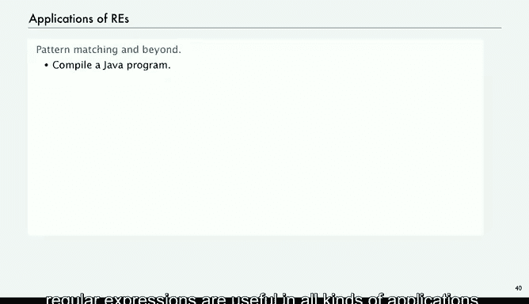

# 普林斯顿大学《计算机科学：算法、理论和机器｜Computer Science： Algorithms, Theory, and Machines》中英字幕 - P19：19_05_05_应用.zh_en - GPT中英字幕课程资源 - BV1Ct42177Y6

Next， we're going to talk about applications of this theory。

 and then we'll go back to the fundamental theoretical questions。

So the most application is a solution to the pattern matching problem， it's called GEP。

 and it's based on the idea of cleaning theorem， which we given a regular expression。

 we build the corresponding a corresponding discrete deterministic finite automaton and then simulate the operation of that machine。

Now in practice， there's a difficulty in this in that the DFA。

Might have exponentially many states for some kinds of REs。

 so that limits the use of this specific algorithm in practice。

 but very soon after a much more efficient algorithm that uses what's called a nondeterministic finite automaton and NFA was developed。

 and that's the one that's the basis of GE。And the NFA will talk briefly about later on。

 it's kind of an imaginary device where the finite automa can go of one of two different states for any given character and it figures out the right one to go to it it's kind of a mind blowlowing concept and you can learn more about that in an algorithms course we will talk about nondeterminism again later。

So that method is called GrP， generalized regular expression pattern Matcher。

 it was developed by Ken Thompson， who won the Turing Award in 1983， in part for this work。

And GEP is everywhere， it's been an indispensable tool for programmers and anyone using computer effectively for decades。

 and now you find it built into systems of all kind， it's in many development environments。

 including Java and we'll look briefly at how it's found within Java next。

You can get a teacher that says，Grep will find you。And there's many。

 many other products you can find out there。So the first thing is that Java string class actually implements GrEP。

 so there's a method called matches that takes this argument a string and that string can be a regular expression that built according to the rules that we've described。

 and then it returns true if this string matches that regular expression and false otherwise。

So if we put in a string RE， and this is our description of the finger domain protein thing。

 and then we have a specific string， then we can say zinc finger dot matches that regular expression。

 and in this case we'll get true。So right away， the capability of recognizing regular expressions is built right into Java and it's definitely worthwhile to use it in these sorts of applications。

 so here's an example just an example of a client， you can write a program that takes a regular expression from the command line and it takes strings from standard input and then validates whether or not those strings are in the set defined by the regular expression。

So we take our regular expression from the command line while standard in is not empty。

 we'll read an input string， and then we'll just print out the result of input that matches the regular expression given on the command line。

呃。So all kinds of applications for this that we've discussed in are examples of regular expressions。

 so you might want to type the zinc finger domain thing and there's a few things that you have to worry about in terms of quotes around the string。

 but therere details and then type in a string and it says， yep。

 that one's in there or type in another one it says no it's not。

So if you know the regular expression and you might not have to go to the website。

 you can deal with problems like this on your own。This is another example that is maybe useful in programming languages is an example of what's a legal Java identifier。

 so 12，3 is legal， but 123 is not， you can't start with a number， it's just another example。

And here's our email example， our simplified email address example。

 and again this stuff is all built into Java so for a broad variety of applications you can put a regular expression on the command line and then a bunch of strings and try to understand how that regular expression is working to validate whether or not the strings that you have are in the language described by the regular expression that's a very simple client。

There's actually many other useful methods related to regular expressions built into Java。

 so you can use search and replace defined by regular expressions。

 and then what's called parsing is taking a string and dividing it up according to the appearance of substrs。

 matching a regular expression。And I'm not going to spend a lot of time with this。

 not appropriate to cover this level of detail in lecture。

 but wanted to make people aware that there's quite a bit of powerful string processing built right into Java string class。

So for example， you can call replace all for a given string and its first argument is a regular expression and the second argument is a string and you can just replace all occurrences of the substrings matching the regular expression with your given string and this is useful to clean up data of all kinds we'll see some examples。

Or the other thing is to split the string around occurrences of or matches of the given regular expression。

 and then that if there's a lot of occurrences of the regular expression in our big string。

 then this will make an array of the substrings that appear in between and again we use this in all kinds of applications。

So here's an example of cleaning up data so where we want to clean up white space in a text string。

 so we want to in a process， a text string， but we don't care if there's three spaces between words or one or if there's a tab or a new line。

 we want all of those to。Be treated the same。 So we have this tricky notation that often comes up in string processing where we have to use a backslash or two backslashes to specify a single one。

 So what this means is one or more white space characters。

And so then if we have a string read everything on standard input， say the contents of a web page。

 then we can call replace all to replace all contiguous occurrences of white space with a single space。

 so that's really useful， that's where we get our examples of text for various algorithms。

Or we can use split around the white space and just get the distinct words in a big input text so a little bit for experts but not so much once you've seen a few examples like that。

 you can to see ways to take big strings and clean them up and process them and we do this quite often in our examples for this course。

You can even go away beyond this is an interface defined for professionals。

 but it's still worth a study where actually what you can do is the special classes for taking regular expression in creating really the machine。

 the pattern matching machine that can find substrings。

 matching the pattern in the given input stream， and this gives even more flexibility in processing strings and again I'm not going to take the time to go through the details of these implementations。

 but if you're interested they're worth studying and they're quite related to the basic concepts that we've been talking about。

So here's an example of a client that uses this stuff。

 and I won't again go through the details of the client just to show the types of things that are possible with just a little bit more study。

So maybe you want to harvest information from a huge input stream。

 so what we do is take the regular expression from the command line。

 take our input from standard input， a file or our web page， and then print all the substrs。

 matching the regular expression。And this is not built into the string class。

 we have to call these special classes built for regular expressions。

 you can see there in Java Uti Ragx。And so here's what the code looks like。

 so first thing is to just take our regular expression from the command line。

 then build an input stream and then read the whole thing and that's our input stream。

Then we build a pattern which takes the regular expression and compiles it into basically an automaton that's going to go through the string and we build a match out of that and as long as match finds the occurrence we print out what we've seen since the last occurrence。

 that's what the group is。Pretty simple code and again。

 not my intent that everybody should understand every on that code， but if you study it。

 you find it to be useful。So if we have a chromosome and we go ahead and look for our fragile X syndrome。

 we can print out all the occurrences of it in that one chromosome。

And that can be hugely a huge file thing like that。

 and then again it matters how many occurrences of the triplet appear。

 but the CGG and the AGG appear between the two endpoints。Or you might want to get email addresses。

 so this is a command that we've shown in class for many years for harvesting email addresses off a web page and you might expect to get our emails out of there actually that doesn't work anymore probably because we've been showing this slide in class because there's no email addresses on that site anymore。

 and that's true of many sites just for this reason it's so easy now to harvest emails in this way。

So。In summary， regular expressions and DFAs， which we use to recognize languages。

TheD byvarigular expressions are useful in all kinds of applications。

 and these are just a few that we're listing， you certainly will encounter them as you use computers for more and more sophisticated applications。

So our point of this last section is to convince you that theory is useful。

 but next we have to really get into the basic theoretical questions surrounding this。So sure。

 Grin facilities like that are built into many， many systems that you'll be using。

 but it iss only the tip of the iceberg as far as the theory goes and that's what we'll look at next。

