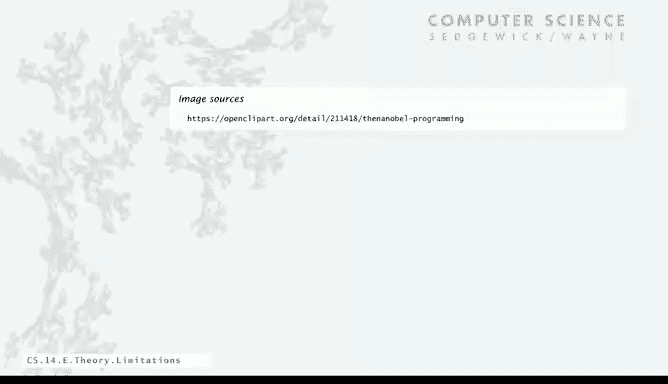

# 计算机科学：算法、理论和机器：P20：计算能力的局限性


在本节课中，我们将要学习理论计算机科学的一个核心概念：计算能力的局限性。我们将探讨是否存在正则表达式或确定性有限自动机无法描述的字符串集合，并通过一个具体的数学证明来理解这种局限性。最后，我们将初步了解如何通过增强机器模型（如添加栈）来扩展其计算能力。

---

## 计算能力的局限性

上一节我们介绍了正则表达式和确定性有限自动机（DFA）作为描述字符串集合的强大工具。本节中，我们来看看这些工具的能力边界。

一个基本的问题是：是否存在任何正则表达式都无法描述的字符串集合？答案是肯定的。我们将通过一个数学证明来展示，不存在任何正则表达式可以描述“包含相等数量0和1的比特字符串”这一集合。这仅仅是众多例子中的一个，其他例子还包括合法的正则表达式字符串本身、质数、生物学中的互补回文序列等。这些集合都超出了正则表达式的能力范围。

同样的问题也适用于DFA。根据克林定理，这与正则表达式的问题是等价的。我们无法构建一个DFA来识别包含相等数量0和1的比特字符串。如果我们能证明这一点，也就同时证明了不存在描述该语言的正则表达式。

---

## 一个关键命题的证明

我们的命题是：**存在一个字符串集合，无法被任何正则表达式或DFA描述**。

我们将通过证明一个具体的语言——**包含相等数量0和1的比特字符串集合**——无法被任何DFA识别，来证明这个命题。证明将采用反证法。

1.  **假设**：假设存在一个DFA `M` 能够识别该语言。设 `M` 的状态数为 `n`（一个有限的数字）。
2.  **构造输入**：考虑输入字符串 `s`，它由 `n+1` 个 `0` 后接 `n+1` 个 `1` 组成。显然，`s` 包含相等数量的0和1，根据假设，`M` 应接受 `s`。
3.  **分析状态转移**：当 `M` 读取 `s` 开头的 `n+1` 个 `0` 时，它会经历一系列状态。由于 `M` 只有 `n` 个不同的状态，根据**鸽巢原理**，在读取这 `n+1` 个 `0` 的过程中，至少有一个状态 `q` 被访问了两次。
4.  **找到循环**：设第一次和第二次访问状态 `q` 时，已经读取的 `0` 的数量分别为 `i` 和 `j`（`i < j`）。这意味着在状态 `q` 之间，`M` 读取了 `j - i` 个 `0`，并且完成了一个循环。
5.  **构造矛盾**：现在，我们构造一个新字符串 `s‘`，它从 `s` 中删除这 `j - i` 个 `0`（即删除导致循环的那部分 `0`）。由于 `M` 是确定性的，并且循环开始和结束于同一状态 `q`，`M` 在处理 `s‘` 时，其状态转移路径将与处理 `s` 时在循环后的部分完全相同。因此，`M` 也会接受 `s‘`。
6.  **得出矛盾**：然而，字符串 `s‘` 中 `0` 的数量比 `1` 少（因为只删除了 `0`，没删除 `1`），它并不属于“包含相等数量0和1的比特字符串”这一语言。这与我们最初的假设——`M` 能识别该语言——相矛盾。

因此，我们的假设是错误的。**不存在任何DFA能够识别“包含相等数量0和1的比特字符串”这一语言**。根据克林定理，这也意味着不存在描述该语言的正则表达式。

这个证明展示了DFA和正则表达式模型固有的局限性。

---

## 扩展计算能力：添加栈

既然简单的DFA能力有限，一个自然的问题是：是否存在更强大的机器模型能够识别这类语言？答案是肯定的。

我们可以通过给DFA添加一个**栈**来增强其能力，得到**下推自动机**。其核心思想是利用栈的“后进先出”特性来记忆信息。

以下是识别“相等数量0和1”语言的一个非形式化算法描述：

```python
# 伪代码：使用栈识别0和1数量相等的字符串
stack = []
for character in input_string:
    if stack is empty:
        push character onto stack
    else if character == top of stack:
        push character onto stack
    else: # character != top of stack
        pop from stack

if stack is empty:
    accept the string
else:
    reject the string
```

**工作原理**：
*   读取 `0` 时，将其压入栈。
*   读取 `1` 时，如果栈顶是 `0`，则弹出（表示匹配了一对0和1）；如果栈为空或栈顶是 `1`，则将 `1` 压入栈。
*   处理完整个字符串后，如果栈为空，说明0和1的数量相等，机器接受该字符串；否则拒绝。

仅仅通过添加一个栈，我们就获得了一个能够识别更复杂语言（上下文无关语言）的机器模型。这体现了在抽象机器上增加存储或计算资源可以扩展其能力范围。

---

## 更强大的机器与根本极限

那么，能力的扩展是否无止境？如果我们添加第二个栈呢？

拥有两个栈的自动机（本质上等同于**图灵机**）能力会得到极大提升。它可以识别诸如“质数的二进制表示”、“合法的Java程序”等极其复杂的语言。

一个令人惊异的事实是：**在计算能力上，拥有两个栈的自动机已经达到了一个根本性的极限**。即使再添加第三个、第四个栈，或者使用一房间的超级计算机，在“能识别哪些语言”这个问题上，其能力**并不会超过**一个拥有两个栈的简单自动机。

这个简单的双栈自动机模型，从可计算性的角度看，与最强大的超级计算机是等价的。这引出了理论计算机科学中最深刻的问题之一：**什么是可计算的？** 我们将在下一讲中深入探讨这个根本性的计算极限。

---




本节课中我们一起学习了计算能力的局限性。我们证明了DFA和正则表达式无法描述某些简单的语言（如0和1数量相等的字符串），从而理解了基础计算模型的边界。接着，我们看到了如何通过添加栈来增强机器模型，突破原有的限制。最后，我们了解到能力的增强存在一个根本性的天花板——图灵机模型，这为下一讲讨论“可计算性”这一核心主题奠定了基础。