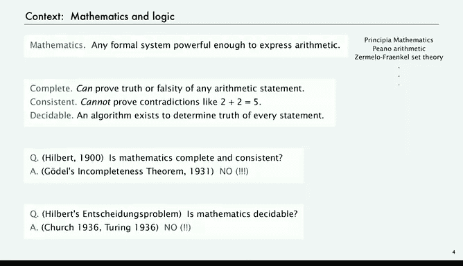
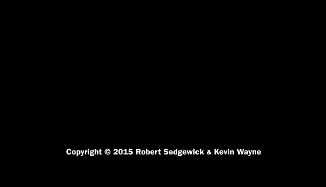

# 计算机科学：算法、理论和机器：P21：背景与可计算性理论

在本节课中，我们将探讨理论计算机科学的核心——可计算性理论。这一理论由英国数学家艾伦·图灵在20世纪30年代建立，为计算研究提供了形式化基础。我们将了解计算的普适性及其极限，并回顾相关的数学背景。

## 数学背景：希尔伯特的问题

上一节我们介绍了可计算性理论的重要性，本节中我们来看看其诞生的数学背景。20世纪初，数学家大卫·希尔伯特提出了一系列关于数学基础的根本性问题。

以下是希尔伯特在1900年著名数学大会上提出的核心问题：

*   **完备性**：一个形式系统是否足够强大，能够证明或证伪在该系统内可以表达的所有陈述？
*   **一致性**：在该系统内，是否不可能推导出矛盾的陈述（例如 `2 + 2 = 5`）？
*   **可判定性**：是否存在一个**算法**，可以确定该系统内任何陈述的真假？

当时，数学界普遍相信数学既是完备的、一致的，也是可判定的。然而，随后的发展彻底颠覆了这一认知。

## 哥德尔的不完备性定理

1931年，普林斯顿大学的库尔特·哥德尔证明了其著名的**不完备性定理**，震惊了整个数学界。

该定理指出：**任何足够强大、能够表达算术的形式系统，不可能同时满足完备性和一致性**。这意味着，在这样一个系统内，总存在一些既不能被证明也不能被证伪的真实陈述。这个深刻的结果动摇了数学的基础。

## 邱奇与图灵的贡献

希尔伯特还提出了“判定性问题”：数学是否是可判定的？是否存在一个通用算法来判断任何数学陈述的真假？

在20世纪30年代，普林斯顿大学的阿隆佐·邱奇以及当时在普林斯顿访学的英国学生艾伦·图灵，分别通过**λ演算**和**图灵机**模型，独立地给出了这个问题的答案：**否**。

他们的工作表明，不存在一个通用算法能够解决所有数学陈述的判定问题。这一结论不仅回答了希尔伯特的问题，更从根本上划定了计算的边界，为理解计算机能做什么和不能做什么奠定了理论基础。

## 从数学到计算

现在，我们将从这些宏大的数学问题，转向更贴近我们上节课所讨论的简单机器的层面。理解上述背景非常重要，它能帮助我们明白为何当时的人们会对这类结果如此着迷，以及它们如何塑造了我们今天对计算本质的理解。

本节课中，我们一起学习了可计算性理论的数学起源。我们回顾了希尔伯特提出的关于数学基础的三大问题，了解了哥德尔不完备性定理如何证明了完备性与一致性不可兼得，并看到了邱奇与图灵如何最终证明了数学的不可判定性。这些里程碑式的工作，共同构成了现代理论计算机科学的基石。