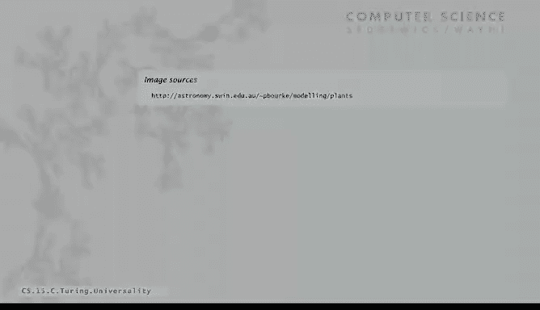
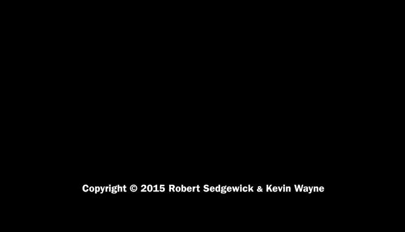

# 计算机科学：算法、理论和机器：23：通用性 🧠

在本节课中，我们将要学习计算机科学中一个极其深刻的概念——**通用性**。我们将探讨图灵机如何成为所有计算模型的基石，以及“通用图灵机”的存在如何证明单一机器能够执行任何可计算任务。我们还将看到，这一思想如何延伸到其他看似简单的系统（如“生命游戏”）中，并理解其深远意义。

---

图灵的贡献不仅在于提出了一个简单的计算模型，还在于证明了该模型足够强大，能够执行我们所能想象的任何计算。这个概念被称为**通用性**。

图灵机本质上不过是一个有限的符号序列。我们之前曾以图形方式展示过“递减图灵机”，但它也有一个文本文件表示形式，即一串符号。因此，我们可以将一台图灵机及其输入都放在一条图灵机纸带上。只需在纸带上用空格分隔，放置不同的符号即可。左边是我们想要运行的输入，右边则是该图灵机的完整描述。这样，图灵机及其输入就全部由一个有限的符号序列描述了。

这意味着，我们可以开发另一台图灵机，它能将此作为输入，并模拟其操作。由于任何图灵机都可以用这种方式以有限符号集描述，这台以描述为输入的图灵机将能够模拟任何其他图灵机的操作，就像我们的Java程序所做的那样。这就是**通用图灵机**的思想：一台以任何其他图灵机及其输入纸带作为输入的图灵机。

这是一台特定的机器，称为通用图灵机。在我们的例子中，输入是“递减器图灵机”及其要递减的数字。实际上，你可以将任何图灵机放在那里。通用图灵机的作用是，最终在纸带上留下的内容，与纸带上描述的那台图灵机在给定输入下运行时留下的内容**完全相同**。如果那台机器进入循环，通用图灵机也会循环；如果它停机，通用图灵机也会停机。在我们的例子中，它会将输入数字减一并清空纸带的其余部分。

图灵认识到，模拟一台图灵机本身就是一个简单的计算任务，可以用我们为图灵机设定的基本操作来完成。既然它是一个简单的计算任务，那么就存在一台图灵机来完成它——那就是通用图灵机。或许更容易理解的方式是：看看我们的Java模拟器所做的一切，然后为每一部分思考如何构建一个图灵机（或图灵机的一部分）来完成它。实际上，我们经常做的只是去查表，以确定下一步应该进入什么状态等等。这是一个相当简单的计算任务，我们的模拟器为其提供了路线图。我们不需要构建“构造器”，因为一切都已经在纸带上了。至于模拟无限长的纸带，我们也不必担心，因为图灵机本身已经拥有无限长的纸带。大部分工作在于更新状态。

如果你想了解细节，或为任何计算任务构建自己的图灵机，有很多资源可供参考。事实上，我们在书籍网站上有一个完整的图灵机开发环境，其中包含一个**24状态**的通用图灵机。你可以去研究它，并在我们的“递减器”或任何你想模拟的图灵机上运行它。只要你将输入以正确的格式放在纸带上，它就能模拟任何图灵机的操作。

如果你觉得24是个小数字，实际上人们已经开发出只有**4个状态**和**6种不同符号**的通用图灵机。需要提醒的是，如果你开始研究图灵机，并且喜欢处理离散过程和编程，这可能会让人上瘾。你会在书籍网站上找到许多人们为各种计算任务开发的图灵机示例。

---

上一节我们介绍了通用图灵机的概念，本节中我们来看看通用性的深远意义。

通用性的思想确实非常深刻。通用图灵机是一个非常简单的计算模型，但在精确的技术意义上，它是**通用**的。我们将一个任务定义为**可计算的**，如果存在一台图灵机能够计算它。

图灵证明的是，可以发明一台**单一的机器**，用来执行任何可计算的任务。这个证明就是通用图灵机的存在。这是图灵的主要定理之一。

由此产生的一个推论是：如果你能模拟一台图灵机，你实际上就能模拟一台通用图灵机。因此，如果你制造的任何机器能够模拟图灵机的操作，那么它就能执行任何可计算的任务。因为具体来说，它可以模拟通用图灵机，而通用图灵机能执行任何可计算的任务。

这意味着，就**可计算的内容**而言，任何一台这样的机器都是通用的。我们不需要为可能遇到的每个任务（如解决科学问题、处理电子邮件或播放音乐）分别制造不同的计算机。这意味着所有我们能发明的计算机都是**等价**的，它们是通用的，因为它们能做图灵机能做的任何事情，也就是任何可计算的任务。这是一个非常深刻的结果，也具有许多实际意义。

---

通用性的思想不仅限于图灵机。让我们看一个不同的例子，它展示了简单规则如何产生通用计算能力。

这个例子你可能见过，叫做**生命游戏**。它是一种不同的、简单的形式化计算模型，称为**细胞自动机**。

我们想象一个无限的方形网格，其中的细胞根据特定规则生存或死亡。时间是离散的，一步步前进。

以下是决定细胞生死的一些规则：
*   它取决于其八个邻居的值。
*   如果一个细胞的活邻居太少（0个或1个），它会因孤独而死亡。
*   如果活邻居的数量恰到好处（2个或3个），它将存活到下一代。
*   如果活邻居太多（超过3个），它会因过度拥挤而死亡。
*   另一条规则是：如果一个细胞恰好有3个活邻居，它就会诞生。

这些是简单的规则。假设我们在特定时间T有这个配置。

那么，我们可以为每个细胞计算其八个直接邻居的数量。根据这些数量，你可以推断出每个细胞接下来会发生什么：边缘的细胞邻居数为0；有几个恰好有3个邻居；有几个会因孤独而死，有一个会因过度拥挤而死。你可以验证，在时间T+1，我们得到了一个不同的配置。

问题是，这个离散计算模型的故事到底是什么？它确实是一个计算模型，你马上就会看到。

康威生命游戏的思想是，即使是像这样比图灵机更简单的规则，也能导致相当复杂的行为。很早以前，人们就意识到有一种叫做“滑翔机”的东西。经过一、二、三、四步后，这个东西具有相同的形式，但它会沿着网格向下移动。网格是无限延伸的，所以如果你得到那个配置，它就会移动。

你可以写一个Java程序来实现生命游戏，看看会发生什么。我写了一个，这就是我们这里一些演示的来源。这是一个非常简单的程序，可能在我们讨论数组时可以作为作业。

但该程序的输入可以导致有趣而复杂的行为。一个相当惊人的东西叫做“滑翔机枪”。如果你这样开始，接下来会发生这些。它看起来相当复杂，但过一会儿，你会意识到这个“滑翔机枪”在顶部来回反弹，但它会不断发射出滑翔机。

仔细想想，我们能从如此简单的规则中得到这种行为，实际上是非常深刻的。那些滑翔机正在传输信息。如果我们能传输信息，也许我们能做更多事情。还有另一个层次，有一种“滑翔机枪繁殖器”，它能生成滑翔机枪，而这些滑翔机枪又都能生成滑翔机，行为极其复杂。

有人已经发现，如果你有那个起始配置（一个相当复杂的起始配置），经过仔细研究（需要相当深入的研究），你会理解，实际上那个东西就是一台**通用图灵机**。你几乎可以看到纸带沿着对角线延伸，而状态图则像一个小阵列位于左下角。

因此，利用生命游戏，我们可以构建一台通用图灵机。这意味着任何我们可以计算的东西（根据图灵机的定义），都可以用生命游戏来计算。这非常令人惊讶，是与现实世界非常深刻的联系。

---

那么，这些不同的模型之间是什么关系呢？这就是邱奇和图灵所阐述的。

当时许多人在研究不同的计算模型，他们试图看看一个模型是否比另一个更强大，就像我们在上一讲末尾看到的一栈和两栈机器一样。顺便说一下，两栈机器，正如我们用两个栈模拟纸带时所看到的，你可以让它像图灵机一样工作。因此，两栈机等价于图灵机，所以它们能计算图灵机能计算的任何东西，它们是等价的。

邱奇和图灵阐述的是，任何我们在这个宇宙中能做的事情都将是等价的。一台通用图灵机可以模拟任何其他模型，任何其他模型如果能模拟通用图灵机，那么它们都是等价的，都能计算相同的东西。然而，这一点无法被证明，因为它涉及到宇宙的物理属性。它可能被证伪，但我们永远无法证明它是真的。

因此，自这个**论题**被阐述以来，如果有人想研究一个新的计算模型或一个新的离散物理过程，我们可以使用**模拟**来证明它等价于某个已知的、我们已经知道与图灵机等价的物理过程或计算模型。我们将在课程后面看到一个我们定义的小机器，我们可以在Java中模拟它，反之亦然。当你拥有Java编译器时，它所做的就是获取一个Java程序并使其在那个简单机器上运行，所以那些机器是等价的。通过Java模拟器，我们展示了与图灵机在一个方向上的等价性；通过几个步骤，你可以展示另一个方向上的等价性。

总的来说，使用模拟来证明计算模型等价并不困难。这意味着，如果你相信这一点，那么一旦你超越了两栈机，就无需寻找能计算更多东西的机器了。一切都关乎**便利性和效率**，而不是关于**可解决问题的种类**。这一点非常重要，因为如果我们相信邱奇-图灵论题，它使我们能够对宇宙中的计算是什么进行严格的研究。

有很多证据支持这一点，因为许多许多计算模型已被证明是等价的。这只是一个简短的列表，其中一些来自数学家试图提出更强大的计算模型，另一些则随着人们开发不同的计算方式而实际出现。

事实上，八十多年来，人们已经开发了非常多不同的计算模型，并且仍在继续。就计算设备能解决的问题而言，它们都被证明是等价的。这一切都始于图灵机，这个由图灵阐述的简单机器，作为我们对“可计算”的定义。

这些通用模型有时与自然界有着惊人的相似之处。这是一个叫做“林登迈耶系统”的模型，它是一个形式化模型，并不比图灵机复杂多少，但可以链接到图形模型，这让我们思考：自然界中是否也存在可计算性？这类问题是深刻而重要的。

---

**本节课中我们一起学习了：**
1.  **通用图灵机**的概念：一台可以模拟任何其他图灵机的特殊图灵机，证明了单一机器执行任何可计算任务的可能性。
2.  通用性的深远意义：它意味着所有足够强大的计算模型在能力上是**等价**的，区别在于效率而非根本能力。
3.  **邱奇-图灵论题**：关于“可计算性”的哲学断言，认为任何在物理上可实现的计算过程都能被图灵机模拟。
4.  通用性不仅限于图灵机，在其他简单系统（如**生命游戏**）中也能实现，展示了简单规则产生复杂、通用行为的潜力。
5.  通过**模拟**可以证明不同计算模型之间的等价性，这巩固了我们对计算本质的理解。