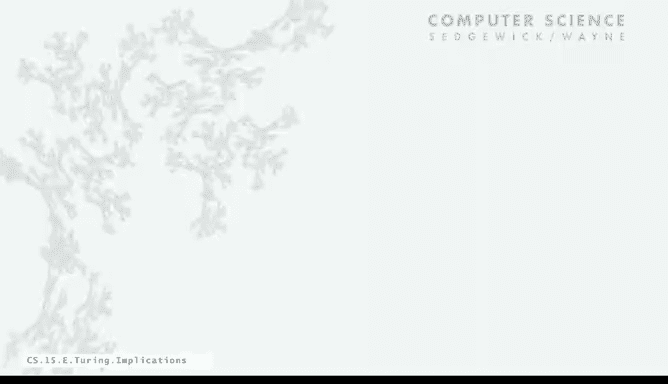

# 普林斯顿大学《计算机科学：算法、理论和机器｜Computer Science： Algorithms, Theory, and Machines》中英字幕 - P25：25_06_06_影响.zh_en - GPT中英字幕课程资源 - BV1Ct42177Y6

So let's take a look now at implications of the undecidability of the halting problem。

I think the main thing that people should take away is that if you know that a problem is undecidable。

 don't try to solve it。Here's Alice and Bob， Alice。

 we came up with an idea at our hackathon we're going to go for startup so what's the idea Well。

 we're going to have an app that you can use to make sure that any app you download won't hang your phone。

Alice， who has taken a few computer science courses， says， well， I think that's undecidable。

Bobob really doesn't know quite what that means， so maybe a better way to phrase it is what happens if you give your app itself。

 that's the self reference part that really characterizes noncomputability or undecidability and let's take a look at some more implications。

诶。If you really think about it， this idea is the reason that it's difficult to debug programs。

Because all the following things are undecidable。 halting problem is something that every beginning programmer would like to solve as soon as you learn about loops。

 and as soon as you have your first program go into an infinite loop， You wonder。

 why doesn't my instructor have a program that takes my program is input and checks whether or not it's got an infinite loop。

 You can't， because the undecidability of the halting problem。

 What would that program do if it was given itself as input and so forth and so on。

 without much trouble you get back to Tring's proof。

And then there's lots of similar problems that with similar types of constructions can be proved to be undecidable。

The idea is to assume that you can solve the holding problem。 you could solve the holding problem。

 then you can solve this problem。 But since the holding problem is undecidable。

 that would mean that this problem is undecidable。So these types of things， given a function。

 does it halt on every inbook？Input X， given a function would no input does it hold。

Do two functions always return the same value， That's another one that every programmer would like to have。

 I have a new version of an old program and I want to know if it does the same thing and you might go and get a job in the software industry and have a manager ask you to write up something like this and you can say no。

 I can't do it。 It's undecidable。And all kinds of things in programming systems。

 so did I declare a variable and then use it without initializing it again， undecidable？

I have a huge programming system， there's lots of code in there。

 does every line of code going to get executed equivalent been proven equivalent to the halting problem。

So each one of these， people prove by showing that if you solved it。

 that would be a solution to the halting problem， which thought was undecidable。

So we're going to stamp these undecidable methods， undecidable problems this way。So the question is。

 why are program development environments complicated。

 theyre programs that manipulate programs and therefore they're susceptible to this self reference idea。

But it goes way beyond programming systems。 Well， here's another example。

 that's remember Hilbert's in Chinaning's problem， which is the decision problem。

 is mathematics Decidable。So given a first order logic。

 a mathematical system with a finite number of additional axioms。

 is it provable from the axioms using the rules of objects？

Or church had a different formal system called the Lambda calculus that he developed in order to try to address this。

 it's also the basis of modern functional programming languages that's programming languages based on functions operating on functions。

So if you use Ha or Java 8， and what church in Turing showed through equivalence of the Lambda calculus and Turing machines and the halting problem is that Hilberts and Shiidings problem is undecidable。

There's many others， the post correspondence problem that we gave at the beginning。

 and you write a program that takes the different types of cards as input and tells you whether or not there's an arrangement that has matching top and bottom spring。

That was another model of competition， and another decade or more later。

 Post proved that that problem is undecidable。And it's not just toy problems。

 computational mathematics is a fine area of important application。

 and nowadays people use systems like Mathematica in Sage and MATLb and other systems。

 and that's functions that manipulate functions。So there's a famous one known as Hilbert's10th problem given again around 1900。

 Hilbert asked， so given a multivariate polynomial， does it have integral roots。

 that is are there integer such that evaluating the polynomial at those integers is equal to 0。

 So so here's an example， say it's6 x cubed Y z squared plus 3 x Y z squared minus xq minus-10。

 Are there values of x Y and z that make that0 or not， In this case there is 5。

3 and0 does it but in this case x square plus y squared minus-3 theres no way。

 So can we have as part of our mathematical manipulation systems a facility that you give it a polynomial and it tells you whether or not it has integral roots or not No。

 it's undecidable that was a difficult result that was。Proved more than 100 years after。

However aroundund 100 years after Hilbert Po formulated it。

Definite integration that's something that you'd like to have in our mathematical symbolic manipulation systems。

 So if you have a rational function that's composed of polynomials and trigometric functions you want to know does the definite integral from minus infinity to infinity of that function exist so like cosine x over1 plus x squared yeah that's pi over E but cosine x over1 minus x squared。

 no， so if a user types in a rational function like that that arises in an application you'd like to if you can't provide the answer you'd like to at least say that no such answer exist can't do it it's undecidable from computer science。

 there's all kinds of different ones so data compression we have a movie you want to compress it to make it smaller so I want to make it as small as I can what' the one way to formulate that is。

Given a string， find the shortest program that can produce it， or given a picture。

 find the shortest program that can produce it。Remember we did the manlebrot set that's a pretty complicated picture。

 we produce that with a 34 line program， but if some data compression method gets that picture。

 can it figure out a short program to produce it， No， that's undecidable。Vi identification。

 so there's a virus out on the web that you load into your computer would be nice to have a program that can analyze the code that you bring into computer and tell you whether or not it's a virus can't that's undecidable。

So all of those practical applications are extremely important。

 you should know whether or not problem is undecidable or not。

 but really let's review the key ideas in Turing's paper。

 this is a single paper called oncomputable numbers with application to the enshtidings problem。

 it's been called one of the most impactful scientific papers of the 20th century。In that paper。

 he introduced the Turing machine， a formal model of computation。

The equivalentvalence of programs and data， we encode both programs and their data as strings。

 and we compute with them both。The idea of universality。

 the concept that we can have one device that can compute anything that we know how to compute。

The third church Tring thesis that says if you can compute it at all。

 you can compute it with a Tring machine and therefore anything in this universe that computes is equivalent to a Tring machine。

The idea that there are limits to computation and there are things that we cannot compute。

 all of these things were published in this paper in 1936。

 which is 10 years before the earliest computers and we'll talk later about the Antic that was worked on in the 40s。

 all of these things were thought about abstractly before we even had in computers。Now。

 John von Neuman， who' is a scientist at Princeton。

 read this paper and talked to Turing and we'll pick up this story later on。But for now。

 let's talk about the importance of theoretical computer science and Turing's ideas。

 and he's sometimes called the father of computer science。

This is a quote from a famous biography of Turing called Alan Turing。

 the Enigma written by John Hodges。So he's saying， well。

 it wasn't only a matter of abstract mathematics， not just a play of symbols。

 because it involved thinking about what people do in the physical world。

It was a play of imagination like that of Einstein or Van Neumman doubting the axioms rather than measuring effects。

What he had done was to combine such a naive mechanistic picture of the mind with precise logic of pure mathematics。

His machines， which were soon to be called Tring machines， offered a bridge。

 a connection between abstract symbols in the physical world。

 And that's the true significance of this work and it has really had important implications in the development of the computational infrastructure that we now enjoy。

 touring showed that the biggest Google data center in terms of power in terms of problems it can solve is no different than the simple model of his universal touring machine。

 quite a stunning result with long lasting implications。

