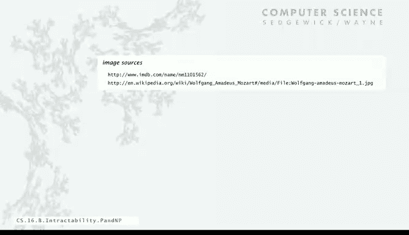
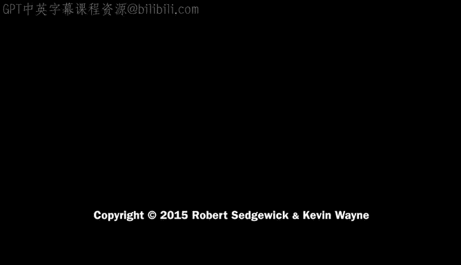

# 普林斯顿大学《计算机科学：算法、理论和机器｜Computer Science： Algorithms, Theory, and Machines》中英字幕 - P27：27_07_03_P与NP类.zh_en - GPT中英字幕课程资源 - BV1Ct42177Y6

To begin， we're going to start with rigorous definitions of our cast of characters。

 which are classes of problems， and we want to classify problems in terms of efficiency。

So to start out， we'll have the concept of a search problem， I're going to call a search problem。

 any problem for which there's an efficient algorithm to certify a solution。

I want to say at least if you have a problem in your given solution。

 you want to know that you've got a solution。So for example， the traveling salesperson problem。

 we have a set of cities， para wide distances and threshold M if somebody gives you a solution which is a permutation of the cities that the order in which you're supposed to visit them。

 then you can easily check by just adding the distances to make sure that the total is less than am。

 so that's just a linear time algorithms as long as the algorithm that certified solution is guaranteed polynomial time。

 that's a search problem。We've got a problem if we have a solution。

 we know that we have a solution because we have an algorithm that can check it。

So that brings us to the class NP， we're going to call the class of all such problems。

 all search problems， we're going to give it the name NP and I'll give you the reason for that name in a minute for it。

 but now let's just take that to be the name。So here's example so just showed that TSP with a set of cities and a threshold value is a search problem because there's an algorithm that checks that anything is supposed to be a solution is actually a solution。

Integer linear programming is a search problem the problem is you're given a set of inequalities and you're supposed to find a binary vector that satisfies those inequalities and again if you're given the values of x that are supposed to be a solution you can plug those values into the inequalities and check each equation to make sure that it in fact holds in the same first satisfiability again as I did when I was explaining it。

 given a set of values for a solution you can plug them into the equations and check that it's in fact a solution。

there' many， many other search problems， for example， here's an important one factoring。

 so you're supposed to find a factor of the integer M while M and1 are factors。

 so a non trivial factor besides those two。So you're given a number and somebody says well here's a factor。

 you can just use long division to check whether that's a factor or not。

 so definitely a search problem there' a polynomial trim algorithm to check that purbported solution is actually a solution。

All problems of that nature are called search problems and what we think of those is really those are the problems that we would like to solve。

 many， many problems like that， where we can precisely formulate what the problem is and if we have a solution we know that it's a solution or we can find out that it's a solution。

Very， very significant class of problems， really all the problems that people would want to solve with a computer。

Now with a search problem you always can find a solution by checking all possibilities we call that brute force search so for TSP you can go through and try all possible permutations of the cities in order to find one that has length less than m and that's a method for solving the problem for sure。

 integer linear programming you're supposed to find n values that's the number of variables that are satisfied the equations that you have well if you have n binary variables each one of them can take on either of the values zero and one so this's two to the n different possibilities and you have to try those alls to find a brute force solution to integer linear programming and similar for satisfiability for factoring。

Your size of the problem is the number of digits in the number and so number of possibilities you only have to go up to try the square root of the number you try dividing everything up to the square root of the number to see if you find a factor it's still lots of possibilities but there's a brute force solution that's possible by checking all possibilities that's brute force search now the thing is that we can easily implement articulate brute force search even as the blogger said a beginning programmer can code one of these things up but the problem is it's not efficient it's too slow when N is large even when n is moderately large but if N is huge like the ones that might appear in practical situations there's absolutely no hope Uber computeruter can't even do it。

So now let's look at at the class P that's the class of all tractable search problems。

 those are the ones that we can solve guaranteed in polynomial time no matter what the input is so like sorting as we mentioned is fine we've got insertion sort and merge sort or like the threesome problem that we looked at we have a find a triple and the numbers of sums to zero so just try all triples and there's only a polynomial number so there's an efficient algorithm for solving it and again solving simultaneous equations。

 appropriate version of Gaussian elimination will solve it and for since the 80s we've known that even linear programming there's an efficient algorithm for solving it so significance of P that's the class of problems that we're actually solving we have guaranteed polynomial time algorithms we can make them better and we can solve bigger instance。

We're not blocked by this exponential barrier that even the Uber computer can't address that's the class P。

 the class of search problems for which we know efficient algorithms Now of course all of these are also in NP if we can find a solution in polynomial time we can certainly check that it's a solution in polynomial time so that's the first thing to remember these things these definitions of sets of problems can get a little bit confusing but think back to the basic definition。

NP is the ones that if you have a solution， you can efficiently check that it's a good solution。

 P is the ones that you can find a solution in polytine with an efficient algorithm。

Okay so before going on I just want to mention that there are a number of different ways to characterize these sets of problems we've been talking about them in terms of search problems where the goal is to find a solution there's other ways to formulate the problems like so-called decision problem is does there exist a solution and then there's optimization which is find the best solution so some of the problems and we're going to look at a lot of problems。

 there are more naturally formulated in one regime than another and some authors and researchers work with the problems in different domains。

 for example， traveling salesperson is usually formulated as an optimization problem find the shortest tour connecting all the cities。

And I just mentioned this to avoid confusion by considering all of these later on。

 technically these regimes are not equivalent， but the main conclusions apply to all three。

 and kind of like picking a programming language you kind of have to pick one and then develop everything associated with that choice and so I just mentioned that because the definitions that we give for P and NP are a little bit different than the classic definitions which usually talk about decision problems we just find the search problem regime a little more natural to explain because we only have a single lecture to talk about these issues so this is just as a sanity check if you look at other literature or treatments of this material in this lecture are always going to be talking about search problems。

So here's the basic question， so we have the R2 classes。

 NP is the ones that we can if we have a solution， we can efficiently check that it's a solution。

 but there's problems that the only method that we know for solving seems to be some brute force algorithm。

 and then there's P which are the ones that we can solve in polynomial time。And the question is。

 are these classes of problems the same or not？It seems like there should be an answer to this if you just look at their ramifications。

So if P is not equal to MP so that means there's a problem that's intractable。

 at least one and maybe many problems that cannot be we can prove cannot you cannot guarantee to solve a polynomial time on the other hand。

 if P equals NP， all problems that are in NP， even the ones that seem to be difficult like the traveling salesman problem。

 actually are tractable， there actually exist the polynomial time algorithm we just haven't discovered it yet。

 like linear programming eventually maybe we can discovered a solution。

IfP is not equal to NP P it would mean for those problems。

 the best we can do really is brute force search if we want to guarantee that we can solve a problem with time for any input。

But if P equals NP， then there are efficient algorithms out there for these problems that we don't know efficient algorithms yet。

 it's a big difference， is brute force the best we can do or are there efficient algorithms there？

So those are the two situations， two possible situations。

And the frustrating situation is that most people believe that P is not equal to NP。

 that those problems actually are intractable， but nobody's been able to prove that。

 That's a very frustrating situation that's existed for many decades now。

 that's the central question that we want to address。

 This problem is so important that we're going to look at it from a couple of different points of view。

 First one is called nondeterministic nondeterminism。

So we're going to think about the concept of a non deterministic machine which can choose among multiple options at each step。

This is in opposition to all the abstract machines we've considered in all the real machines。

 any computer that we've talked about， if you know it's state， you know what's going to happen next。

 it's deterministic。A non deterministic machine is different， so in particular。

 since it can choose among multiple options， a non deterministic machine can just guess the one that leads to the solution。

So this seems like a fanciful idea， but it's actually not so complicated mathematically。 So。

 for example， let's imagine that Java has an either or statement。

So if you say either x equals0 or x of 0 equals 1， that's an either or statement。

 it'll pick one of those two and then so this is going to be a solution to integer linear programming。

 whatever the instance is， the machine will pick the proper option of the either or statement to do the assignments that we care about。

And it'll get the right solution。And really， the question is。

 is there a way for the machine to make these choices to get to the answer。

 not all problems are quite so simple as this one， but this one really well illustrates the point。

So that's a fine solution to inter linear programming just do that for all end variables actually the way the theoreticians look at it in terms of a Tring machine where given a state and looking at a particular character under the tape head you have two possible choices for a given character and again the machine can guess the option that leads to the solution and this one maybe you can see how nondeterminism might work。

 just imagine a machine of states that are all connected together and really what you're asking is is there a way to get through that to get to the halt state to do the right computation or not。

 you can certainly formulate a nondeterministic machine and imagine that it computes and sometimes there'll be a way to get there other times there won't。

So it's a fine mathematical formalism for describing computation and of course。

 even nondeterminism isn't going to change the problems that we can compute it has to do with efficiency and we saw an actually an example of this when we talked about regular expressions and converting regular expressions into automaton and cleaningy theorem which takes a nondeterministic finite automaton turns it into a deterministic one。

 the difference is the deterministic one has an exponential number of states。

 that exponential blowup in such a conversion， that's what's related to the kinds of efficiency questions that we're talking about。

So anyway， whatever context that you pick， nondeterminism seems like a complete fantasy。

 we couldn't possibly imagine a machine that can always guess the right answer。

 can we but the fact is that if P is not equal to NPp then intractable search problems exist。

 P equals NPp no attractivetractable search problems exist， but if P's not equal to NP。

 then nondeterministic machines would give us sufficient algorithms， and if P equals NPp。

 nondeterministic machines would be of no help or wouldn't make it more efficient at all。

 and so the P equals NPp question is would non-determinism help even if we could build it。

 it seems like a theoretical question that we should easily be able to resolve because no one believes that we could build nondeterministic machines that could actually compute the answer。

No one's been able to prove that for many years。Many decades。

Here's another way to look at the situation around creativity。

 so it's the idea of creating something being versus being able to appreciate or understand it。

So Mozart composes a piece of music， we think that's difficult， but the audience can appreciate it。

 that's easier， or a mathematician proves a deep theorem while proved from much's last theorem。

 so however he proved it， a colleague can check his proof， we think of that being easier。

Or Boeing designs on airfoil， the design is one thing。

 checking it verifies it it's easier or any scientist that proposes a theory than it gets validated by an experimentalist。

 it's the difference between Mozart and an American iddol judge， and that's the analog。

 P versus NP is getting to the solution is one thing we think that's difficult checking the solution is another thing。

 but no one's been able to prove that creating a solution to a problem is more difficult than checking that it is correct。

We're going to look into this a little bit more deeply next。

