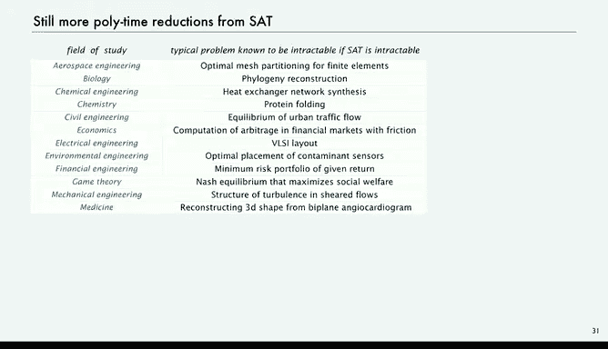

# 计算机科学：算法、理论和机器：P28：多项式时间归约

在本节课中，我们将要学习一个用于根据问题难度对问题进行分类的重要数学工具——归约。我们将了解其定义、性质，以及如何利用它来证明问题的难解性。

## 概述

上一节我们介绍了P类与NP类问题的概念。本节中我们来看看如何利用“归约”这一工具，在假设布尔可满足性问题难解的前提下，证明其他一系列问题同样难解。

## 多项式时间归约的定义

给定两个问题X和Y，我们说“X多项式时间归约到Y”，记作 **X ≤ₚ Y**，其含义是：如果我们拥有一个能高效解决Y的算法，那么我们就可以利用它来高效地解决X。

一个典型的归约过程如下：
1.  使用一个高效的方法，将任意一个需要解决的X问题实例，**转换**为一个Y问题实例。
2.  使用我们已有的、能高效解决Y的算法，得到一个Y的**解**。
3.  将这个解**转换**回X问题的解。

这个过程保证了，只要Y能在多项式时间内解决，并且两个转换步骤也是多项式时间的，那么X就能在多项式时间内解决。这类似于模块化编程中调用库函数：我们通过调用高效的数学库来计算指数函数，从而在自己的程序中高效地使用它。

## 归约的性质与应用

多项式时间归约具有**传递性**。如果X ≤ₚ Y，且Y ≤ₚ Z，那么X ≤ₚ Z。这个性质非常有用，它允许我们通过一系列已知的归约关系，将问题的难解性“传递”下去。

从理论角度看，归约主要有两种应用方式：

1.  **算法设计**：如果我们有一个新问题X，并且发现它可以归约到一个已知有高效解法的问题Y，那么我们就可以利用Y的算法来高效解决X。例如，利用排序算法来解决去重问题。
2.  **证明难解性**：这是我们本节课的重点。如果我们想证明一个新问题Y是难解的（假设P ≠ NP），我们可以尝试找到一个已知是难解的问题X（例如SAT），并证明X ≤ₚ Y。这样，如果Y存在高效算法，那么X也将存在高效算法，这与X是难解的假设矛盾。因此，Y也必须是难解的。

## 从SAT到整数线性规划的归约示例

让我们看一个具体的例子：证明SAT问题可以多项式时间归约到整数线性规划问题。

*   **SAT问题**：求解一组布尔变量的赋值，使得所有给定的布尔方程同时成立。变量取值为真或假。
*   **整数线性规划问题**：求解一组0-1整数变量的赋值，使得所有给定的线性不等式同时成立。

以下是归约方法：
*   将每个布尔变量`Xi`映射为一个0-1整数变量`Ti`，其中`Ti = 1`当且仅当`Xi`为真。
*   将布尔表达式中的“非”运算`¬Xi`替换为`(1 - Ti)`。
*   将每个形如`(A + B + ...) = 1`的布尔方程（要求子句为真）替换为线性不等式`(A + B + ...) ≥ 1`，其中A、B等是替换后的变量或表达式。

通过这种转换，任何一个SAT实例都被转化成了一个等价的整数线性规划实例。如果我们有一个能高效解决整数线性规划的“黑盒”算法，那么我们就可以：
1.  将SAT实例按上述规则转换。
2.  调用整数线性规划求解器，得到0-1解。
3.  将0-1解映射回真/假值，即得到SAT的解。

因此，**SAT ≤ₚ 整数线性规划**。这意味着，如果我们假设SAT是难解的（不存在多项式时间算法），那么整数线性规划也必然是难解的，因为如果后者有高效算法，通过这个归约，前者也将有高效算法，导致矛盾。

## NP完全问题与难解性证明的扩展

理查德·卡普的开创性工作表明，在假设SAT难解的前提下，一大批经典的计算问题都是难解的。以下是部分例子：

以下是部分被证明是NP完全的问题：
*   子集和问题
*   划分问题
*   装箱问题
*   旅行商问题

卡普为这些问题中的每一个都构造了从SAT（或已证明的NP完全问题）到该问题的多项式时间归约。利用归约的传递性，所有这些问题的难解性都归结到了SAT的难解性上。

这一分类方法影响深远。在过去五十多年里，从化学中的蛋白质折叠、经济学中的金融市场建模，到计算机科学的各个领域，无数问题都被证明，如果SAT是难解的，那么它们也是难解的。每年都有成千上万的学术论文致力于此类证明，这成为了理解计算问题固有难度的一个核心工具。

## 总结

本节课中我们一起学习了多项式时间归约这一核心概念。我们了解了其定义和传递性，并看到了它如何被用于证明问题的难解性：通过将一个已知的难解问题（如SAT）归约到目标问题，从而证明目标问题至少和已知问题一样难。这帮助我们理解，在P ≠ NP的假设下，存在一个庞大且相互关联的“NP完全”问题类，它们极有可能不存在通用的高效精确解法。对于任何试图用计算机解决复杂问题的人来说，理解这一点至关重要。