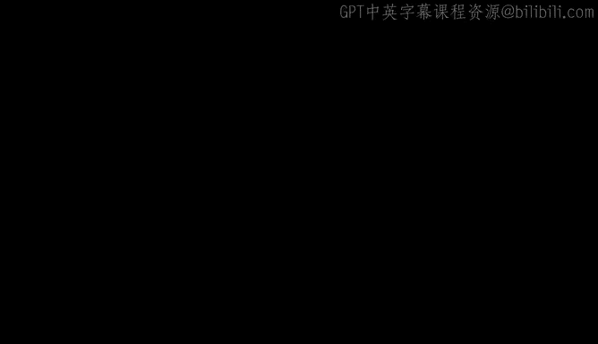
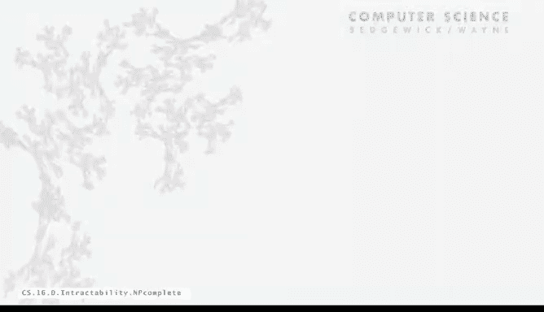
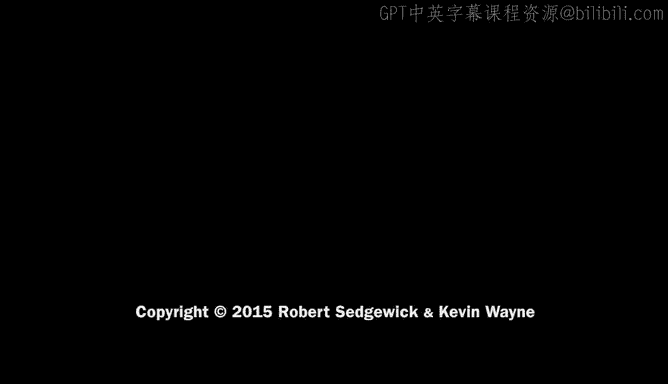

# 计算机科学：算法、理论和机器：P29：NP完全性 🧩

在本节课中，我们将要学习计算复杂性理论中一个极其重要的概念——NP完全性。我们将了解NP完全问题的定义、其重要性，以及它如何帮助我们理解计算问题的内在难度。

## 概述

上一节我们讨论了P与NP问题的基本概念。本节中，我们来看看NP完全性。这个概念为我们提供了一个强有力的工具，可以将成千上万看似不同的问题联系起来，并判断它们是否“本质上”同样困难。

## NP完全性的定义

NP完全性始于一个非常简单的定义。对于**任何**搜索问题（即NP类中的问题），如果**所有**NP类中的问题都能在多项式时间内归约到该问题，那么该问题就被称为是**NP完全的**。

这看起来是一个非常强的条件，但实际上，正如我们即将看到的，它相当自然。

## 库克-列文定理

NP完全问题之所以重要，是因为库克和列文在20世纪70年代初独立证明了一个定理。这个定理指出：**SAT问题是NP完全的**。

这个结果具有惊人的深远影响。在理论计算机科学课程中，你可以在大约一小时内学习这个证明。虽然我们没有时间详细展开，但可以极其简要地解释其基本思想。

其核心思想是利用**非确定性图灵机**的概念。你可以将任何搜索问题表述为一个非确定性图灵机，这实际上是搜索问题的形式化定义。该证明所做的是，将这种表示（一种包含状态和箭头的数学表示法，类似于我们处理带标签转换的方式）转换为SAT问题的表示法。这两种都是离散的形式化系统。证明的关键在于，给定任何搜索问题，你都可以构造一个非确定性图灵机，然后将其转换为一个SAT问题的实例。

这意味着，如果你对SAT问题有一个高效的解决方案，那么你就能够高效地模拟那个非确定性图灵机，从而为NP类中的**任何**问题提供高效解决方案。这就是归约的过程。再次强调，虽然这里极大地简化了证明，但这确实是一个惊人的基础性成果。

## 推论与意义

这个定理的一个推论是：**SAT问题是可处理的，当且仅当P等于NP**。显然，如果P等于NP，SAT是可处理的。但反过来，如果SAT是可处理的，那么NP中的所有问题都是可处理的，这意味着P等于NP。

另一种表述方式是：认为SAT问题是难处理的这一假设，与假设P不等于NP在很大程度上是等价的。

## 对实际问题的意义

以下是该定理对实际问题的影响：所有NP类中的问题都能归约到SAT。同时，SAT也能归约到所有这些问题。这意味着，**所有这些问题都是NP完全的，而不仅仅是SAT**。

如果我们能解决这些NP完全问题中的任何一个，我们就能解决NP类中的所有问题。这是一个关于解决这些问题难度的更强有力的陈述。成千上万每年在科学论文中被提出和证明的问题都是NP完全的。其意义在于，如果你能为其中任何一个问题找到算法，你就拥有了解决所有这些问题的高效算法。这比单纯的归约给了我们更大的信心，去断言寻找保证多项式时间算法来解决这些问题的难度。

## NP完全性对理论框架的补充

NP完全性以下列方式完善了我们的理论框架：
*   如果P不等于NP，那么存在一些难处理的问题。
*   如果P等于NP，则不存在这样的问题，非确定性计算没有提供额外帮助。

我们之前看过的不同表述再次适用：
*   如果P等于NP，那么找到一个答案并不比仅仅猜测它更难。
*   如果P等于NP，那么对于NP中的所有问题都存在保证的多项式时间算法。
*   如果P不等于NP，那么你可以通过从一个NP完全问题进行归约，来证明某个问题是难处理的。

目前的情况更倾向于后者。这些可能性仅仅是基于我们已有的基本定义，但尽管许多人已经研究了几十年，我们仍然不知道这两个选项中哪一个是真的。

## 总结

本节课中我们一起学习了：
*   **NP类**：所有搜索问题的集合。
*   **P类**：我们能在多项式时间内解决的问题集合。
*   **NP完全问题**：可以看作是NP类中最难的问题。
*   **难处理性**：如果P不等于NP，那么NP完全问题就是难处理的。

我们有成千上万个被证明是NP完全的问题。这个理论的核心思想是，当面对实际情况时，将其作为指导。如果你遇到一个NP完全问题，你需要知道，为该问题找到一个高效（保证多项式时间）的算法将是一个惊人的科学突破，它将证明P等于NP。你应该了解这一点，因为在你的职业生涯中肯定会遇到一些NP完全问题。

因此，假设P不等于NP，并且NP完全问题是难处理的，是相当安全的。你至少应该能够做到的是识别这些情况，并相应地采取行动。我们将在下一节讨论具体的方法。

---

**附注**：在普林斯顿大学，如果你观察计算机科学大楼的西墙，可以看到砖块图案中的一些凹痕。这实际上是给学习本课程的学生的一个小设计。如果你将这些凹痕视为二进制数，并将其转换为ASCII码，你就会得到“P=NP?”这个问题。

当这座大楼在80年代末建成时，许多人说建筑会存在很久，为什么要把一个如此重要、如此多人在研究的问题刻在砖上？实际上，几十年后的今天，它成为了计算机科学一个比以往任何时候都更重要的象征。当然，只需投资几块砖，我们就能轻松地将等号改为不等号，或者将问号改为感叹号。