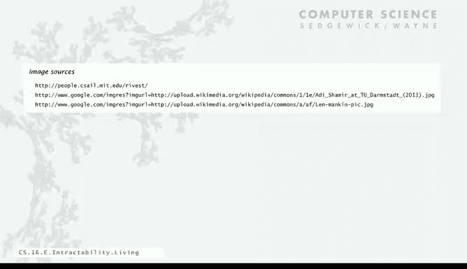

# 计算机科学：算法、理论和机器：P30：应对难解性问题 💡

在本节课中，我们将要学习如何应对计算中的难解性问题。我们将探讨几种不同的策略，理解为什么某些问题难以解决，以及在实际应用中如何绕过或利用这种困难性。

## 概述

难解性问题是我们必须面对的现实。当我们遇到一个NP完全问题时，几乎可以断定它是难解的。本节将介绍四种应对难解性问题的成功策略。

## 应对难解性问题的四种策略

上一节我们介绍了难解性问题的概念，本节中我们来看看具体的应对方法。

以下是四种主要的应对策略：

1.  **避免直接求解**：认识到问题本质上是难解的，因此不寻求通用的多项式时间算法。
2.  **分析实际输入**：理论上的最坏情况可能在实际中很少出现，可以针对特定类型的输入设计算法。
3.  **寻求近似解**：不追求最优解，而是寻找一个足够好的近似解。
4.  **利用难解性**：将问题的难解性转化为优势，例如在密码学中的应用。

## 策略一：避免直接求解

最重要的一点是，当你面对一个NP完全问题时，不应试图寻找一个保证对所有输入都有效的多项式时间算法。这极不可能实现。

理解难解性理论能让你在面临此类问题时处于有利地位。你可以解释说，不仅是你，许多顶尖的研究者也无法为这类问题找到高效算法。这避免了因无法解决问题而被视为能力不足的尴尬。

一个著名的例子来自统计物理学中的伊辛模型。在20世纪30年代至2000年间，许多杰出的科学家，包括理查德·费曼，花费数十年时间试图寻找三维伊辛模型的闭式解。然而，大约在2000年，研究者证明该问题是NP完全的。如果早期的研究者了解难解性理论，他们就会知道寻找闭式解的努力很可能徒劳无功，或者至少会意识到这将是世纪性的科学突破。

## 策略二：分析实际输入

难解性理论讨论的是最坏情况。但在实践中，你需要解决的实例可能并非那些最困难的案例。

因此，一个合理的方法是放宽算法必须对所有输入都有效的要求，只要求它对实际关心的输入有效即可。这种方法在实践中非常有效。

例如：
*   **SAT求解器**：存在能快速解决包含数万个变量的SAT实例的程序，它们运行在多项式时间内，而非指数时间。
*   **旅行商问题**：名为Concorde的程序能够常规性地解决现实世界中包含数万个城市的大规模实例。
*   **整数线性规划**：CPLEX等软件能够为大型公司解决其业务所需的大规模现实问题。

## 策略三：寻求近似解

对于许多优化类NP完全问题（如旅行商问题），一个可行的策略是放弃寻找绝对最优解，转而寻找一个接近最优的可行解。近似算法是算法研究中一个非常重要且成果丰硕的领域。

## 策略四：利用难解性

难解性本身也可以被利用。一个著名的例子是RSA加密系统。

RSA加密系统基于整数分解的困难性。使用该系统时，进行大整数的**乘法**和**除法**是相对容易的（多项式时间）。但要破解该系统，则需要**分解**一个大整数，这被认为是极其困难的。

例如，尝试分解下面这个212位的整数：
`RSA-704 = 74037563479561712828046796097429573142593188889231289084936232638972765034028266276891996419625117843995894330502127585370118968098286733173273108930900552505116877063299072396380786710086096962537934650563796359`

虽然我们尚不能从理论上证明分解问题是NP完全的（即没有从SAT问题到分解问题的归约），但普遍假设它是难解的。RSA公司正是基于这一理论计算机科学的思想，创建了价值数十亿美元的电子商务安全业务。

## 关于P vs NP与未来计算

最后，我们讨论一个重要的当代问题。我们假设整数分解是难解的，但这一假设面临新的挑战。

在20世纪90年代中期，彼得·肖尔证明，在一种称为**量子计算机**的设备上，存在一种算法可以在`O(n^3)`步内分解一个n位整数，即多项式时间。

这引出了一个根本性问题：我们是否仍然相信扩展的丘奇-图灵论题？该论题认为，所有合理的计算模型在资源使用上彼此相差一个多项式因子。如果量子计算机能够被建造出来，它将证伪这一论题。

无论量子计算未来如何，本节课的重要结论是：难解性是我们必须理解的概念，它甚至可能告诉我们关于所处宇宙的某些深刻道理。

## 总结

本节课中我们一起学习了应对难解性问题的多种策略。我们了解到，面对NP完全问题时，应避免寻找通用最优解，转而分析实际输入、寻求近似解，甚至可以利用其难解性（如密码学）。同时，我们也看到了计算理论（如量子计算）的发展如何持续挑战我们对“可计算”和“难解”的现有认知。理解这些概念对于在计算机科学领域进行研究和实践至关重要。