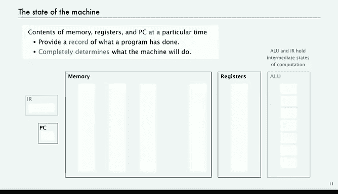

# 计算机科学：算法、理论和机器：31：机器概述（第二部分）

## 概述

在本节课中，我们将深入探讨一个假想的“玩具”计算机的内部结构。我们将了解其基本组成部分，包括内存、寄存器、算术逻辑单元以及控制程序执行的关键部件。通过理解这些概念，你将揭开计算机如何执行指令的神秘面纱，并为学习计算机体系结构打下基础。

## 机器内部组件

上一节我们介绍了学习机器内部结构的目的。本节中，我们来看看构成这台“玩具”计算机的核心组件。

### 内存

内存用于存储程序运行所需的所有数据和指令。你的计算机拥有内存，而“玩具”计算机的内存规模要小得多。

以下是“玩具”计算机内存的关键特性：
*   **容量**：共有 256 个“字”。
*   **字长**：每个字包含 16 个比特。
*   **寻址**：每个字都有一个地址，我们使用十六进制数从 `00` 到 `FF` 来表示这些地址。
*   **表示**：要引用内存中特定地址的内容，我们使用类似 `M[2A]` 的表示法，其中 `M` 代表内存，`2A` 是地址。

### 算术逻辑单元

算术逻辑单元是计算机的计算引擎。你可以把它想象成一个计算器。

以下是算术逻辑单元的核心功能：
*   **作用**：执行对数据的操作，例如加法或逻辑“与”运算。
*   **工作方式**：它接收两个数字作为输入，执行指定的操作，然后输出结果。

### 寄存器

寄存器是 16 个特殊的存储字，你可以把它们看作是程序中的变量。

以下是关于寄存器的要点：
*   **数量与命名**：共有 16 个寄存器，编号从 `0` 到 `F`，分别命名为 `R0` 到 `RF`。
*   **用途**：它们作为“暂存区”，用于计算以及数据在内存和算术逻辑单元之间的移动。
*   **约定**：在“玩具”计算机中，我们约定寄存器 `R0` 的值始终为 0，以简化代码。寄存器 `R1` 则通常存放值 `0001`。

### 程序计数器与指令寄存器

程序执行依赖于两个关键抽象：程序计数器和指令寄存器。

以下是这两个部件的定义：
*   **程序计数器**：它存储着**下一条**将要执行的指令在内存中的地址。
*   **指令寄存器**：它存储着**当前正在执行**的指令。

## 机器运行原理：取指-递增-执行周期

了解了基本组件后，我们来看看机器如何协调工作。其核心是一个简单而强大的循环。

“玩具”计算机的基本操作基于一个**取指-递增-执行**周期。具体过程如下：
1.  **取指**：根据程序计数器指向的地址，从内存中取出指令，并将其放入指令寄存器。
2.  **递增**：大多数情况下，程序计数器简单地加 1，以指向内存中的下一条指令。
3.  **执行**：执行指令寄存器中指令所指定的操作。这可能是移动数据、改变程序计数器或进行计算。

机器就是通过不断重复 **取指 -> 递增 -> 执行** 这个循环来运行程序的。所有计算机都以类似的方式运作。

## 机器状态与确定性

最后，理解“机器状态”这个概念至关重要。机器的状态完全由内存内容、寄存器内容和程序计数器的值决定。

这个概念有两个重要意义：
1.  **记录**：它记录了程序已经执行的操作结果。
2.  **决定未来**：它完全决定了机器接下来要做什么。给定一个确定的状态，机器的下一步动作是唯一确定的，因此我们说计算机是一个**确定性**的机器。指令寄存器和算术逻辑单元保存的是计算的中间状态，我们通常不将它们视为决定机器整体状态的部分。

## 总结

本节课中，我们一起学习了“玩具”计算机的内部构造。我们认识了其核心组件：用于存储的内存、用于计算的算术逻辑单元、作为高速暂存区的寄存器，以及控制程序流的程序计数器和指令寄存器。最重要的是，我们理解了计算机通过**取指-递增-执行**这个基本周期来运行，并且机器的当前**状态**完全决定了其未来的行为。下一节，我们将探讨存储在这些组件中的具体数据和指令格式。