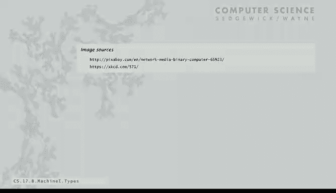
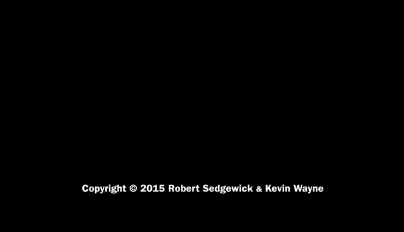

# 普林斯顿大学《计算机科学：算法、理论和机器｜Computer Science： Algorithms, Theory, and Machines》中英字幕 - P32：32_08_03_数据类型.zh_en - GPT中英字幕课程资源 - BV1Ct42177Y6

What kind of data can we process with toy Well we've talked before that all data and computer is encoded in binary。

 so it's a matter of the encoding we can process any kind kind of data in toy but let's look specifically of what at what we're talking about so the concept of a data type that we started with in Java programming definitely applies here a data type is a set of values and a set of operations on those values so that's what we need to talk about to describe how toy operates。

Toy's data type is called 16 B2s complement integers。

You know what 16 bit means and we'll talk about Tu's complement in just the next couple of slides。

And there's two kinds of operations that it can perform on these 16 bit2th complementent integers。

 one is arithmetic， you can add the integers。And in your computer。

 you can multiply them and divide them and other things like that， arithmetic operations。

 every computer's got a full suite of arithmetic operations。

And the other kinds of operations are bitwise operations where we treat the integers as sequences of bits and we perform bit by bit operations we saw that in our cryptography example at the beginning of the course where we did bitwise exclusive ore operations in order to implement a cryptographic protocol。

 it turns out that there's lots of operations that we perform in computer and data processing that require this type of operations so they're built into all computer hardware。

But every other type of data and every other operation has to be implemented with software。

If you want to have 32 bit integers you're going to have to write code that takes to 16 bit integers and treats them as 32 bit integers。

 if you want floating point values， you have to come up with an encoding and write software to do this if you want characters and strings again you're going to have to write programs that take the built-in data type and then treats them as characters and strings and so forth and so on and what we're doing here is reflecting what life was like when the first computers were built and really all there were with these kinds of operations and all of these other things were implemented in software eventually many of them found their way to hardware so that they' basic operations built in hardware encoded in hardware on your machine but still it's important to remember that that dividing line is not so absolute and really we just implementing abstractions。

valueues and operations and those values， sometimes we do it in hardware。

 sometimes we do it in software， and at the level that we usually program。

 we don't know the difference except for performance。So for toy。

 all values are represented as 16 bit words and that's what we're going to be mainly talking about and the way that we communicate them is with switches and lights and we'll see that in great detail in just a minute。

So the original design for toy and this is true actually of many computers。

 let's just work with unsigned integers， values from 0 to 216 minus1 encoded in binary and then we talk about them in Hex so if we want the number 6。

375 in decimal then we can look at the binary encoding of that thing this is it it's2 to the 12 plus2 to the 11th plus 27262 to the  fifth and2 to the second212 to 0 that's the binary representation of 6375 we can convert it to hex by taking4 bits at a time and this is just just a little check if you don't believe our binary to hex trick that's one times 16 cube plus 8 times 16 squared plus 14 times 16 plus 7 same number 6300 and75。

And then we can perform operations on these numbers like add and subtract or test if it's zero。

 just as we would with binary numbers so if we want to add if we're going to compute double of 18E7 or 6375。

 then we just add the binary numbers and adding binary numbers is just using the grade school algorithm of add the two digits and carry and in this case that's the result that you get and you can convert that one digit at a time to get 31 CE and we'll ignore overflow it's a detail that we can do in an exercise but that's the original design of toy the things that you could do。

And so what happened with Toy and actually what happened with lots of real computers is that people realize that without really any work。

 it's possible to change the data type and allow us to process negative integers。

 really without changing the computer at all， so it's interesting to see why this works and it's worthwhile knowing about it because every computer uses tos complement to represent integers for the purpose of also including negative integers。

can support the same operations easily， add subtract， test of positive negative or0。

 and the rule is simple if we have a positive number， we just use the 16 bit representation of x。

 if we have a negative number， we use the 16 bit representation of2 to the 16th minus the absolute value of x。

Now we can only go from minus2 to the 15th to2 to the 15th minus1。

 that is we can only encode half as many positive integers because we want to encode the negative integers as well。

So in 16 bits， the biggest number that we can represent is 2 to the 15th minus1， which is 32，00767。

 so in HCC that's seven FFFF。FFF， which is a zero followed by all once。

 that's the biggest positive number。And then if we subtract one。

 then we get smaller and smaller ones until we get eventually down to three， two， one。

 this is the standard binary representation of positive numbers and zero。Now。

 but as soon as we go negative， if we want to do negative1。

 the representation of that is 2 to the 16th minus1， which is all once or all f's and hex。

And then those numbers we keep decrementing by one。

 and eventually we get to the smallest negative number that we can represent。

 which is a one followed by all zeros。it takes a few minutes to get used to this representation and I'll just describe its properties that there's one thing that's slightly annoying is that we have one more extra negative value than positive value so we can represent minus2 to the 15th。

 but we can't represent positive2 to the 15th and the reason for that is that there's just one representation of zero。

But this representation has。Useful property。 So one of them is the leading bit always signifies the sign。

 if the leading bit  zero， then it's positive if the leading bits one， then it's negative。

There's one representation of zero and that's when all the bits are zero。 you might say。

 why not just use the first bit for the sign， but then if you do that。

 then you have two different zeros and that makes things complicated。

But the other thing that's interesting is that you can do add and subtract just the same as you would if they're unsigned。

 we'll look at that， you don't have to change the hardware at all and you get to process negative numbers for free besides the mathematical rule we want to be able to convert from decimal and hex binary to two complements。

 so how do we get a decimal number into two complement。Well。

 first thing is if it's outside the range， you say you can't do it。

 so if it's bigger than2 the 15th minus-1 or less than minus2 the 15th。

 we can't fit it in a 16 bit two complement number。

Otherwise I take the magnitude of the number and convert it to binary if it's0 or positive then you're done that's all it is and if it's negative what you do is flip all the bits and add1。

 an easy operation so let's look at an example， so for example the number of 13 in decimal is all 0s 11018 plus4 plus1 is 13 or in hex it's 000 d。

To get minus get the representation of minus 13， you just flip all the bits which is all ones0010 and then add one and we get all10011 or in hex that's FffF3 very easy operation to convert from from decimal first you convert to binary for the magnitude and then if it's negative flip all the bits and add one to go the other way to convert from two's complement to decimal。

 you do the opposite if the s bit is1 that means it's negative so you flip all the bits。

 add one and then I'll put the minus sign just convert to decimal so for example if you have the hex number is 0001 that's all zeros and a1 if you want to know the binary representation of minus1 you flip all the bits so that's all ones in a0 add one you get all one that's a representation of minus1。

And there's the example for 243， flip all the bits and add1 since minus243 starts with a1 if you want to get positive。

 you flip all the bits and add1 so very simple conversion from a negative number to a positive number and then again just to add and subtract and just have to do an example to start to believe this in the book if you read it more carefully we do the math that proves it but if you take minus 256 there's that example and plus 13 and forget about the representation just treat them as positive 16 bit integers you get the right answer for two's complement。

 so people realize they built machines that just work with positive integers but with two's complement they also work with negative integers as well。

There's just one problem and that's overflow and we're ignoring overflow。

 but still it's one that you want to know about because every beginning programmer runs into it right away and we ran into it right away with your first couple of Java programs so if you have the largest positive number。

 say in 16 bits that's2 to 15 minus1， that's zero followed by all once now if this is the one case that addition doesn't work if you add one to that。

Then we're adding all zeros and a1 to it， so the one plus one is0 carries the one the carries go all the way over and the result is one followed by all zeros or in he 8000 and that's the representation of the smallest negative number so if you're not checking for overflow and you're just incrementing you find that your largest positive number。

 all of a sudden becomes the smallest negative number and many beginning programmers see that in their early programs。

 numbers get too big， all of a sudden they become negative so this is the reason。呃。

It's well cataloged， you can find many examples， and this is an XKCD on somebody counting sheep and overflowing and then well。

 that's the computer scientist joke of the day。Okay。

 so that's arithmetic operations what about bitwise operations Toy's got a bunch of bitwise operations and their familiar operations that we've seen in another context and actually in Java you can do these same operations although we haven't used in much so the idea is just for each bit position implement the basic boolean function。

 so the and function is if it's one if x and y are both one otherwise it's zero and again we've seen this function in other context。

 but what this does is it does it for every bit in the 16 bit word so the first two or zero so it's zero then one0 it' zero and then two zeros in it's zero and then we have a couple where they're both one。

 so the result is one and so forth， so that's a bitwise and operations。

And actually we use that for isolating some bits in a word， so for example， in this case。

 the first three bits are0， but then there's a bunch of ones in a row and if you look at it the result of ending against those ones just give the bits in the other word so if you wanted to isolate those bits you could use an and operation with a mask of ones in this way and we'll do this later on。

And then there's bitwise X or， again， Xor is the one that we use for our crypto example。

 that function is zero if the two bits are the same and one if the two bits are different。

So in this case again， it does it for each one of the bits。

 so the leftmost they're both zero so it's zero then for a while then the next one is one of thems one so it's one and then they're both zero and then they're both one。

 so those results are zero and so forth。So bit wise exclusive ore is implemented in Toy hardware。

And then there's shift operations。 So those， we just take the bits in the word and move them specified distance in places that are。

So this is a shift left three， so we move every bit to the left three positions and that leaves us with three bits that we have to fill in and we fill with zeros。

 and then there's shift right， which again fill with zeros now from the right。

 so shift left and shift right， those are bitwise operations that we can implement into toy instructions。

And a special note is that the shift left and right are implement multiply and divide by powers of two and they're the basis for actually integer multiply as well there's one extra thing that you have to do if the leading bit is one the shift right has to fill with ones so that's like if it's a negative number it keeps it negative and that's a detail but it's kind of a mix of the data type are these things bitwise operations or are the arithmetic operations well for shifts they're kind of both。

And that's it， that's the summary of the operations that are involved in the toy data type。

 those are the things that we can do on the data values that we can represent。Not too much。

 and it's kind of surprising that we can build up a full computational infrastructure like the one we've been using with just such basic operations。

 but that's really the reality of today's computers。

