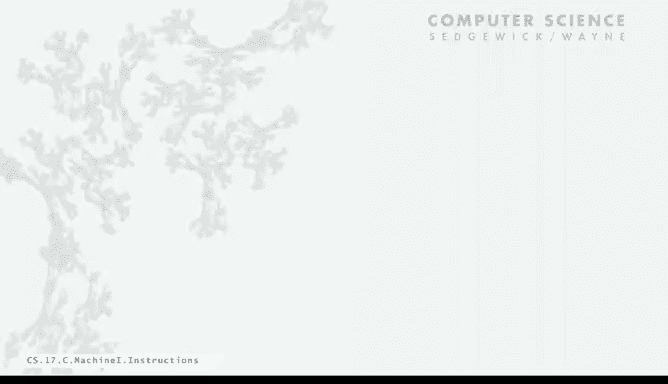

# 普林斯顿大学《计算机科学：算法、理论和机器｜Computer Science： Algorithms, Theory, and Machines》中英字幕 - P33：33_08_04_指令集.zh_en - GPT中英字幕课程资源 - BV1Ct42177Y6

So now let's look at toy's instructions and actually a toy program。So， the。

Fundamental point that you want to know right from the beginning is that any 16 bit value defines a toy instruction。

 If you have 16 bits， that's a toy instruction。 and toy will do something with that 16 Bs。

 So we have to describe what every 16 bit value means。The first hex digit。

 so there's four hex digits and 16 bits， the first one says which instruction？

And each instruction changes the machine state somehow in some well defined way you can figure out exactly how it changes the machine state。

So we've talked about the data type operations so that's add some track bitY Z， bit wise or。

 shift left and shift right those are op codes one through6。

 they implement data type operations and they change the values of a register and we'll see precisely how but that's the way they change the machine state。

Then there's five instructions that are devoted to moving data between registers in memory。

 and those might change a register or they might change a memory cell either bringing some from memory into a register or the other way。

 so that's op code 7978，9， A and B， and again we'll talk about precisely how they differ the ways that they change the state。

And then the remaining five instructions are about flow of control。

 which instruction gets executed now next， these are the ones that are used to implement Java abstractions like conditionals。

 loops and functions， and those are op codes zero， C D， E and F。

 What they change is the program counter。And now we'll look at precisely how each of the instructions do it。

Now there's two different instruction formats that depends on the op code the first type is called RR and that's where the first digits the op code and then the three remaining digits specify registers remember theres 16 registers so we can specify a register with the hex digit and for all the arithmetic instructions and a couple of other ones those three digits specify registers so when we say an add instruction when the op code is one then the next three digits represent the first one is the register that gets the result and the next two are the registers that contain the opera and that's true for all the ones that define data type operations and a few others。

And then the other type of instructions are the ones that refer to memory。In those。

 the first digit again is the opP code， next digit is a register。

 which is specified a register is supposed to be operated on。

 and then the next two digits are memory address， so they refer to the memory。

 remember with two hex digits we can refer to one of the 255 memory locations。

And so those two different types- it's the op code that determines how the instruction is going to be interpreted。

So for example， if we say1 CAAB， that's an add instruction。

 and it means add RA and RB the last two digits and put the result in RC。

So now you know how to decode any 16 bit value that begins with 0001。

any value like that is specifying an ad instruction it's just different registers might be involved。

Or if we say 8， a15， remember， this is 15 hecx。 So it's actually 21。That8 means load。

 then a means register A， and then the next two hex digits specified the memory location。

 and it says load into register A， the data that's in memory location 15。

And all the other instructions are defined similarly and we won't go through the details of all of them in lecture。

 but there's a little table on the book side and the text and we'll put one up later that describes all the instructions。

And that's it， that's a description of what Toy does。

 and with that we're ready to start writing programs。So let's look at a simple program。

 the simplest possible program， this is say hello world for Toy。

So what we're going to do is add two integers and so this is say memory locations 10 through 16 have these values there just four X digits or 16 bit values and that's what a toy program is so what this program does is load some opera from memory into the registers then uses the add instruction that gets the ALU to add the contents and then puts the result back in memory so let's look at how this instruction does its thing。

So the most important thing is that really what characterizes it being a program is that the PC has the address of the first instruction。

So the PCs at 10 in the memory has this contents， here's what happens when the machine starts running。

So the first instruction says load into register A。

 the data that's in memory 15 and down at the bottom we have a trace of what's going on in the registers。

 so what happens with that is if you look at memory 15 has 0008。

 so that value is going to get loaded into register A。And then remember。

 all the machine does is increment the PC。It actually does it before executing the instruction。

 but that'll be confusing for the simple example， so we do it after we execute the instruction。

And now that points at the next instruction。And that next instruction says load into Reg B。

 the data that's in memory location 16， memory location 16 has got 0005。

 so that's what gets into register B。Again， go to the next instruction。

 next instruction says add register A and B and put the result into register C， and right away。

 remember we're thinking hex all the time， what's 8 plus5？You might be thinking it's 13。

 but it's actually D， and again， it won't take you too long to be thinking in Hex and as we go through examples in the book and even in these couple of lectures。

Okay， so now we have that result in Reg C， but the registers really are internal and as you'll see when we're programming。

 we only have really access to what's in the memory。

So what we need to do is store that result that we've computed in the register into memory。

 and so that's the next instruction， store what's in Reg C into memory location 17。

And so that's our D goes into location 17。And then PC increments again。

 and the next instruction says haltt， that's the end of the program， stop。

So that's a full example of a toy program in operation illustrating load instructions。

 arithmetic instructions and store instruction and you can see even with just studying a few more instructions。

 there's a lot of programs that you know how to write because you're used to learning a new programming regime and this one's a really simple one that's well specifiedified and we'll do another much more complicated program later in this lecture。

So you know the question comes out is how do you know that words is actually an instruction and the answer to that is if the PC's got its address。

 it's an instruction。Now if we run this same program with different data。

 we can further illustrate that point， so again load into registerister A。

 whatever is in memoryory 15， in this case it's a big number minus 29，930。

 which in two's complement 16 bit is actually 8B16。

Now we go to the instruction at number 11 and that says load into RB。

 whatever is in memory location 16 in memory location 16 has 1 CAB， that's the number 7。

339 so that's what's in our registers and now we're going to add those two numbers and we get the result a7 C1 which happens to be minus 22。

591 in decimal。So just changing the data we can use the same program to computer result and in fact that's what we often do with computers。

 we write a program and give it a bunch of different data values and absolutely that's what people did with early computers。

 they wrote programs provided various data values and computed the answers。And again。

 we store our result in memory locations 17 and Hed。So if you want to know the question， well。

 how can you tell whether a word is data， Well， if you add it to another word， it's data。

It might be the same bit values， we have the same bit values in locations 12 and location 16 in this situation。

 but the first one is an instruction because the PC pointed to it and the second one is data because it got added to another number。

That's a fundamental concept that we're going to be coming back to again and again in the next few lectures。

