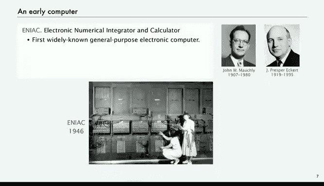

# 计算机科学：算法、理论和机器：P36：视角

在本节课中，我们将把Toy程序语言置于更广阔的背景下进行探讨。我们将回顾其历史渊源，并思考一台遵循如此简单规则的机器所带来的深远影响。通过对比Toy与现代计算机，我们将理解其核心原理的普适性，并认识到即使是有限的内存也足以完成复杂的任务。

上一节我们介绍了Toy程序的基本概念，本节中我们来看看Toy与现代计算机的对比。

Toy与你的笔记本电脑截然不同，其中一个是虚构的。但它们都实现了基本数据类型、条件判断、循环和其他低级结构。它们也都能通过构建实现数组、函数、库和其他高级结构。此外，两者都拥有无限的输入和输出流。

因此，如果你深入探究这个问题，最终会发现，我们在初次学习Java编程时研究的所有基本构建块，都可以在Toy中实现。你可能会问，Toy只有256个字的内存，这真的足够做任何有用的事吗？答案是肯定的。当然，当我们有能力时，我们肯定希望拥有更快、内存更大的版本。但关键在于，我们用Java所做的一切，理论上都可以用Toy完成，区别仅在于规模。

那么，我们来谈谈这个256个16位字（即4096字节）内存的问题。这真的足够做任何有用的事吗？

以下是一个来自20世纪60年代、50年前的旧计算机的例子。在那个年代，每一个比特都是一块穿过三根导线的物理金属片。因此，1000比特的内存是难以制造且昂贵的。但这确实是真实的1000比特内存。如果你有四个这样的模块，你就有4000比特的内存。这足够做任何有用的事吗？实际上是的，因为这就是阿波罗导航计算机的内存，它成功将人类送上了月球并返回。

另一个例子是麻省理工学院的一台实验计算机，它拥有更多的比特——24,000比特。这发生在更早的20世纪50年代末，人们使用像Toy这样的计算机进行生物医学实验和各种其他实验。这位是20世纪60年代初的韦斯·克拉克先生，我放上他的照片是因为他的儿子道格·克拉克是我的同事，并且多次教授过这门课程。

让我们更详细地审视这一点：4000比特的内存。实际上，如果你考虑在特定时间点内存、寄存器和程序计数器的内容，我们在开始时讨论过，这提供了程序所做工作的完整记录，并且完全决定了机器下一步将做什么。Toy是一台确定性机器，其行为完全基于这些内存比特。

如果我们计算涉及的总比特数：由于我们使用最后一个位置作为标准输入，内存有255 * 16比特；由于寄存器0始终为0，寄存器有15 * 16比特；再加上程序计数器。总共有4328比特。这些比特可以是0或1，因此机器可能处于的不同状态总数是2的4328次方，即超过10的1300次方。这是一个巨大的数字。机器可能处于这些状态中的任何一个，并且该状态将完全且唯一地决定一个新的状态。

这个数字如此巨大，我们在理论课上也讨论过：如果你取宇宙中的每一个电子，并让一台超级计算机在其整个生命周期内检查状态，也只能达到大约10的19次方个状态。10的1300次方是一个令人震惊的巨大数字，这意味着你需要10的1200次方个宇宙，所有这些宇宙中的每一个电子都在运行超级计算机。这些都是基本估计，你可以争论，但这不影响主要观点。结论是：我们永远无法知道一台拥有4096比特内存的机器能做什么，因为可能的状态数量远远超过我们在宇宙生命周期内所能观察到的。

所以，是的，4096比特的主内存绝对足以做一些有用的事情。

现在，让我们谈谈一些历史背景。

一台非常早期的计算机叫做ENIAC，由莫奇利和埃克特开发。它通常被认为是第一台广为人知的通用电子计算机。关于这一点有很多争论，你也可以阅读其他候选者。它具备条件跳转功能，是可编程的，但没有内存。编程是通过改变开关和电缆连接来实现的，机器背面布满了电缆，你需要重新插接机器以使其准备好执行特定计算。然后，机器会处理数据，并执行诸如绘制抛物线以计算导弹轨迹之类的任务。数据通过打孔卡输入，机器读取这些数字并进行计算。ENIAC就是这样工作的。

那是一台重30吨、占据整个房间的机器，使用真空管，每秒能进行300次乘法运算，一个比特就是一个叫做真空管的物理器件。使用这样的机器解决科学问题需要克服许多障碍，但它确实在运行和工作，并在战争期间为准备弹道表提供了帮助。

现在，我想谈谈一份著名的备忘录，名为《关于EDVAC的报告初稿》，由普林斯顿大学的数学家约翰·冯·诺依曼撰写。EDVAC是埃克特和莫奇利提议建造的下一台计算机，冯·诺依曼在1945年夏天与他们合作。但他同时也在洛斯阿拉莫斯为原子弹进行数学计算和模拟工作，他不得不乘火车去洛斯阿拉莫斯撰写关于他们EDVAC工作的报告。

事实证明，那份备忘录是对“拥有内存并在内存中存储程序”这一概念的精彩总结，实际上是一台能够实现此功能的计算机的完整设计。冯·诺依曼听说过艾伦·图灵的理论，关于程序可以将另一个程序作为数据操作的想法无疑影响了他的思考，并且自此影响了每一台计算机的设计。特别是在你学习了接下来几节关于设计和构建这样一台机器的课程后，再阅读这份备忘录，你会惊讶地发现其中包含了多少我们今天仍在常规使用的东西。每一台计算机都是如此。

于是，关于谁发明了存储程序计算机的问题，引发了一场引人入胜的争议。埃克特和莫奇利在冯·诺依曼出现之前就讨论过这个想法，并在与冯·诺依曼讨论EDVAC设计的合作中提及。但冯·诺依曼将一切整理成文，他在漫长的火车旅程中，将他所知的每一部分，包括艾伦·图灵惊人的理论，都融会贯通。他处于一个独特的位置，将这一切整合在一起，而他正是这样做的。

当冯·诺依曼抵达洛斯阿拉莫斯时，一位名叫赫尔曼·戈德斯坦的年轻中尉传阅了这份草案，因为他看出这是一份惊人的文件，引起了广泛兴趣。但这份关于EDVAC的报告初稿的公开披露，意味着埃克特和莫奇利无法为他们的设计申请专利，他们对此当然不太高兴。冯·诺依曼从未明确声称存储程序计算的想法归功于他，但他也从未将此归功于他人。因此，我们都需要对此做出自己的判断。

另一个例子，仅作为冯·诺依曼备忘录影响力的证明。在该备忘录发表后不久，英格兰的莫里斯·威尔克斯建造了另一台名为EDSAC的机器。那台机器具有许多与我们今天使用的机器非常相似的特征：数据和指令以二进制形式加载，你可以将程序（不仅仅是数据）加载到内存中，并且无需重新布线即可更改程序。这些都是我们所依赖的特征，我们将在本讲座后面再次提到这一点。

那台机器拥有512个17位字，与Toy相差不大；两个寄存器；16条指令；输入是纸带；输出不是纸带，而是电传打字机；一个比特是另一种不同的设备，不是真空管，但体积也没小多少。这台机器之所以能迅速问世，正是因为冯·诺依曼的备忘录如此完美地勾勒出了需要完成的蓝图。

事实上，自20世纪50年代以来，存储程序计算机的基本架构一直是几乎所有计算机的基础。因此，我们使用的所有东西——你的手机、服务器农场、个人电脑、Toy以及旧计算机——都具有我们在接下来几节课中将要研究的基本相同的设计。

存储程序计算机的实际意义在于，我们可以下载应用程序。当你将应用程序下载到手机时，你正在将一个程序加载到手机的内存中。这在今天看来是如此直接和自然，但请记住，第一台计算机并不具备这种能力。

另一件事是，我们可以编写能生成程序作为输出的程序。这就是编译器、解释器以及我们将要讨论的许多其他类型程序的功能。

你还可以编写将程序作为输入的程序，并且可以模拟其他机器。这是图灵的一个杰出概念。因此，正如我们在理论课中更详细讨论的那样，这些影响是非常深远的。使用Toy，你可以解决任何其他计算机能够解决的任何问题，但你也受到限制，即有些问题是任何计算机都无法解决的。

所有这些都是为了证明仔细研究Toy是合理的。它是一台简单的机器，具有我们使用的所有机器的相同特征。唯一的区别在于规模，而这正是我们接下来要深入探讨的，即更详细地审视其中的一些影响。

本节课中我们一起学习了Toy程序语言的历史背景和理论意义。我们将其与现代计算机进行了对比，认识到其核心原理的普适性，并探讨了有限内存下计算的可能性。通过回顾存储程序计算机的诞生和发展，我们理解了冯·诺依曼架构的深远影响，以及像Toy这样的简单模型如何成为理解现代计算基石的关键。