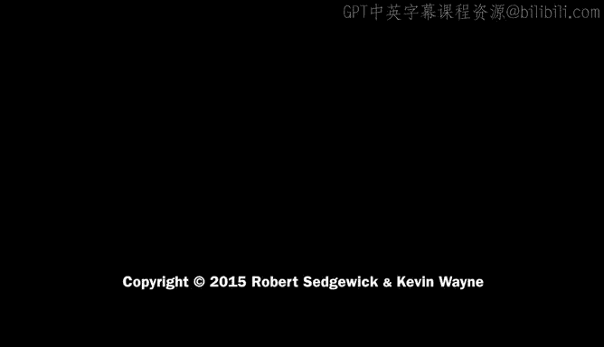

# 计算机科学：算法、理论和机器：P37：数组实现与冯·诺依曼机器的安全警示


在本节课中，我们将学习如何在TOY计算机上实现数组，并探讨一个与冯·诺依曼体系结构相关的、至关重要的安全概念。我们将通过一个具体的程序示例来理解数组的加载过程，同时揭示一个潜在的安全风险。

## 数组在TOY中的实现原理

上一节我们介绍了TOY计算机的基本指令。本节中我们来看看如何利用这些指令来实现数组数据结构。

实现数组的基本思想与在Java中引入数组时讨论的抽象概念一致：我们将数据项连续地存储在内存中，从一个给定的内存地址开始。例如，一个包含11个元素的数组从内存地址80开始存储。

访问数组中第 `i` 个元素的方法是：将数组首地址加上索引 `i`。因此，`a[2]` 的地址是 `80 + 2 = 82`。这是一个简单的计算，可以让我们定位到任何索引位置的数组元素。

为了便于实现，我们将使用TOY指令集中的**间接寻址**指令。其核心思想是：我们将数组的基地址保存在一个寄存器中，当需要访问数组元素时，我们将索引值加到基地址上，然后使用间接加载和存储指令。这些指令使用寄存器中的内容作为内存地址，而不是指令本身编码的地址。

以下是实现数组将要用到的三条关键TOY指令：
*   `7`：加载地址。将指令中的地址位加载到指定的寄存器。
*   `A`：间接加载。使用指定寄存器中的内容作为地址，加载该地址处的内存字。
*   `B`：间接存储。使用指定寄存器中的内容作为地址，将数据存储到该地址。

例如，一个间接存储的流程如下：
1.  `7 A 80`：将地址80加载到寄存器A。这是数组的起始地址。
2.  假设另一个寄存器（如寄存器9）保存数组索引，通常从0开始。
3.  在代码中，通过 `1 C A 9`（加法指令）计算实际地址：将寄存器A（基地址）和寄存器9（索引）相加，结果存入寄存器C。
4.  最后，间接存储指令 `B C D` 会将寄存器D中的内容存储到内存中，而存储的地址正是寄存器C中刚刚计算出的值（例如84或85）。

## 从标准输入读取数组的示例代码

接下来，我们通过一段具体的TOY代码来演示如何从标准输入（纸带）读取数据并填充数组。

以下是该过程的Java伪代码描述。数组在标准输入上的表示形式是：一个表示长度的整数，后跟相应数量的数据字。
```java
n = readInt(); // 从输入读取数组长度
i = 0;
while (i < n) {
    a[i] = readInt(); // 读取一个数据并存入数组
    i++;
}
```

在TOY实现中，我们假设数组从内存位置80开始。寄存器A保存数组基地址（80），寄存器9作为索引 `i`，寄存器B保存长度 `n`。

循环过程如下：
1.  比较寄存器9（索引）和寄存器B（长度）。通过减法指令，如果结果为0，则使用分支指令跳出循环。
2.  否则，计算数组元素地址（A + 9），结果存入寄存器C。
3.  从标准输入读取一个字到寄存器D。
4.  使用间接存储指令，将寄存器D的值存入寄存器C指向的内存地址（即 `a[i]`）。
5.  递增索引寄存器9，然后继续循环。

通过动态模拟这段代码，我们可以看到它如何一步步地从纸带上读取长度值（例如6），然后依次读取6个数据字（例如1, 2, 3, 4, 5, 6），并将它们存储到从地址80开始的内存位置中。当索引 `i` 等于长度 `n` 时，循环结束。

## 冯·诺依曼机器的安全警示

在理解了数组的基本操作后，让我们思考一个典型场景，并引出冯·诺依曼体系结构的一个根本性安全问题。

假设科学家Alice编写了一个程序来处理她的实验数据。她的科学仪器将数据输出到纸带上，然后她使用上述的TOY程序将数据读入计算机内存进行分析。一旦程序调试成功，她可以反复使用它处理大量数据。

现在，假设另一位科学家Eve发现Alice的分析程序对她的实验也有用，于是请求Alice帮忙处理她的数据。Alice欣然同意。

然而，Eve提供的纸带数据看起来有些可疑：它声称包含256个字（而TOY计算机总共只有256个字内存），并且数据大部分是数字8，末尾还有一些奇怪的代码。如果Alice（或计算机操作员）没有仔细检查就运行了程序，会发生什么呢？

程序会忠实地执行读取操作：
1.  首先读取“长度”256。
2.  然后开始将后续的“数据”（大量的8和末尾的特殊代码）读入内存，从地址80开始存储。
3.  由于长度被声明为256，程序会试图填满整个内存。当写到内存地址FF（255）之后，地址会回绕到00。
4.  关键问题出现了：程序代码本身也存储在内存中（从地址00开始）。Eve的“数据”会覆盖掉Alice的原始程序代码。
5.  当程序计数器（PC）执行到被覆盖的内存区域时，它不再执行原来的循环检查指令，而是开始执行Eve注入的代码。在这个例子中，注入的代码是一个无限循环，不断在输出纸带上打印“888”。

Eve通过精心构造的输入数据，完全接管了Alice的计算机。她可以注入任何她想要的代码。这个问题的根源在于**冯·诺依曼体系结构**：在这种架构中，程序和数据共享同一内存空间，处理器无法区分内存中的内容究竟是数据还是可执行的指令。

## 现实世界中的例子：缓冲区溢出

上述TOY示例并非只是理论演示，它在当今计算中仍然以**缓冲区溢出**的形式普遍存在。

以下是一个简单的C语言代码示例，它存在字符串缓冲区溢出漏洞：
```c
#include <stdio.h>
int main() {
    char buffer[100]; // 声明一个100字符的缓冲区
    scanf(“%s”, buffer); // 从标准输入读取字符串到buffer
    printf(“Hello, %s!\n”, buffer);
    return 0;
}
```
这段代码使用 `scanf` 读取字符串，但没有检查输入字符串的长度。如果黑客输入一个超过100个字符的字符串，多出的字符就会溢出 `buffer` 数组，覆盖其后方内存中的数据。

在内存布局中，`buffer` 数组后面通常存放着函数的返回地址或其他控制数据。黑客通过溢出缓冲区，可以精确地覆盖返回地址，使其指向自己注入的恶意代码。当函数执行完毕试图返回时，程序就会跳转到恶意代码并执行它，从而让黑客获得计算机的控制权。

历史上著名的例子包括：
*   **1988年的莫里斯蠕虫**：利用缓冲区溢出漏洞感染了全美众多研究计算机。
*   **2004年的“JPEG of Death”**：特定格式的JPEG图片会导致Windows浏览器溢出并执行恶意代码。
*   **iOS设备漏洞**：缓冲区溢出长期被列为系统前五大安全漏洞之一。

## 总结与缓解措施

本节课中我们一起学习了如何在TOY计算机上实现数组，并通过一个生动的例子深入理解了冯·诺依曼体系结构的一个根本特性：数据和指令共享内存。这一特性使得程序可以动态生成和执行代码（如编译器和解释器），但也带来了巨大的安全风险——恶意输入数据可能被当作代码执行，从而完全控制计算机。

为了缓解此类风险，现代编程语言和系统采取了多种措施：
*   **边界检查**：如Java语言会在运行时检查数组访问是否越界，防止数据写入非预期内存区域。
*   **类型安全**：强类型语言有助于确保数据不会被意外解释为代码。
*   **内存保护技术**：如操作系统的**数据执行保护（DEP）** 和**地址空间布局随机化（ASLR）**，使得利用缓冲区溢出漏洞变得更加困难。




然而，正如我们在计算理论部分讨论过的，在通用图灵机（或冯·诺依曼机）上，完全避免此类问题是不可能的。这是“数据即代码”这一强大能力所带来的固有风险。因此，编写安全的程序要求开发者始终保持警惕，对任何来自外部的输入都进行严格的验证和边界检查。