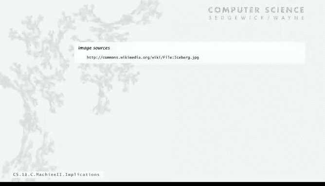
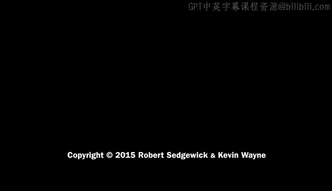

# 计算机科学：算法、理论和机器：P38：实际影响 💻


在本节课中，我们将探讨冯·诺依曼架构中“数据即代码”这一核心概念所带来的深远实际影响。我们将了解早期程序员如何利用这一特性来简化工作流程，并催生出更高级的编程工具。

---

## 概述

冯·诺依曼架构的核心在于数据和指令没有本质区别，同一个字（word）可以此刻是数据，下一刻是指令。虽然这可能导致恶意代码（如病毒）的产生，但其带来的积极实践意义更为重大。本节我们将重点讨论这些积极影响，包括程序存储、加载以及更高级编程语言的出现。

## 程序转储与引导加载

上一节我们介绍了数据和指令的统一性，本节中我们来看看早期程序员如何利用这一点来提升效率。他们面临的一个实际问题是：每天都需要通过开关手动输入程序，而机器（使用真空管）不能一直开着。

### 转储程序

为了解决这个问题，程序员编写了短小的“转储”程序，将内存内容保存到物理介质（如纸带）上。这样，一天的工作成果得以保存。

以下是转储程序的核心逻辑，它循环将内存内容输出到标准输出设备：

```
地址 04: 9AFF  // 将当前字写入标准输出
```

这段程序类似于我们之前用于加载数组的代码，但其核心操作是 `9AFF` 指令，用于输出内存字。程序从内存地址 `10` 开始循环，直到 `FEFF`（标准输入输出地址，无需转储），将内存内容全部输出到纸带上。程序员只需通过开关输入一次这个短小的转储程序，就可以用它来保存整个内存的状态。

### 引导程序

第二天，当计算机重启后，内存全部清零。程序员需要再次输入一个短程序，即“引导”程序，其功能与转储程序相反：从纸带读入数据并加载到内存中。

引导程序同样利用了间接寻址，与我们之前读取数组的代码非常相似。它的作用是读取纸带，将前一天保存的程序和数据重新载入内存。通常，内存的前几个字会预留给这段引导代码。许多早期计算机甚至将这段引导代码用胶带贴在机器旁边，因为这是每天开工的第一步。

早期程序员每天甚至每天多次进行这种操作，并以能快速在机器面板上输入这段代码为荣，其熟练程度堪比弹钢琴。转储和引导是早期工作流程的关键部分，而这完全得益于冯·诺依曼机器的思想。

## 汇编语言的出现

在掌握了基本的程序加载和保存后，人们很快意识到可以构想更高级的语言来编程。于是，汇编语言应运而生。

汇编语言使用助记符来代替数字操作码，例如用 `LA` 表示“加载地址”，`A` 表示“加法”，`S` 表示“减法”，`BPP` 表示“条件为正则跳转”等。更重要的是，它允许使用符号名来标记内存地址或寄存器。

例如，我们可以用 `loop` 这样的标签来标记一条指令，然后在跳转指令中引用 `loop`，而不是直接使用数字地址。

以下是使用汇编语言的优势：
*   **可读性增强**：使用字母助记符而非数字代码，使程序更易理解和编写。
*   **地址符号化**：使用符号而非具体数字来表示地址。
*   **位置无关性**：代码可以被移动到内存的其他位置，而无需修改源代码，因为汇编器会计算符号（如 `loop`）的实际地址。

这些优势使得编写一个名为“汇编器”的机器语言程序变得非常有价值。这个汇编器程序可以读取用符号正确编码的汇编代码，并生成对应的机器码。在威尔克斯的机器上，早期就采用了这样的汇编语言，因为用更高级的语言编写程序要方便得多。

值得注意的是，汇编器本身就是一个**以程序为输入并生成新程序为输出**的程序。这再次体现了冯·诺依曼架构的威力。直到今天，在性能关键的应用中，人们仍然会编写汇编语言代码，因为它能直接映射为极其高效的机器语言。

## 深远影响与总结

汇编语言只是冰山一角。“程序即数据”的思想带来了极其广泛的实际影响。

以下是一些现代常见的、处理程序的程序实例：
*   **安装程序**：将应用程序加载到你的机器中。
*   **编译器**：将你的 Java 等高级语言程序翻译成机器语言。
*   **模拟器**：接收为一台机器编写的代码，并使其在另一台机器上运行。
*   **交叉编译器**：在大型机器上生成供小型机器运行的代码。





本节课中，我们一起学习了冯·诺依曼架构“数据即代码”概念的实际影响。我们从早期的程序转储和引导加载开始，看到了它如何简化工作流程。接着，我们探讨了汇编语言如何利用这一思想，通过符号化和自动化翻译来大幅提升编程的便利性和灵活性。最后，我们认识到，从安装程序、编译器到虚拟机，现代计算基础设施中无处不在的“处理程序的程序”，其根源都来自于这一核心思想。尽管它也带来了病毒等安全问题，但其产生的积极推动作用无疑是决定性的。