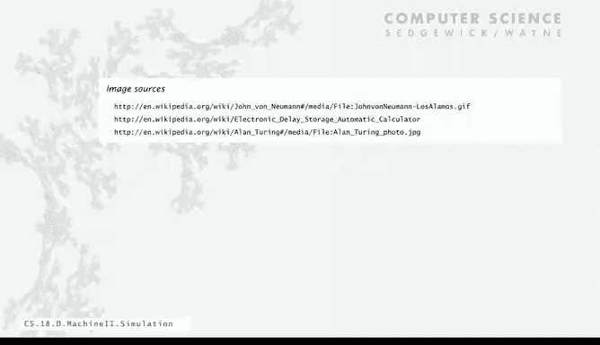

# 计算机科学：算法、理论和机器：P39：模拟

## 概述

在本节课中，我们将要学习计算机科学中的一个核心概念：**模拟**。我们将探讨如何通过编写一个程序来模拟另一台计算机（例如TOY机器）的运行，并理解这种模拟技术在现代计算机设计、软件开发以及虚拟化技术中的深远影响。

---

## 模拟的概念与重要性

接下来，我们来谈谈模拟，这是计算机领域的一个关键概念。

学生们经常问一个问题：TOY机器是真实的吗？我们如何调试TOY程序呢？答案是，我们编写了一个Java程序来模拟TOY机器，让它执行我们期望TOY机器执行的操作。正如你即将看到的，编写一个TOY模拟器是可行的。

实际上，TOY是一台简单的机器，因此模拟它的程序也相当简单，甚至比你为其他应用编写的许多程序都要容易。

事实上，我们设计TOY的方式就是基于这段Java代码，并不断对其进行完善。你可能会发现与这段代码相关的、更早版本的TOY设计，但我们主要使用这个Java代码。这表明，如今所有计算机都是以这种方式设计的：在真正建造计算机之前，人们会先为新计算机编写模拟器。

这引发了一些有趣的问题。例如，像Android或iOS这样的系统，你认为它们是“真实”的吗？全球有数十亿台Android设备，iOS设备也类似。你会认为这些设备是真实的。虽然市面上没有TOY设备，但另一方面，Java是真实的吗？Android运行Java。我们可以在Android上运行我们的TOY模拟器，那么理论上就有数十亿台TOY设备。所以，TOY和Java或Android一样真实吗？这是一个相当具有挑衅性的问题，我们现在就来深入探讨一下。

---

## TOY模拟器的实现

首先，让我们看看这个模拟TOY的Java程序。

我们的程序将从命令行指定的文件中读取TOY程序，然后使用Java的标准输入/输出来模拟TOY的标准输入/输出。

以下是一个例子：我们有一段TOY代码，用于将标准输入上的整数相加。这段代码将被加载到内存地址`0x10`（即十进制16）。这是TOY代码。如果存在数据（例如纸带的内容），当我们调用模拟器`toy.java`（字节码文件名为`toy`）时，第一个参数是程序文件，然后通过管道从`data.txt`文件获取输入。这个命令将使模拟器运行那个程序，即对`data.txt`中的数字求和，并将结果输出到标准输出，例如`00F7`。

让我们看看这段代码的结构。我们从十六进制地址`0x10`开始，需要一个名为`PC`（程序计数器）的变量。然后，我们需要TOY的16个寄存器，在Java中用一个大小为16的数组`R`来表示。内存同样用一个大小为256的数组`memory`来表示。

我们使用输入流来读取作为第一个参数指定的文件。只要输入流非空，并且地址小于`0xFF`，我们就用一个循环将输入流中找到的整数加载到内存中。这里我们使用`parseInt`方法，并指定第二个参数为16，表示我们期望数字是十六进制的。这是Java内置的功能，用于将表示十六进制数的字符串转换为整数，然后存入内存。

模拟器的核心是一个循环：读取`PC`指向的内存地址中的下一条指令，将其加载到指令寄存器`IR`（一个Java变量）中，然后递增`PC`。

在接下来的两页幻灯片中，我们将查看模拟器的主要功能：解码指令并执行它。这就是我们模拟TOY机器程序的一般结构。

---

### 指令解码

解码指令有时被称为“位操作”，因为我们需要拆解指令，查看其不同部分，并提取各个字段以供后续处理。

有一种简单的技术称为“移位与掩码”，它在Java中的工作原理与机器语言指令中的位与、异或等操作相同。通过几个例子，你可以在书中读到更多细节。

假设我们要从指令`1CAB`中提取目标寄存器`D`。指令寄存器`IR`包含这个16位值。我们将其右移8位，这样我们感兴趣的位（目标寄存器编码）就到了最右边的4位。然后，我们取字面值`0xF`（即二进制的`1111`），并与移位后的结果进行“与”操作。在掩码为0的位置，结果总是0；在掩码为1的位置，结果就是原始数据的比特位。这样我们就得到了目标寄存器`C`。

“与”操作的结果是：在掩码为0的位置结果为0，在掩码为1的位置结果为数据的比特位。这是一个基本技术，我们可以用它来获取所需的所有信息。

因此，在获取指令并递增`PC`后，我们可以通过将`IR`右移12位并与`0xF`进行“与”操作来获取操作码。获取目标寄存器的方法我们刚刚演示过。获取源寄存器`S`需要右移4位后再与`0xF`进行“与”操作。获取另一个源寄存器`T`则不需要移位，直接与`0xF`进行“与”操作即可。对于使用地址的指令，我们需要8位地址，因此与`0xFF`进行“与”操作。我们计算所有这些值，有些指令会使用`S`和`T`，有些则使用地址`addr`，但我们可以全部计算出来。这就是解码计算，即对TOY指令进行位操作，以获取模拟其运行所需的信息。

---

### 指令执行

执行部分是一个Java的`switch`语句。每条指令规定了简单的状态变化，这就是TOY机器的本质。我们只需要根据指令改变寄存器或内存的值。

如果操作码是0，我们就跳出循环。否则，我们根据操作码的值进入不同的`case`。

例如，`case 1`对应加法指令，这意味着`R[D] = R[S] + R[T]`。所有算术指令都类似。

实际上，这些`case`看起来非常像TOY机器程序员卡片上的文档说明。这里有左移、右移、加载地址（设置`R[D]`为`addr`）、加载指令、存储指令、间接加载和存储，然后是分支指令。分支指令可能涉及测试寄存器的值，并可能改变`PC`的值。`case 14`和`15`（操作码`E`和`F`）是关于实现函数的，我们可以跳转到寄存器中给出的地址，并可以将当前地址保存在寄存器中。你可以在书中阅读如何使用它们。以上就是TOY机器定义所规定的状态变化。

---

## 完整的模拟器与设计思想

这就是完整的模拟器，它整合了代码：加载程序部分、主循环、取指与递增、解码以及执行。整个模拟器可以放在一页幻灯片上。事实上，我们设计TOY的一个主要目标就是让它的模拟器能放进这堂课的幻灯片里。

当然，我们省略了一些细节：例如`R[0]`必须始终为0；我们需要处理标准输入和标准输出（当地址`addr`为`0xFF`时）；由于TOY是16位而Java是32位，有些地方需要进行类型转换；我们还需要更灵活的输入格式，因为有时我们希望将程序加载到内存的其他位置。你可以在书籍网站上看到完整的`Toy.java`实现，但这里的版本对于许多用途来说已经足够。它可以运行任何TOY程序，其行为与真实的TOY机器完全一致。事实上，它就是TOY。

如果我们给它一个导致无限循环的程序和输入纸带，它就会像真实TOY机器一样进入无限循环。

思考这一点非常重要：如果你想设计另一台计算机，你只需要修改这个程序。改变设计非常容易：我们真的需要三个寄存器吗？我们应该有一个寄存器内存吗？我们想包含哪些指令？你可以用这样一个简单的程序设计任何你想要的计算机。顺便说一句，我们没有TOY实体机，但我们可以使用这个模拟器在另一台机器上开发大量的TOY代码。

因此，有了我们的模拟器，我们就可以为TOY开发代码，即使TOY本身并不真实存在。

事实上，这个程序如此简单，你甚至可以用TOY语言本身来实现它。你可以在TOY上模拟TOY自己。这听起来有点疯狂，但现实世界中人们正是这样做的：你在当前计算机上编写一个程序来模拟下一台计算机。

---

## 模拟器的优势与虚拟化

这里还有另一个模拟TOY机器的程序，它是一个图形化模拟器，包含了各种辅助程序开发的功能，如完整显示机器状态、允许单步执行程序等。它还附带了许多简单的示例程序，可以看作是一个纸带库。这门课程的一位学生编写了它。你可以在这个模拟器上随心所欲地开发TOY软件。

模拟器甚至比真实机器更好，因为我们可以在模拟器中加入所有在真实机器上不存在的程序开发工具。这正是当今所有新系统采用的方法：我们先构建一个软件模拟器和开发环境，用它来为实际机器开发和测试软件。只有当我们确信软件在模拟器上经过充分测试、表现良好后，我们才会真正制造和销售硬件。

这是一个需要思考的重要概念，它再次得益于冯·诺依曼体系结构的思想。

---

## 向后兼容性及其挑战

这引出了向后兼容性的概念。在历史的任何时刻，假设我们在一台旧计算机上工作得很好，但我们知道有更快的技术出现了，是时候建造一台新计算机了。那么，我们如何处理旧软件呢？

一个想法是为新计算机重写所有软件，但这可能非常耗时、成本高昂且容易出错，而且没人愿意这么做。

因此，人们几乎总是选择编写一个程序，在新计算机上模拟旧计算机。这并不难做到。事实上，通常你已经有一个非常相似的模拟器，所以这不是一个一页纸的程序，可能是一个三页纸的小程序。而且，由于只增加了一点开销，它可能比旧计算机更高效。这使得所有旧软件都能继续使用。这是一个非常强大的想法：我们可以升级到新计算机，继续使用旧软件，速度可能还更快，然后我们可以选择开发哪些新软件。

但随着时间推移，例如在20世纪80年代，你可能需要购买专门的硬件来玩《吃豆人》。人们可能仍然喜欢拥有这些硬件的感觉。但到了21世纪初，你可以在笔记本电脑上运行它，现在你的移动设备上肯定也有《吃豆人》的模拟器。这不是新软件，它们只是在任何设备上通过模拟器运行旧软件。因此，旧软件仍然可用，根本不会消失。

然而，有一个令人不安的想法：真的有人知道那些旧软件是如何工作的吗？它们是在相当苛刻的条件下开发的：机器小、内存少，可能用机器语言编写，并且可能经过了好几层模拟器的模拟。也许移动设备上的模拟器在模拟笔记本电脑，而笔记本电脑又在模拟那台旧机器。因此，随着时间推移，理解旧软件如何工作变得越来越成问题。

这里有一个关于此的城市传说（可能不真实，但说明了问题）：航天飞机的火箭助推器需要通过铁路运输。美国的铁路是由英国移民建造的，因此美国的标准轨距与英国相同，是4英尺8.5英寸。而这个轨距是为了匹配英国旧乡村道路的车辙宽度。那些车辙是由罗马战车留下的。那么，罗马战车轮距是多少呢？它是由两匹战马的臀部宽度决定的。所以，最终结果是，航天飞机火箭助推器的尺寸是由战马的臀部宽度决定的。

这个故事的寓意是，向后兼容性并不总是一件好事。世界上有很多软件似乎有时就具有这种特征。

即使是广播电视也必须向后兼容，尽管现在一切都是数字化的，它必须向后兼容模拟黑白电视。许多商业软件是用COBOL编写的，这是一种“死语言”，现在没人再用它编写新程序了，但它通过许多层模拟仍在运行，人们在使用它，却无法理解它。

在世纪之交，“千年虫”问题是一个大问题，因为无法修复软件来理解“00”代表的是2000年，而不是比“99”（1999年）更晚的年份。航空调度软件写于20世纪70年代，经过多层模拟仍在运行，很难确信有人真正知道它是如何工作的。文档处理也是如此，有时你需要旧版本的文档处理软件来读取别人给你的文件。网页开发的一个真正噩梦就是试图维护与所有版本、所有不同浏览器的兼容性。

别忘了iPhone软件，正如我们注意到的，它使用了一种不安全的语言，但现在已成定局，新设备必须保持与这种不安全性的兼容性。

但真正令人警醒的是，我们大量的计算基础设施是在20世纪60、70、80年代，尤其是70年代，在机器上与TOY没有太大区别的计算机上构建的。所以，也许是时候为当今世界设计和构建一些新的东西了。你们现在拥有的计算机、软件和编程环境，远比我们用来构建现有软件的环境优越得多。这意味着，你们现在掌握的知识足以走出去并付诸实践。

---

## 虚拟机的概念与应用

将这一点提升到另一个层次，让我们看看虚拟机的概念。如今，当人们构建任何东西时，都会先进行模拟测试。模拟器必须非常好，否则可能无法反映现实，而且模拟可能成本高昂，但总比火箭爆炸便宜。对于计算机来说，模拟有许多优势：首先，模拟器就是新机器的定义；硬件建造出来后，会针对模拟器进行测试；模拟器就是现实。其次，在耗费时间、难以设计制造计算机所需的所有物理过程的同时，可以利用模拟器开发软件。再者，我们可以模拟可能永远不会被建造的机器，比如TOY就是一个很好的例子。

当今世界有很多这样的例子。例如，现在大多数编程系统都使用所谓的**虚拟内存**。程序能够寻址巨大的内存空间，远超真实机器可能拥有的内存。操作系统负责跟踪，将程序寻址的内存映射到计算机的真实内存。这个称为虚拟内存的想法已经存在很长时间，并且非常有用，因为它使编程变得容易得多。

**Java虚拟机**是另一个例子，它不是一台真实的机器，但该机器的模拟器运行在成千上万的真实设备上。这意味着可以在其上构建大量软件，而无需担心所有这些设备的细节。

然后是**云**的概念，最初是亚马逊云，但现在有很多。云上有各种类型的虚拟机可供在网络上使用。你只需要一个信用卡号，就可以调用一个虚拟机，以你想要的任何配置来运行你的软件。事实上，互联网商务以及许多软件开发正在转向这样的机器。

如果你正在创业，只需使用虚拟机。它的性能可能比十年前你能负担得起的真实机器还要好。过去，创业的一大努力是建立计算机中心并获取计算资源。无论你销售的是照片处理、消息传递还是其他服务，都需要这些。如今，初创公司不需要这样做，他们只需使用那些永远不会真实存在的虚拟机。计算成了一种像电力一样的公用事业。

---

## 总结

整个想法就是**抽象层**的概念，我们在计算中一次又一次地看到它：我们理解某个东西，然后在它之上构建其他东西。这是一个极其强大的想法。

再次强调，TOY是“真实”的，其真实程度等同于你的计算机是“真实”的。当你面临一个新问题时，一个好的思考方式是创建一种语言或一台机器来帮助你表达解决方案。你是否实际建造这台机器完全是另一回事，也许你只需要在某个真实机器上运行该机器的模拟器。

这是一个非常强大的想法，它完全得益于冯·诺依曼机器的思想，并真正为我们今天仍然面临的机遇打开了大门。

最后，我想提醒大家图灵和冯·诺依曼的贡献。在理论讲座中，我们讨论了**图灵定理**，它指出可以存在一台能够执行任何可计算任务的单一机器。这个思想体现在一种称为**图灵机**的虚拟机上，它是一种编码我们能用计算机完成的任何任务的方式。然后，我们可以有一个特定的虚拟机，称为**通用图灵机**，它可以模拟任何图灵机。使这个证明成立的核心概念就是**程序即数据**的思想。

冯·诺依曼随后很快提出了计算机设计的思想，这种设计具有我们所熟悉的所有计算机特征，并且是“程序即数据”概念的物理实现。

这两个思想共同表明，“程序即数据”的理念一直处于计算机科学的基础地位，并将在未来一段时间内继续如此。