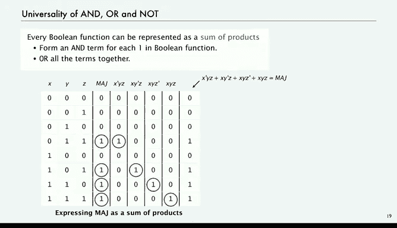

# 计算机科学：算法、理论和机器：P41：布尔代数 🧮

在本节课中，我们将学习布尔代数。这是一种数学形式体系，由乔治·布尔在19世纪40年代创立，用于研究逻辑问题。布尔代数旨在处理“真”或“假”的陈述，其变量代表真或假，我们通常将其解释为1或0。它包含“与”、“或”、“非”等基本运算。布尔代数在数学、逻辑学和计算机科学中有着广泛的应用，并且存在多种不同的记法。我们将使用电路设计中常用的一种记法，其中“与”运算类似乘法，“或”运算类似加法，“非”运算用 `x'` 表示。通过布尔代数，我们可以像处理代数公式一样证明和操作逻辑表达式，为理解更复杂的电路行为奠定基础。

## 布尔函数与真值表 📊

上一节我们介绍了布尔代数的基本概念，本节中我们来看看如何系统地描述布尔函数。布尔函数是接收参数并返回值的对象。对于布尔函数，我们可以使用一种称为“真值表”的工具来完整地定义它。

真值表为每一个可能的参数值组合分配一行，并在该行给出函数对应的值。如果有 `n` 个输入变量，每个变量可取两个值之一，那么真值表就有 `2^n` 行。

以下是几个基本布尔函数的真值表示例：

*   **非 (NOT)**：只有一个输入。
    *   如果 `x` 是 `0`，则 `x'` 是 `1`。
    *   如果 `x` 是 `1`，则 `x'` 是 `0`。
*   **与 (AND)**：`x * y`（或 `x AND y`）。
    *   当且仅当 `x` 和 `y` 都是 `1` 时，结果为 `1`，否则为 `0`。
*   **或 (OR)**：`x + y`（或 `x OR y`）。
    *   当且仅当 `x` 和 `y` 都是 `0` 时，结果为 `0`，否则为 `1`。
*   **或非 (NOR)**：`(x + y)'`。
    *   当且仅当 `x` 和 `y` 都是 `0` 时，结果为 `1`，否则为 `0`。
*   **异或 (XOR)**：我们曾在密码学示例中见过。
    *   如果 `x` 和 `y` 相同，结果为 `0`；如果不同，结果为 `1`。

真值表提供了一种完备的定义布尔函数的方式。它的一个重要应用是，通过穷举所有可能性，我们可以用它来证明布尔逻辑中的恒等式。

## 德摩根定律的证明 ✅

利用真值表，我们可以严谨地证明布尔恒等式。以下是德摩根定律的证明过程。

我们通过列出所有可能的 `x` 和 `y` 值组合，并计算等式两边的结果来证明。

**定律一：`(x * y)' = x' + y'`**

1.  计算 `x * y` 列。
2.  计算 `(x * y)'` 列（即对 `x * y` 列取非）。
3.  分别计算 `x'` 和 `y'` 列。
4.  计算 `x' + y'` 列。
5.  比较 `(x * y)'` 列和 `x' + y'` 列。可以看到它们在所有行都完全一致，因此等式成立。

**定律二：`(x + y)' = x' * y'`**

证明过程类似，通过比较 `(x + y)'` 列和 `x' * y'` 列在所有行的一致性来证明。

这种基于真值表的方法是确立布尔函数恒等式的可靠途径。

## 布尔函数的数量与多元函数 🔢

我们已经看到了两个变量的布尔函数。那么，存在多少个不同的布尔函数呢？

对于两个变量，真值表有 `2^2 = 4` 行。定义函数需要为这4行的每一行指定一个输出值（0或1）。因此，总共有 `2^4 = 16` 种不同的布尔函数。这些函数包括常数 `0` 和 `1`，以及 `AND`、`OR`、`XOR` 等。

对于三个变量，真值表有 `2^3 = 8` 行。因此，不同的布尔函数数量是 `2^8 = 256` 个。虽然我们不会全部列出，但其中一些很有用：

*   **多元与 (AND)**：当所有输入都为 `1` 时输出 `1`，否则输出 `0`。
    *   **公式**：`f(x, y, z) = x * y * z`
*   **多元或 (OR)**：当任意输入为 `1` 时输出 `1`，所有输入为 `0` 时输出 `0`。
    *   **公式**：`f(x, y, z) = x + y + z`
*   **多元或非 (NOR)**：当所有输入都为 `0` 时输出 `1`，否则输出 `0`。
    *   **公式**：`f(x, y, z) = (x + y + z)'`
*   **多数函数 (Majority)**：当超过半数的输入为 `1` 时输出 `1`，否则输出 `0`。对于三个输入，即至少有两个为 `1`。
*   **奇校验函数 (Odd Parity)**：当输入中 `1` 的个数为奇数时输出 `1`，否则输出 `0`。对于三个输入，即恰好有一个或三个为 `1`。

这些概念可以推广到任意 `n` 个变量。对于 `n` 个变量，真值表有 `2^n` 行。因此，不同的布尔函数总数是 `2^(2^n)`。这个数字增长极其迅速：
*   n=2: `2^(2^2) = 2^4 = 16`
*   n=3: `2^(2^3) = 2^8 = 256`
*   n=4: `2^(2^4) = 2^16 = 65,536`
*   n=5: `2^(2^5) = 2^32 ≈ 43亿`

这表明布尔函数的空间极其庞大，我们实际接触到的只是其中极小的一部分。

## 函数的通用表示：积之和 🌉

面对如此多的函数，一个关键问题是：我们能否用一组基本的运算来表示所有布尔函数？答案是肯定的。布尔代数的一个基本结论是：**每个布尔函数都可以用“与”、“或”、“非”这三种运算来表示**。我们将通过“积之和”表示法来证明这一点。

“积之和”表示法的思想是：为布尔函数真值表中每一个输出为 `1` 的行，构造一个特定的“与”项（积项），该积项仅在这一行输入组合下为 `1`，然后将所有这样的积项用“或”运算连接起来。

让我们以**三变量多数函数**为例。其真值表中输出为 `1` 的行对应输入组合：`(0,1,1)`, `(1,0,1)`, `(1,1,0)`, `(1,1,1)`。

以下是构造过程：
1.  对于行 `(0,1,1)`：构造积项 `x' * y * z`。仅当 `x=0`, `y=1`, `z=1` 时，此项为 `1`。
2.  对于行 `(1,0,1)`：构造积项 `x * y' * z`。仅当 `x=1`, `y=0`, `z=1` 时，此项为 `1`。
3.  对于行 `(1,1,0)`：构造积项 `x * y * z'`。仅当 `x=1`, `y=1`, `z=0` 时，此项为 `1`。
4.  对于行 `(1,1,1)`：构造积项 `x * y * z`。仅当 `x=1`, `y=1`, `z=1` 时，此项为 `1`。

现在，将这四项用“或”运算相加：
**多数函数 = `(x' * y * z) + (x * y' * z) + (x * y * z') + (x * y * z)`**

通过真值表验证，这个表达式的结果与多数函数的定义完全一致。这个方法显然适用于任何布尔函数。

因此，我们证明了 **{与， 或， 非} 是一个通用操作集**，因为任何布尔函数都可以仅用这些操作来表达。这对于电路设计意义重大：只要我们能够用物理器件实现“与”、“或”、“非”这三种基本逻辑门，理论上我们就可以实现任何布尔函数所定义的复杂功能。

## 总结 📝

本节课中我们一起学习了布尔代数。我们从乔治·布尔创立布尔代数的背景开始，了解了它用于处理真/假（1/0）陈述的核心思想，并熟悉了电路设计中常用的记法。我们学习了如何使用真值表来完备地定义布尔函数，并利用它证明了重要的德摩根定律。我们探讨了布尔函数的数量随着变量增加而爆炸式增长的现象，并认识了多元与、或、多数函数、奇校验函数等例子。最后，我们掌握了“积之和”表示法，并证明了 **{与， 或， 非}** 这一操作集的通用性，即任何布尔函数都可以仅由这三种基本运算构成。这为后续学习如何用基本逻辑门构建复杂数字电路奠定了坚实的理论基础。