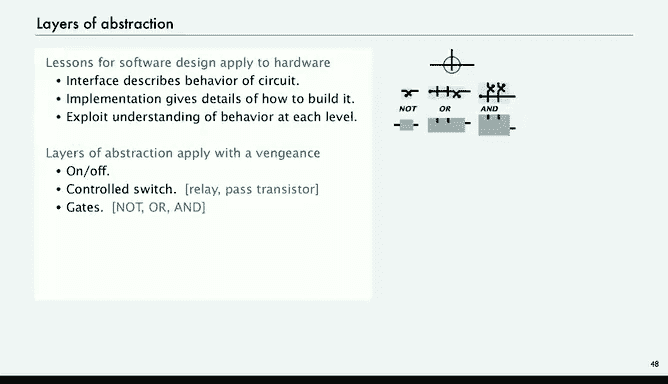
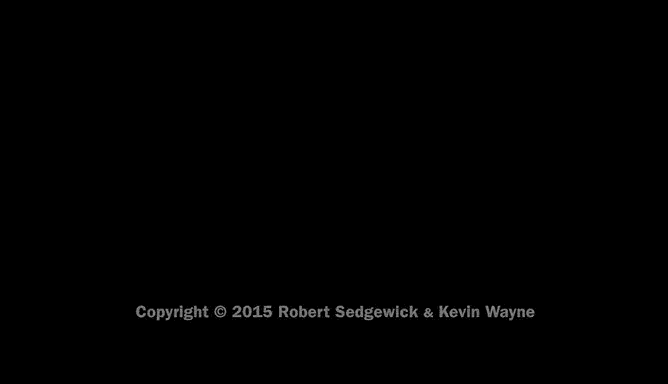

# 普林斯顿大学《计算机科学：算法、理论和机器｜Computer Science： Algorithms, Theory, and Machines》中英字幕 - P43：43_10_05_加法器电路.zh_en - GPT中英字幕课程资源 - BV1Ct42177Y6

Now we're ready to build a circuit that can add two numbers。

 and this will be representative of the kind of calculations that we want to do with our computing devices。

 So let's make an adder。So we're going to do an eight bit adder and so what we want to do is say that we have two binary integers。

 X and y， in this case eight bit and we want to compute the value of their sum。

 so here's an example and we've done binary addition in many cases before。So this is 0001-0111。

 so that's 16 plus 4 plus2 plus5 is 23， and then the other one is 32 plus 1649， so 23 plus 49 is 72。

 that's what we're trying to compute here。So what we'll do is in our adder circuit we'll take inputs and we're going to need those inputs all the way through the circle so at the top is the first binary number00010111 which is 23 and then the next input is the bottom binary number 00110001 that's 49 so that's our inputs to the circuit and again usually inputs come at top or left and then the outputs will come out in the bottom in this case 01001000 which is 72。

So we want to build a circuit that has this behavior。u。

So we're going to ignore overflow is actually if the number gets too big。

 then it would carry out a one。 we could catch that， but we're going to ignore it for now。

So in general， this is with all the inputs labeled symbolically， we're going to have8 bit numbers。

 x7 down to x0， y7 down to y0， our inputs and our outputs are z7 down to z0。

 and then we're computing the sum symbolically shown at the bottom left and we're going to ignore the carryout。

So we just learned how to implement a circuit that can implement any binary function。

 and this is a binary function。 So one thing that we might consider doing is build a truth table for each output bit。

So for8 bit adder， well we've got 16 inputs and then we've got， well。

 if you count the carry nine output bits， but there's way too many rows， there's two to the 16th。

 different possibilities of the inputs。65，000 rows， and if that doesn't seem bad。

 say in a real computer you might want a 64 or 128 bit ater。

 if you were to use this method for that kind of application。

 you'd have two to the 256 rows and we've already calculated that's bigger than the number of electrons in the universe。

So what Shannon and Bo tell us is that it's possible to build such a circuit。

 but not necessarily the most efficient way。 So we're going to look at a much more efficient way to build an adder circuit。

And it's a very simple idea， it corresponds to what we do when we're trying to add。

 we're going to do one bit at a time。So like what do we need to do to implement the carry bit when we're adding the first two bits？

Well， the carry bit， if x， Y and the carry in are 0， then it's going to be 0， or if it's 0，01。

 it's going to be 0。 It's only going to be one if we have two ones or three ones。

Does that sound familiar Well it is and we'll see in a second and similarly the sum bit it's going to be one if exactly one of them are one or if all three are one and then there's a carry out all three are one the sum is one and there's a carry out those are the functions that we need to compute。

 but those are the functions that we know The carry bit is the majority function the sum bit is the odd odd parity function so we already have the circuits that we need to compute the one bit at a time compute the carry in the sum and all we need to do is connect those circuits together to get our job done。

 and that's what this does so at the top is a majority function for each bit at the bottom is an odd parity function or the sum for each bit。

Both of those functions take three inputs， the three inputs are input bits。

 X and Y and a carry bit and the carry bit comes from the circuit to the right starting with a zero over at the left。

 then the output of the majority function， I'm sorry over at the right。

 The output of the majority function on the rightmost is routed through the middle and up over to be carry input into the secondmost from the right and so forth。

 So the carries are routed out and up to the next one to its left and these one bit adders are chained together with the carry which ripples through this is design is called a carry ripple adder。

And obviously， the same design extends to any number of bits。And that's our adder circuit。

 so here's our adder circuit magnified and we can take the covers off to reveal the circuits inside that we've already talked about on the top is a majority circuit for each bit and the bottom is odd parodity for each bit in if you examine this closely you can see the sums being computed in the carries coming out exactly as in our example an eight bit circuit for circuit for adding two eight bit numbers where we can see the function of every switch in the circuit。

So this example illustrates again the lessons of software design to really apply to hardware the interface gives the behavior of the circuit。

 the implementation gives the details of how to build it and we just exploit our understanding of the behavior at each level in order to implement the ad we needed to implement a boolean function we knew how to implement those Boolean functions we start with a controlled switch we build gates from the gates we can implement Boolean functions and after a while we have an adder next we'll look at how to incorporate the adder into an arithmeticologic unit and eventually to an entire central processing unit in the next lecture。

This approach vastly simplifies it not just vastly simplifies。

 it makes possible the design of complex computer systems， and not only that。

 it enables the use of new technology at any layer if we want to work hard on developing a better adder we can plug that in at any level and in fact。

 computers today use a more efficient adder， this one takes time proportional to the number of bits to ripple the carries through and it's possible to cut down on that time by a log factor。

So next we'll look at the athmeticologic unit。

