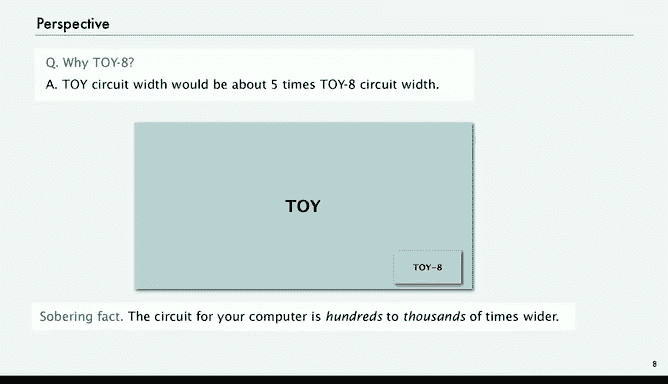

# 计算机科学：算法、理论和机器：P45：CPU设计概述

在本节课中，我们将把之前学过的所有概念整合起来，尝试解释计算机中央处理单元的工作原理。我们将从一个小型计算机TOY-8的CPU电路设计入手，理解其核心组件如何协同工作以执行指令。课程结尾，我们将总结CPU设计的关键思想。

## 概述：构建一台计算机

今天，我们将把这些概念整合起来，尝试让你了解计算机中的中央处理单元是如何工作的。

首先进行简要概述，以便理解背景。

我们要做的是构建一台计算机。实际上，我们将讨论计算机的中央处理单元。

我们不会过多关注键盘、显示器或触控板等设备。我们将专注于区分电视机和计算机的关键部分。如果你撬开计算机并观察内部，会看到一个称为主板的东西，上面有一个大型方形设备，即集成电路芯片，它实际上实现了一个称为CPU的电路。我们要研究的就是实现CPU的电路。

在上节课中，我们讨论了组合电路，并以实现ALU（计算机的计算器部分）作为结束。

在本节课中，我们将讨论内存。为了实现内存，我们需要所谓的时序电路，它包含反馈，这将使我们能够实现CPU电路的其他组件，并将它们全部整合在一起。

我们将为一个比TOY更小的计算机制作电路，我们称之为TOY-8。

回想一下基本的TOY指令集架构，我们花了几个课时讲解它。它有两种类型的指令：操作码加三个寄存器，或操作码加寄存器和地址。该机器有256个16位字的内存，16个寄存器，一个程序计数器，以及16条不同的指令。

今天，我们将看一个更小版本的TOY，称为TOY-8。

你可以将这个计算机视为TOY的早期版本。

它只有16个8位字的内存，并且只有一个8位寄存器。有16个不同的内存字，这意味着我们可以用4位来访问其中任何一个，这就是程序计数器。指令将只有一种类型，即包含操作码和地址，并且只有8条不同的指令。

8条不同的指令，我们只需要3位来指定其中一条指令。

16个字的内存，我们只需要4位来指定16个内存字中的一个。

实际上，在TOY-8指令集中有一个未使用的位。

你可以想象，在我们构建这台计算机时，我们不确定拥有更多内存（在这种情况下，我们会将该位用作地址的一部分）还是拥有更多不同的指令（在这种情况下，我们会将该位用作操作码的一部分）对我们更重要。这实际上反映了人们设计早期计算机时的现实情况。

但我们使用TOY-8的主要原因是，最终得到的电路足够小，可以放在一张幻灯片上。对于TOY来说，情况就不太一样了。

我们会回到这一点，但我们将展示这台计算机的完整CPU电路设计，它与许多真实计算机的区别主要在于一个参数，即内存的大小。

理解了TOY-8的设计，你就能理解完整TOY甚至你自己计算机的设计。

因此，TOY-8是一台不同的机器，所以我们将首先完整描述TOY-8是什么。

就像我们对TOY所做的那样，我们将使用一张参考卡来完整描述TOY-8中的每条指令。

现在我们将像在TOY中一样使用十六进制，但现在一个字只有8位，所以是两个十六进制数字。一个用于地址（在右边），另一个用于操作码（在左边）。

由于我们假设操作码的最后一位（字的第四位）是零，那么我们的操作码都是偶数。例如，加法指令的操作码是0010，但我们用来表示它的十六进制数字是0010或2，所以我们所有的十六进制数字都是偶数。

与TOY一样，伪代码给出了每条指令的操作。

与TOY的主要区别在于，在TOY中我们有多个寄存器，指令对这些寄存器进行操作并引用它们；而在TOY-8中，算术指令对寄存器内容和指定内存字执行操作的结果，并将该结果放回寄存器中。

因此，加法指令（操作码2）将寄存器的内容替换为寄存器内容和内存字内容之和。按位与（操作码4）和按位异或（操作码6）以相同方式工作。

然后我们有加载地址指令（操作码8），我们取指令右边的4位，并将其加载到寄存器中。

接着是加载指令，我们使用地址引用一个内存字，并将该内存字放入寄存器中。

然后是存储指令，我们做相反的操作：使用地址引用一个内存字，但将寄存器的内容存储到该字中。

最后，我们有一条分支指令，它测试寄存器是否为零，如果为零则改变程序计数器。

这里TOY-8缺少的主要是移位指令。右移更容易实现，而左移更具挑战性，这些是练习内容。但你仍然可以用TOY-8实现许多我们在TOY中实现的程序，主要限制是它只有16个字的内存。

尽管如此，所有基本功能都在：算术指令、内存引用和条件分支。

在TOY-8中，我们假设内存位置0始终为零。我们将有标准输入，因此可以从内存位置F加载；以及标准输出，存储到内存位置F。

有了这些信息，再加上TOY和其他编程语言的经验，我们都可以编写简单的TOY-8程序。

以下是一个TOY-8程序的例子。这是你在TOY中的第一个程序，其中有两个数字存储在内存中（本例中是内存位置5和6）。这个程序的作用是将这两个数字相加，然后将和存回内存。

第一条指令是加载指令（可以从第一个数字看出，指令的第一个数字总是偶数），用于加载内存位置5。然后，位置2是一条加法指令，我们将内存5中的数字与内存6中的数字相加，结果放入寄存器。第三条指令是存储指令（操作码C），我们将寄存器内容存储到内存7。第四条是停机指令00。这比在TOY中需要先加载两个寄存器才能做加法的指令数要少。

同样，执行完加载后，寄存器5有数字5。执行完加法后，得到8加5，即D。执行完存储后，该结果进入内存位置7，然后我们停机。

因此，一个非常简单的程序是15个或更少的两位十六进制数字列表。看起来不多，但另一方面，如果你枚举所有可能性，TOY-8程序的数量远远超过我们所见过的，你可以继续编写程序，将斐波那契数列输出到标准输出、相加数字等等。16个字的限制绝对是一个限制，但你仍然可以做很多事情。

但我们并不是主张你编写程序，只是希望你相信这个程序与TOY或真实计算机足够相似，理解如何设计实现TOY的电路，就能很好地理解如何为拥有更多内存、寄存器和指令的计算机设计电路。

## CPU电路组件

我们需要实现的电路组件实际上基于描述机器时描述的组件。

有一个实现加法和异或的ALU，有内存，有寄存器，有程序计数器和指令寄存器。然后在本节课中，我们将介绍两个新组件：一个称为控制器，一个称为时钟。时钟是驱动机器一个接一个执行操作的部件，控制器是将这些序列转换为指令，发送给所有组件以改变其状态来实现指令的部件。这就是我们本节课要重点关注的。

我们想要一个完整的TOY-8 CPU电路，它实现所有这些组件，将它们连接在一起，并执行指令。

回顾一下，这是上节课的一张幻灯片。我们所有的组件都是主要功能单元。我们将采用某些约定，以便轻松识别它们的功能。

它们是蓝色方框，接收总线输入（通常是字的内容或地址），这些输入从顶部进入，我们总是在左侧连接到组件。

输出在底部，我们从组件的右侧连接出去。

然后我们有蓝色的控制线，它们使组件执行操作。

我们在上节课中以这种方式实现了ALU。

在本节课中，我们将实现其他组件，然后讨论如何将它们连接在一起。

同样，我们可以通过旋转这些部件、将它们打包在一起，并放弃这种“左侧进入、右侧出去、顶部进入、底部出去”的约定，使电路更小一些。但那些打包的电路更难理解。这就像编码中的风格约定，你可以在程序中使用更少的字符，但程序会变得难以理解得多。电路也是如此，我们的电路可能只比原本的电路大50%左右，所以这不是什么大问题。

因此，我们将坚持这些约定。

## 为什么选择TOY-8？

那么，既然我们已经有了TOY，为什么还要费心去研究TOY-8呢？主要原因是TOY的电路会非常庞大，或者如果我们试图把它放在一张幻灯片上，组件会非常小。估计大约是TOY-8的五倍大，所以不太值得。我们转向TOY-8，这样你就能看到每一个开关，然后你可以想象TOY会非常相似，并且大部分空间被极其相似的东西占据，比如内存位。

TOY-8有16个8位字，只有16乘以8等于128位内存。而TOY有256个16位字，有4000多位内存，这些都是相同的，所以在整体图中包含所有这些内容没有意义。

现在，一个令人清醒的事实是，你的计算机可能比TOY-8宽几百或一千倍。因此，这些电路与你的计算机中的电路相比极其微小。但同样，其中大部分是非常规则的东西，比如内存位，它们对理解其实际工作原理没有太多帮助。因此，当我们讨论设计时，这种差异并不真正显著，因为这三者都基于相同的基本思想，而我们的目的就是尝试解释这些思想。

接下来，我们将开始研究实现内存的基本思想。