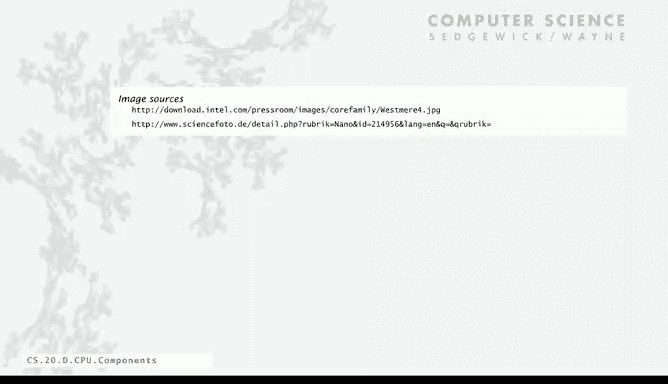

# 普林斯顿大学《计算机科学：算法、理论和机器｜Computer Science： Algorithms, Theory, and Machines》中英字幕 - P48：48_11_05_组件与连接.zh_en - GPT中英字幕课程资源 - BV1Ct42177Y6

Now we're going to use those same basic ideas that we use for the program counter to put together an entire computer processor。

So again， just remember that just as with your actual computer for you' to pry it open。

 we're thinking of the CPU as just a circuit inside the 2y8 machine。

And we're not going to worry about the interface to the outside world at all Well， I guess on off。

 we you've got to have power in all our power dots and run。

 we assume that when the programme represses the run button and there's a wire that comes into a circuit that goes up。

But in terms of getting stuff loaded into the memory through the switches and lights。

 we'll leave that stuff， that stuff out， it's an easy addition。

 but maybe the memory gets loaded with lasers or some other way and actually in modern computers actually there's lots of different ways to load the memory。

 so what we're concerned with is that the machine' got some state。

 it's got the program in it say what happens when the run button is pressed。Okay， so again。

 let's review our components， we have our ALU， our memory， our register， our PC。

 our instruction register control and the clock。And we'll look at the connections on the next slide。

 but we're also going to need we already talked about these。

 we're also going to need bus muges for the register because there's a of three things that connect to the register and for the memory address because there's two things that connect to the memory address。

Those are the basic components。So the next thing we do is have to look at the bus connections。

 how exactly we have to connect these components together。

And that's dependent on the instructions that we want to implement， so for all instructions。

 we have to get the fetch， so that is what do we have to do in a fetch。

 we have to get a word out of the memory， get a word out of the memory。

 its addresses is in the PC so we have to connect the PC， to the memory address。

And then to get the word out of the memory it's the output of the memory it's got to go into the instruction register。

 so in order to do a fetch of an instruction we need these bus connections address going from the PC into the memory address and the output of the memory going into the instruction register。

Halt instruction and no information well that's the control line we'll talk about on the next slide。

What about arithmetic instructions， Well， arithmetic instructions。

It takes the we have to get a word out of the memory， what word do we get out of the memory。

 its address is given in the address bits of the instruction register。

 so we take the four address bits out of the instruction register and those have to connect up to the memory that's a section second connection to the memory that's what goes into the address mugs。

 two connections to the memory from the PC and from the four bits of the instruction register and we have to raise a line to select between them。

So that's getting the address from the instruction register the memory。

 but we also have to get the word out of the memory into the ALU so add an extra connection over on the left there。

 taking the output of the memory into the ALU as well as to the IR again。

 that's an output connecting the two components so we can just do that with the T connection。

So then we also need our second argument is from the register into the ALU。

 so this is all just to make an add or X or andt happen。

 so now we've connected up our memory word and our register contents to the ALU and the way to get it through the address and then we have to take the result and that has to go into the register eventually but since there's a lot of things go into the register we just connect it to the R MuX and again we've got multiple connections to the RMX so for example load address we have to take the address bits from the instruction register and bring them around over to the R MuX as a candidate for going into the register。

And then that output of that Rm goes into the register。 and again， we have multiple connections to R。

 That's why we have the mus。So load instruction， we've already used。

 we have to get the instruction register address connected to the memory。

 and then the word from the memory has to go into the register。

 so a new little tab appeared at the left connecting the memory output at the bottom into the ROX that's the third connected connection to the register。

And finally， for store， again， we already have the connection from the instruction register address to the memory address。

 but now what do we have to do in a store， we have to get the contents of the register into the memory。

So now the output of the register goes straight up and then over to the left into the ALU。

 we just need to connect it over to the right to also go into the memory。

So that's the data path the connection for the store instruction。

 and then the last one is branch of zero， branch of zero in order to do that we're going to have to get the address from the instruction register into the PC。

And that's the input to the PC that we talked about when we did the PC。

So that's all our bus connections for our entire toy8 computer。

Different instructions call for different connections and when we have multiple inputs to a component。

 we have to include aMx and just by systematically considering each of these。

 we can see what we need。That's the first part of the job。

 Second part of the job is the control wires。 Well。

 we've already talked about control wires for each one of these components。 This is by components。

 so we just need to enumerate them。For the clock， when we press run it goes on and when a halt happens。

 it goes off， so that's a control wire from that go into the clock component and most of these control wires come out of the control circuit that we'll talk about next。

So what goes into the control circuit is the signals raised by the clock， that's our fetch。

 fetch right， execute and X right， execute right， so our clock produces those signals and control as we'll see in the next slide is a combinational circuit that uses those signals to provide control wire sequences for all the other control wires in the circuit。

So for example， the ALU， there's add X or and and， those are the ones that select which of the computed output should go to the output bus for each of the Muuxes like the R Mus。

 there's the three possibilities do we want to select the input that is connected to the ALU。

 the memory or the instruction register， then there's the right for the instruction register when it's time to write it。

 that's the right pulse and for the register and another one for the instruction register。

 the memory's got its right pulse， and then the PC has are we going to increment or load。

 those are selections for the internal Mus， and then PC write signal and then the last two or the selection lines for the address MuX。

Those are all the control wires for the toy 8 CPU。So those are the wires that we have to lay out and the last thing we have to talk about is control。

 that's a circuit that does the control wire sequencing。

We get the behavior we want by lighting up these control wires in particular sequences。

So the inputs for control are the four wires from the clock， and those come in at the top。

We also need the op code from the instruction register because what we do depends on which instruction we're executing。

We also need the contents of R and that's for the branch on zero if all of those are zero and the op code is7。

 we're going to do a different thing I'm sorry is E。

 we're going to do a different thing then if not that's branch on zero。

And the outputs of this control circuit are all the 15 control wires that we just enumerated for all the CPU components。

The important thing to remember about control is that it's just a simple， combinational circuit。

If we remove the cover， we have a combinational circuit that is going to do the job of deciding which control wires to light up depending on what the op code is。

And so we just make a table for all the things that we want to have happen and implement the conditions expressed in that table with a combinational circuit。

The key feature of this circuit in the middle is a couple of demors that are based on the op code。

 so there's three op code bits， and these demplexexors have eight outputs。

 one going left and one going right the signal， a demplexexer takes three bits and it takes a signal and then it produces on the addressed output。

 the value of that signal so this has the effect of the one on the left is tied in with fetch sorry the one on the left is tied in with execute the one on the right is tied in with execute right so when execute comes high it'll light up one of those eight outputs on the left and when execute right becomes high one of the eight outputs on the right will be lit up according to the instruction so only one of those lines is on。

But let's look at the tables now on the left。For all instructions， when fetch becomes high。

 we need to raise the the control line that selects the that the。

Input to the memory address should come from the PC。

 so that's the address Mus PC line and you can see that fetch， which is labeled left at the top。

 goes all the way through the circuit and comes out with that control line on。And also。

 we always increment the PC except in the case that branch on zero， if the register is zero。

 and there's a gate in there that takes all the inputs from the register and takes whether it's the branch instruction and lights that up。

And then for fetchtch right we just want to write the instruction register so Fretch Fright goes right through the whole circuit and does an IR write signal down at the bottom and execute right always writes the PC so over on the right we light up the PC and then for each instruction there's logic that like for example the arithmetic instructions add instructions is op code one so the second gate down in the multiplexer is the only one that turns one so it turns on ALU add and then it'll also needs to select the ALU line of the register mus and so all of those instructions go down into an or gate that lights up that line and so forth you can check everyone for everyone instructions which control lines it lights up and it's exactly the ones that we need。

In order to get the state change that instruction specifies。

Control turns the clock sequence into a sequence of control wires。

 those control wires cause changes in the memory modules。

 changes in states that really implement what the instructions want to do you can study those in the book or on the book site are on this slide so let's take a look at how our sample program which loads a word from memory adds to it another word for memory stores the result in memory we'll see how that's implemented through a sequence of control of control signals。

Again， we assume that the program loaded in the memory somehow。

 the first instruction address of the first instruction one is in the PC。

 and we press the run button。And we're going to look at the sequence of control signals。

So the first thing that happens is a fetch signal comes out of a clock。

 the clock is just going to repeatedly do fetch， fetch right， execute， x。

 execute right as we described。And fetchch through control is connected to the PC selection line for the address mugs that means that we're going to want to get a word out of the memory for fetchch in what word is it it's the word whose address is in the PC。

 the first instruction the one at address one memory location one so now when fetch right comes up。

 control sets that to IR right， that's what we want to do every time fetch rightite comes up is we want to change the value in the instruction register to be the instruction to be executed well how exactly does that happen well the instruction register has only one input that input is the memory output。

So what word of memory is on those memory output lines Well it's the one that's addressed selected in the address mus and that one is selecting the value in the PC so those output lines contain the contents of memory location1 which is a5 and when we give the fetch right pulse。

 that value gets stored in the instruction register。

 that's as simple as that that's what happens for every instruction fetch sets the address Mox PC line。

 fetch right sets the IR right pulse which causes the word from the memory to be loaded into the instruction register。

Okay， so now that's load instruction。The next thing that happens is execute。

 which through control sets the appropriate lines for the load instruction。

 so what has to happen for the load instruction。Well， first thing is PC increment。

 PC increment happens for every instruction except branch on zero， except maybe branch on zero。

 so we're going to set up so that when the right signal comes， the PC is going to increment。

 so that we do that by selecting the PC increment line and the PC。

Then what else happens has to happen for a load instruction。

 well we're going to want to get a word out of memory and put it into the register。

So what word do we want to get out of memory while the one whose address bits are in the instruction register。

 so that means we set the selection line for the Me address mus to choose the address bits of the instruction register。

And then the other thing we want is we want that word to go into the register。

 but that has to happen through the Mus， the memory output is connected to the register Mux。

 but we have to do the selection line which which selects that output to be the one that's loaded into the register so now when execute right happens with all these control lines on two things happen first the PC gets incremented PC right just enables the value that is out of the incrementer to get loaded into the PC and the second thing that happens is since the address Muux is set to use the address from the instruction register that's memory word5 then the contents of memory word 5 which is05 gets loaded into the register because that's the input that's chosen by the register Mus。

So that's our first instruction executed through this sequence of control signals now the same thing is going to happen。

 we're going to load our next instruction， which is the ad instruction for memory location 6。

So now that's instructions in the instruction register so now when the execute signal comes from the clock we always go fetch fetch right。

 execute xrite， execute right so when the execute signal comes we want to set up for the ad so how do we set up for the add instruction again we want to increment the PC for an add instruction then we want to select the result of the adder from the ALU so the ALU addd is selected and now we want the result to go into the register but now we want the that has to go through the MuX the ALU is connected to the register but we have to light up the ALU selection line for that MuX。

So that the the result computed by the AL you will go into the register。

 So now when we click execute right， think about what's going to happen execute right is going to。

Enable writing the register， it's going to enable writing the PC so writing the register because of the way the control lines are set up is going to add the word at the address memory location to the word in the register and it's going to put the result back into the register on that right pulse and the PC right is going to increment the PC。

Now again we'll load up the next instruction which is a store instruction， it's the C7 instruction。

 so a store instruction it's again it's going to increment the PC and store instruction we want to set the again the memory instruction word that referred to its address is given in the instruction register。

 that's number7。And then。What happens at execute right for the store instruction is a memory write signal so what value gets written into the memory well let's look at the connections that we have set up so first of all the address of the word that's affected is selected through the address marks to be the address bits of the instruction register which is7 so it's word 7 that's affected and what value gets put in there well the only input to the memory it comes in at the top where does it come from well you see it comes from the register so the value that's in the register gets stored in the memory and again the PC gets increment。

So that's our third instruction executed and now the PC is at four。

 and so again we fetch our next instruction and that's the halt and then what happens and execute is that that lights up the halt signal which stops the clock。

So that that sequence of control signals executes that program and gets the two numbers executed。

 and you can see that any program is going to result in a sequence of control signals like that that is going to affect the change of state that's needed。

So that is how your computer works。Now we've not covered a lot of details。

 but really this basic idea really is at the root of implementing a computing circuit。

Here's our complete Toy 8 CPUU， and if you take the covers off and look carefully。

 you can see every control signal， every bus， every memory bit in this circuit。

Our whole design goal for the last four lectures was to get to this point where you could really see how a computer circuit works。

Now here's a closeup of a real microprocessor and you can an expert could identify the bits in this image。

 and I just want to make the point that you there's really no difference between our drawing and this drawing。

 other than scale， so we have maybe a one bit per square centimeter and this thing has maybe 25 billion bits per square centimeter。

 but in terms of the conceptual design they're not different。So how does your computer work。

 the details， all the details are very interesting， but somebody might ask， well。

 you took a course in computer science， how does the computer work。

 and it's worthwhile to try to think of the basic ideas that we've covered。

So there's a circuit known as the CPU that's built of very simple elements switches that are connected by wires and what it does is it processes information that's encoded in binary。

 even including its own instructions， that's the fundamental concept of the von Neuman machine。

 circuits that have feedback we use to implement memories。

 tiny circuits that tiny elements making big circuits and what instructions do is move information among the memories specify operations or implement mathematical functions like adan that are based on Boolean logic。

And it all works because of clock pulses， regular clock pulses that activate sequences of control signals that cause the state changes that implement the machine instructions。

Everything else， almost everything else is implemented as layers of software。

 everything that you're familiar with from your applications to your display and so forth is implemented as software。

 a layer of abstraction， each layer that adds a vast amount of additional power and scope。

The basic concept and the basic machine is relatively simple。

 it's just that it does it at amazing size， scope and speed。

So that's the the the last slide of content。 And I just want to revisit what we promised at the beginning。

 So this course is supposed to be a brief introduction in computer science。And our goals are to。

 first of all， to empower you to exploit available technology。

 and we covered data structures and link structures and algorithm design。

 a lot of basic information that are going to help you solve applications problems。

Then we want to build awareness of intellectual underpinnings and the idea of universality and computability and interacttractability absolutely give you some idea of the limitations and opportunities of what we can compute。

And then we wanted to demystify computer systems and that's what our toy machine and our toy circuit in this lecture were all about。

 so I hope we can check that one off for many of you as well there's much more information available on the web and in our book and I also want to take this opportunity to thank Kevin Wayne who you haven't seen on screen but who has worked with me for 15 years in developing these materials Kevin and I have learned quite a lot during the 15 years been working on this and we hope that many of you have learned a lot as well。

 and there's much more to learn available in the book on the book site and if you're interested in more consider taking algorithms and we'll see you there。

