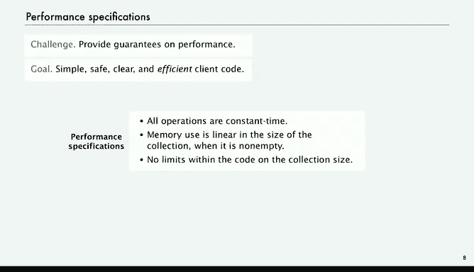

# 普林斯顿大学《计算机科学：算法、理论和机器｜Computer Science： Algorithms, Theory, and Machines》中英字幕 - P6：06_03_02_应用程序接口.zh_en - GPT中英字幕课程资源 - BV1Ct42177Y6

Today we're going to start talking about data structures。

 ways of organizing data within the computer to make it accomplish certain tasks more efficiently。

To start， we're going to talk about two very fundamental abstract data types called stacks and Qes。

At first blush they seem quite simple， but actually they lie at the heart of many computational procedures。

As with everything we do， we're going to precisely describe these abstractions with APIs。But first。

 just a little review of the distinction between data types and data structures。

 so we know and we've talked from the beginning， a data type is a set of values and a set of operation on those values。

Some of the data types are built into Java like int or double or string。

 but most of the data types that we use are not built into Java。

 we define them ourselves like complex or picture or Char and other examples that we have considered in this course。

And we describe the data types with APIs， and these are just examples that we've considered in earlier parts of this course。

So data structure is a different thing， that's about representing data within the computer and relationships among data。

 and you'll see in this lecture that even with a few very simple mechanisms。

 we can build quite intricate data structures。Sometimes data structures are built into Java。

 for example， as， for example， of a data structure。

 one dimensional or two dimensional that are built into Java。

Where we can store tables of numbers or any kind of object， but most are not。

 and that's what we're going to start looking at today。

 we're going to look at link lists today and next time we're going to look at trees。

They can take all different types of form so for every data type you have a set of values you have your data and there's a design challenge which is what data structure should we use there's two primary resources that come into play the first one is how much memory is needed and the second one is how much time do the data type methods use given that data structure and those are going to be informed the design decision every time we define a data type that is going to involve processing a significant amount of data。

So now let's look at the APIs for stacks and cues， and they're examples of collections。

 collections and abstract data type whose values are a set of items that are all of the same type。

 we say a multiet because they could be equal。So several， actually。

 of the fundamental collection ADts in particular， the stack in the queue differed just in the detail of the specification of their operations。

 So let's look at a stack。 the basic operations for a stack or to add a new item to the collection and we say we add it at the beginning。

 and then the second operation is to remove and return the item most recently added。

 that's the specification of what that operations should do。

 That's called a lifeO disciplineip last in first out。 So we take away from the beginning。

 Those are the stack operations。 And then we also want to test if there's any items there。

 test if the collection is empty。 and we want to know the size of the collection。

 So those are the basic operations that characterize a pushdown stack。A queue is very similar。

 the only difference is the specification of which item to remove and return。For a Q。

 we think of adding new items at the end and taking items from the beginning。

 that's called a first in， first out discipline。And again， we test if the collections empty。

 return the sides of a collection， so those are very similar abstract data types。

 and they only differ in this detail of the specification。

 whether we use a LIFO or a FiIO discipline to decide which item to remove and return。Now。

 these two data types arise naturally in countless applications。

 and we'll examine a few of them in just a bit。One of the key characteristics that we want to emphasize is there's no predetermined limit on the size of the collection from the point of view of the program。

 there's no limitation on how many items can go into the stack or how many items can go into the queue and that's very important conceptually and allows the design of code that can survive the test of time as computers become bigger and bigger the programs can operate with more and more data because there's no specification about the size of the collection and we'll come back to that point in a minute。

 it's a subtle point， but it's a really important one that we want to emphasize in this lecture。

All right， so let's look at some examples of a stack in operation。

So we're talking about the we name the operations push and pop。 P is add an item to the collection。

 P is remove and return the item that was most recently added。So if we push2， then push B。

 then we put B at the top of the stack， put another one or。

 and you can see the items go to the top of the stack。

 So always we take the new new item and put it on the top。

Now we'll specify pop just by writing a minus sign。

 so that says take the item most recently app it added to the collection so we remove the two from the top in this case。

 and that's what we return and then what's left in the stack is the other four in order that we gave them from put them in from bottom to top。

So that way， we know that when we。Remove one。 We take it from the top right at the top。

 So now put B in， take the one from the top。 That's B。 Then the next one is not。Now if we push that。

 that goes to the top and so forth。So this trace of the example of stacks give you a good feeling of what this data structure is supposed to do。

All right， by contrast， here's what happens with a queue with the same list of operations。

So now we put the new items down at the end。And that's not in the specification that's in the implementation of this example。

 but it allows us to remove and return the item least recently added if we take that one from the beginning or from the top。

So the DQ， again indicated by the minus sign is remove and return， the item least recently added。

 is going to come from the top and we put another B on that goes at the end and remove the B and so forth。

Again， remove from the beginning。 Add to the end。 that gives us implements the operation of remove and return。

 The item least recently added。 That's what happens with the Q。Okay。

 so that's the basic idea of those data types in operation is one other thing that we want is we want to be able to put any type of data on a stack or a queue and that requires a little more effort in Java code。

 the way that Java deals with data structures like collections that are intended to work for any type of data is called generics or parameterized data types。

And it's not that difficult to understand the code and then if you look at our code and use it as a template。

 you'll be able to write code of this kind yourself。

The idea is to rather than use a real type name in the definition of the data type。

 we use a placeholder type name， actually within angular brackets。And then in client code。

 we put a real data type in for the placeholder， and let's look at how that works。

 we'll give some examples。For now， I just want to point forward to that kind of code so that we can specify the API。

So rather than just say we want to define what a stack is， we want to say what a stack of items is。

 so inside the bracket is the not a real type name but placeholder type name。

 we want to have a stack of items and we want to be able to substitute any type of data for item。

So the constructor creates a stack of items and they all have to be the same type item。

Then our push method takes an item as parameter， and again， in client code。

 that'll be substituted for string or integer or any other type of data。

It doesnn't return anything just adds the item to the stack。The pop takes no argument。

 it just returns the item most recently pushed from the stack。

 and the type of that is our placeholder name item。Is empty， returns a booleion。

 says whether the stack is empty or not， and size is an int。

 which is the number of items on the stack。That's our specification of a stack in Q specification actually is the same except that the names are different。

We call the add item to a Q method N Q， and we call the remove return， the least recently in Q item。

 DQ。And again， otherwise， the definition of the API is exactly the same differs only in name。

 and then we have is empty in size。So those are our APIs and we're going to look at some client code in just a second and then we'll look at implementations。

That's our specification of what these data types are。

Now but we're going to add one other thing because it's extremely important in many。

 many applications and we've seen it already in several examples。

 performance matters and what we want to do is provide guarantees on performance so that not only is our client code simple。

 safe and clear but also efficient， we don't want to have performance bugs hidden within our implementations。

 and somehow we want to。Specify when we're talking about what a data structure is。

 that it's got some performance guarantees with it。

This is a little bit outside what you normally see in language specifications of libraries。

 but it's very important， particularly for fundamental data types like this。

 and we'll come back to this point often later on。So for stacks and Qes。

 we want to have the specifications that， first of all， all the operations should take constant time。

 These are simple operations， should only take a few instructions。Shouldn't waste a memory。

 If the collection's got a few items， we should only use a little bit of memory。

 If it has a lot of items， we should use a lot of memory。

 but linear in the size of the collection should only use。

A constant factor times the number for every item in the collection。 if it's not empty， of course。

 if it's empty， the size is zero。 so but if there's any number of items。

 the memory you should be bound by constant times the number of items。

And then the other thing I already mentioned is there shouldn't be any limits within the code on the size of the collection。

It's as we'll see， it's kind of easy to solve this problem if you have such limits。

 but it's a much better design goal to say that our code can be used even way in the future when collections may turn out to be much bigger。

 we don't want to have to change our code to adapt to changes in technology。

So these are requirements， again， if the client code is going to be scalable。

 it's going to be useful in the face of Moore's law。Now， as I mentioned。

 it's typical in programming languages to say that if you implement the API。

 we specified the methods that we're going to use， then you have implemented the stack and queue abstraction。

 but we're holding our implementations to a stronger standard。

 we're going to say if you don't meet those performance spec。

 then you do not implement the abstractions， It's not a stack if some operation takes linear time。

 or if the memory use is huge， it's not a cu queue if some operation takes more than constant time。

 those are some other kind of data structures but they're not stacks and queuees。

We're saying if you want to use that name， you better not only match the API。

 but also meet the performance specifications， otherwise you're talking about some other kind of data structure。

