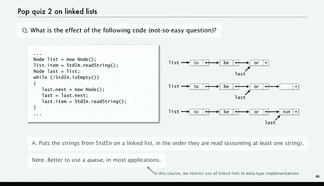

# 普林斯顿大学《计算机科学：算法、理论和机器｜Computer Science： Algorithms, Theory, and Machines》中英字幕 - P9：09_03_05_链表.zh_en - GPT中英字幕课程资源 - BV1Ct42177Y6

The new data structure that we're going to use to implement stacks and queuees is called a linked list。

 It's a fundamental data structure with all kinds of applications。

 and that's the one that's going to solve this problem for us。So。

The idea is a distinction between sequential and linked allocation of memory to whole data。

Sequential data structure or an array， weve put all the objects right next to one another in your computer's memory。

 they just go consecutively in the memory of the computer。So here。

 this is pointing ahead a little to a small machine that we're going to talk about in detail later in the course。

 the memories have names and here the names I'll begin with C in the items are stored one after another consecutively in the memory。

It's like a Java array。The thing is fixed size， but you can get quickly to any item in there。

 that's a sequential data structure。A linked data structure is a different thing。

There we're going to associate with each object a link to a different object。In this case。

What we have in the computer is a memory address of another object。

 over in the left is the names of the objects where the objects are located in the memory。

 and every object has associated with it， the name of another object in memory。So in this case。

 Alice。Is linked through the memory address to Bob。

 and Bob is linked through the memory address to Carol， and Carol's link is null。

 So that indicates the end。In Java these things are called our references。

 that's the Java name for the memory address and we're going to work with Java code and then later on we're going to talk more detail about how things are represented in a machine。

嗯。So the whole idea is that the size of the structure is variable is just as many links as you have。

 they're not stored next to one another in memory， and the only thing you can do is get to the next element in the memory。

 the next element in the sequence each time。Most novice programmers don't get this far。

 this is a level of sophistication， it's not reached by a lot of programmers。

 it's not very difficult but it's quite different than the idea of using an array to access a place in memory and it's an introduction to a whole new world of organizing data and we're going to see in others more important example in the next lecture。

 very flexible and it's very widely used within the system and it's important to understand the concept of linked data structures when it comes to efficiently processing data and implementing algorithms。

So the very simplest linked data structure is called a linked list。

 and one way to think of it is as a recursive data structure。

A linked list is either null or a reference to a node and a node is a data type that has a reference to a node。

 so if we unwind that recursion we can say a linked list is a sequence of nodes。

Or it's a node followed by a linked list is' a number of ways to unwind that recursion。

And so what we do to represent a linked list is use a private class node to implement the node abstraction first this is a little complicated but it's actually very simple and we use this one construct to create all different types of data structures。

 so taking the time to understand it in this simple context is worthwhile。

So we're going to start with nodes just having two values， a string and a node。

 and we can add generics to the code and so forth later。

 but let's just work with a node it's a data type that has a string with it and then it's got another value which is a reference to another node。

And that's what that data type is， so we're going to use this as a nested class within our code so we can refer directly to these variables item and next within any given node。

So it's a string in a reference to another node。And so this diagram shows an abstraction of a linked list built from nodes。

The first is a variable it's a reference to a node， that node。

 its item is got the string Alice and its next is a reference to another node which contains Bob and so forth。

That's a linked list。 It's。Example of a linked list。

 and we're going to use a Java code like that to build linked lists。Now。

 even with just one link like this， a value and a link to another node。

 things can get pretty complicated， we talked about this simple one。

 but you could have multiple nodes pointing to a given node and that creates a structure called a tree or it could be circular or you could get a row shape or in general you can get a pretty complicated mathematical shape。

This just indicates how powerful this abstraction is。

 we're going to stick for now just with the simplest the linked list actually next time so the thing is from the point of view of any particular object。

 the data structure could be any one of these things。

 we have to ensure in our code that we have the simple one。Next time。

 we're going to talk about structures that have more than one link。

 And then there's lots more possibilities。 It's a very powerful concept。

 The idea of structuring data with links。 So let's look at what the。

What Java code that creates a linked list might look like。 and again。

 we've got a abstract representation of what the memory of the computer might be like over on the right。

So we've got a。Variable third， that's of type node。 that's going to be a reference to a node。

 We say that's a new node。 Then job is going to allocate two spaces for it。

 One actually be a reference to a string， but in the example。

 we'll just put the string in and the other'll be a reference to a node。

So if we say third dot item equals Carol， we can refer directly to item given the variable because we're using an inter class third dot next equals null。

 again it would be a reference to the string car and be more complicated but let's think of it in this way。

 that's what we're going to get is a node with a variable that's a reference to a node。

 that node contains a string and another reference in this case it's null。

Or in our diagrammatic representation， that's what we've got so far。

So now let's create another new node， now the system decides where it's going to be in memory and just returns a reference。

And yeah， C9， C A， CB， you'll understand what that means in a couple of lectures。

So second dot item equals Bob and second dot X equals third。

 so this is linking the node containing bob in front of the node containing Carol in the list。

 so now we have second points to Bob which then refers to Carol。

And how do we get that link to Carol in there， that last line， second dot next equals third。

 third is a reference to the node containing Carol。

 second dot next is a reference to the node following Bob and that simple code gets that done。

And again， if we want to put another one in first equals another new node。 that's Alice and then。

We say first that next SQL second， that links Alice in front of Bob。

That's the example of code for building a linked list。

We're not going to write a lot of code like this， but we're going to write some code like this and the point is that with the ability to manipulate links and references we can build rather complicated data structures。

So， when。Before higher level languages like Java， where people were writing in much lower level languages。

 building lists was done with lower level code and there's a lot of standard operations developed for processing data that's structured as a singlely linked list。

So like one thing you might want to do is add a new node at the beginning or remove and return the node at the beginning。

 or add a node at the end。 well， actually you need a reference to the last node in order to be able to add a new node at the end so it can't always do it。

Or traverse the list， visit every node in sequence。For many years。

 we would teach in introductory programming courses quite a bit about writing code of this type。

Sometimes we might have a doubly linked list， which we're not going to do。

 it's where each node points to the one after it and the one before it in the list。

 and that one you can maybe remove and return the node at the end and other types of operations。

So let's look at what these。First couple of basic operations look like with just a singly linked list。

How about Re and return the first item in a linked list？Well， we can get the item。

 the string by just first dot item and we'll put that in a variable。

 and so now we have that first item stored away。 So now how do we remove it from the list Well。

 it's actually very easy just say first equals first dot next。And that will。

The first refer to the same place that Alice's nextfield was referring to， and that's Bob。

And what's really significant about this is it leaves no reference to Alice in Java that's no problem。

 that's precisely what Java's garbage collection system is for。

 Eventually Java will find that memory and reclaim it for later use。And then we just return item。

 so three lines of code， we can remove and return the first item in a linked list。Very simple code。

And what we're left is with the list that just has the later two items。

What about adding an item to the beginning of a linked list well it's just manipulating the few pieces of data that references that we have available so we're going to say that after we're done with this。

 the AliceIS is going to be the second list second note in the list so we save that away。

 second equals first。And to put Dave in， we're going to need a new node， so first equals a new node。

And so now we've got verse a new node and then we got the rest of the list pointed2 by second。

 so we fill in the new node first item equals item that puts Dave in and first at next equals second now we've got a linked list and the second variable is no longer relevant。

But it's critical that we held on to that before we set reset first to be new node。

 If we hadn't done that， there'd be no way to access anything in the list。

 That's the kind of challenge that we face in developing list processing code。

What about traversing a list， visiting every node on a list， Well。

 that's just a simple while loop where you could do it in a for loop as well x equals first while x is not null。

 print x dot item and set x to x dot next。We'll print x dot item， and it's Alice。

 set x to X dot next， just moves right through the list， it's not null。

 I'm print out the list in order。So that's three examples of operations on linked lists that are easy to code。

So let's look at a couple of pop quizzes and I'll not address these directly I'll leave these for you to study and look at the answers。

 so here's a more complicated piece of code that processes a list。

 it reads from Standard in and it does a few operations on the list and then goes through it。呃。

The answer is what it does is it winds up printing the strings from standard in on standard out。

 but in reverse order。So it reads them in and then puts them at the beginning of the list。

 which winds up reversing them。Better to use a stack than this。

 or although this code is kind of implicitly within the stack implementation that we're going to look about。

呃。So here's the code that uses a stack to do it。One reason we don't teach that much less processing nowadays is that most of this kind of processing is embodied in higher level data structures like stacks。

Here's another one and again this is worth a little bit of study just to cement your understanding of linked lists。

 this one it turns out， puts the strings from standard in on a linked list in the proper order and it does that by adding nodes at the end of the list by keeping track of the last one in the list。

Again， this kind of processing is embodied in our Q implementation， as we'll see in a bit。

So those are basic examples of code that process linkedless next we're going to look at how to use code like this within an ADT implementation to actually implement the stack API。

