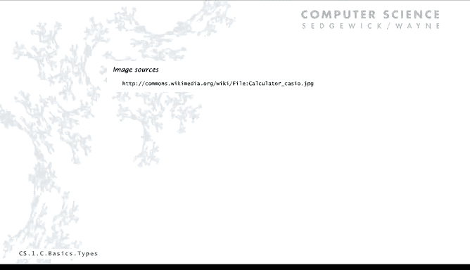

# 003：内置数据类型 🧱


在本节课中，我们将学习Java语言中内置的基本数据类型。我们将了解每种数据类型所代表的值集合、可执行的操作，以及如何通过变量、字面量和语句来操作这些数据。掌握这些概念是编写任何Java程序的基础。

## 数据类型概述

数据类型是编程中的一个核心概念。一个数据类型包含一组值以及可对这组值执行的一系列操作。理解这个定义对于深入学习编程至关重要。

## Java内置数据类型

以下是Java语言中几种主要的内置数据类型及其简要介绍。

*   **字符型（`char`）**：其值集合是键盘上可输入的字符，例如 `‘A’`、`‘@’` 或 `‘1’`。可执行的操作包括比较字符，例如用于单词排序。
*   **字符串型（`String`）**：其值集合是字符序列，例如 `“Hello world”` 或 `“CS is fun”`。核心操作是**连接（concatenation）**，使用 `+` 号实现。
*   **整型（`int`）**：其值集合是整数，例如 `17` 或 `1234`。可执行标准算术运算：加（`+`）、减（`-`）、乘（`*`）、除（`/`）和取余（`%`）。
*   **双精度浮点型（`double`）**：其值集合是浮点数（科学计数法表示），例如 `3.14159` 或 `6.022e23`。可执行与 `int` 相同的算术运算，但用于处理实数（通常是近似值）。
*   **布尔型（`boolean`）**：其值集合只有两个：`true`（真）和 `false`（假）。可执行逻辑运算：与（`&&`）、或（`||`）、非（`!`）。

## 变量、字面量与语句

上一节我们介绍了数据类型的定义，本节中我们来看看如何在程序中操作数据。这涉及到几个基本概念：变量、字面量和语句。

*   **变量**：一个指向某个值的名称。例如，在程序 `int a = 1234;` 中，`a` 就是一个变量。
*   **字面量**：在编程语言中直接表示一个值的方式。例如，整数字面量就是一串数字 `1234`。
*   **声明语句**：将变量与特定类型关联的语句。例如，`int a;` 声明变量 `a` 为 `int` 类型。
*   **赋值语句**：将一个值与一个变量关联的语句。例如，`a = 1234;` 将值 `1234` 赋给变量 `a`。声明和赋值可以合并：`int a = 1234;`。

## 一个简单的程序示例：交换值

为了理解上述概念如何协同工作，让我们看一个交换两个变量值的完整程序示例。

```java
int a = 1234;
int b = 99;
int t = a;
a = b;
b = t;
```

以下是该程序执行过程中变量值的变化轨迹（trace）：

| 语句执行后 | `a` 的值 | `b` 的值 | `t` 的值 |
| :--- | :--- | :--- | :--- |
| `int a = 1234;` | 1234 | - | - |
| `int b = 99;` | 1234 | 99 | - |
| `int t = a;` | 1234 | 99 | 1234 |
| `a = b;` | **99** | 99 | 1234 |
| `b = t;` | 99 | **1234** | 1234 |

该程序成功交换了变量 `a` 和 `b` 的值。需要注意的是，Java中的赋值（`=`）是“关联”操作，而非数学意义上的“相等”。

## 字符串操作与输出

仅仅交换值我们无法看到结果，因此程序需要输出。我们使用 `String` 类型和 `System.out.println()` 方法进行输出。

字符串的核心操作是连接（使用 `+` 号）。连接操作将第二个字符串的所有字符附加到第一个字符串之后，形成一个新的字符串。

> **注意**：`+` 号的含义取决于上下文。在引号内是字符 `‘+’`，在引号外是连接操作符。空格在引号内是字符串的一部分，在引号外则被忽略。

以下是一个使用字符串连接构建尺子刻度标记的程序：

```java
String ruler1 = “1”;
String ruler2 = ruler1 + “ 2 “ + ruler1;
String ruler3 = ruler2 + “ 3 “ + ruler2;
String ruler4 = ruler3 + “ 4 “ + ruler3;
System.out.println(ruler4);
```

运行此程序将输出：`1 2 1 3 1 2 1 4 1 2 1 3 1 2 1`。这个简单的程序仅通过字符串操作就完成了一个有趣的计算。

## 输入、输出与类型转换

程序通常需要与外界交互。在Java中，我们通过命令行进行简单的输入和输出。

*   **输出**：使用 `System.out.println()` 打印字符串。即使打印数字，Java也会自动将其转换为字符串。
*   **输入**：在命令行运行程序时，程序名后面键入的参数会以字符串形式提供给程序。

由于输入是字符串，而计算可能需要数字，因此需要进行类型转换。Java提供了相应的方法：
*   `Integer.parseInt(String s)`：将字符串转换为 `int`。
*   `Double.parseDouble(String s)`：将字符串转换为 `double`。

结合交换程序，我们可以编写一个从命令行读取两个整数并交换后输出的完整程序：

```java
public class Exchange {
    public static void main(String[] args) {
        int a = Integer.parseInt(args[0]);
        int b = Integer.parseInt(args[1]);
        int t = a;
        a = b;
        b = t;
        System.out.println(a + ” ” + b);
    }
}
```

运行 `java Exchange 1234 99`，程序将输出 `99 1234`。这个程序模板适用于许多场景：从命令行获取参数（字符串）、转换为数字、处理、再转换回字符串输出。

## 整数运算

`int` 类型在计算机中的值范围是有限的，在Java中是从 `-2^31` 到 `(2^31)-1`。字面量是此范围内的数字字符串。

整数运算包括加、减、乘、除和取余。需要注意的是：
*   整数除法会**舍弃小数部分**，结果仍是整数。例如，`7 / 2` 的结果是 `3`。
*   取余操作（`%`）得到除法后的余数。例如，`7 % 2` 的结果是 `1`。
*   除以零会导致运行时错误。
*   表达式求值遵循**运算符优先级**：乘、除、取余优先于加、减。可以使用括号 `()` 明确指定运算顺序。

理解整数与字符串的差异及自动转换很重要。考虑以下表达式：
*   `“123” + 4`：Java将整数 `4` 转换为字符串 `“4”`，然后进行连接，结果为 `“1234”`。
*   `123 + 4`：这是整数加法，结果为 `127`。

## 浮点数运算

`double` 类型用于表示浮点数（实数近似值）。其字面量可以用小数形式（`3.14159`）或科学计数法（`6.022e23`）表示。

> **重要**：`double` 值通常是实际数学值的近似。例如，在Java中没有精确等于 `1/3` 或 `π` 的 `double` 值，只有非常接近的近似值。

`double` 运算包括标准算术运算。一些特殊情况：
*   `1.0 / 0.0` 的结果是特殊值 `Infinity`（无穷大）。
*   `Math.sqrt(-1.0)` 的结果是特殊值 `NaN`（非数字）。

Java的 `Math` 库提供了丰富的数学函数，例如 `Math.sqrt()`（平方根）、`Math.sin()`（正弦）、`Math.pow()`（幂运算）、`Math.random()`（随机数）等。利用这些函数，我们可以用Java程序替代计算器进行科学计算。

以下是一个使用二次方程求根公式的程序示例：

```java
public class Quadratic {
    public static void main(String[] args) {
        double b = Double.parseDouble(args[0]);
        double c = Double.parseDouble(args[1]);
        double discriminant = b*b - 4.0*c;
        double d = Math.sqrt(discriminant);
        double root1 = (-b + d) / 2.0;
        double root2 = (-b - d) / 2.0;
        System.out.println(root1);
        System.out.println(root2);
    }
}
```

运行 `java Quadratic -3.0 2.0` 将输出 `2.0` 和 `1.0`。如果判别式为负，`Math.sqrt()` 将返回 `NaN`。

## 布尔运算与比较

布尔类型非常简单但基础，其值只有 `true` 和 `false`。逻辑运算符包括：
*   **与（`&&`）**：两者都为真时结果为真。
*   **或（`||`）**：至少一个为真时结果为真。
*   **非（`!`）**：取反。

比较运算符用于比较两个同类型的值，结果是布尔值：
*   相等：`==`
*   不等：`!=`
*   小于：`<`
*   小于等于：`<=`
*   大于：`>`
*   大于等于：`>=`

这些运算符可以用于构建条件逻辑。例如，判断一个年份是否为闰年的规则是：能被400整除，或者能被4整除但不能被100整除。

```java
public class LeapYear {
    public static void main(String[] args) {
        int year = Integer.parseInt(args[0]);
        boolean isLeapYear;
        isLeapYear = (year % 4 == 0) && (year % 100 != 0);
        isLeapYear = isLeapYear || (year % 400 == 0);
        System.out.println(isLeapYear);
    }
}
```

运行 `java LeapYear 2024` 将输出 `true`。

## 总结




本节课中我们一起学习了Java内置的核心数据类型：`int`（整数）、`double`（浮点数）、`boolean`（布尔值）、`char`（字符）和 `String`（字符串）。我们了解了每种类型的值集合和基本操作，学习了如何使用变量、字面量和赋值语句来操作数据。我们还探讨了简单的输入输出方法、类型转换，以及如何利用这些基础组件构建执行实际计算（如数学运算和逻辑判断）的完整程序。这些概念是后续所有Java编程的基石。