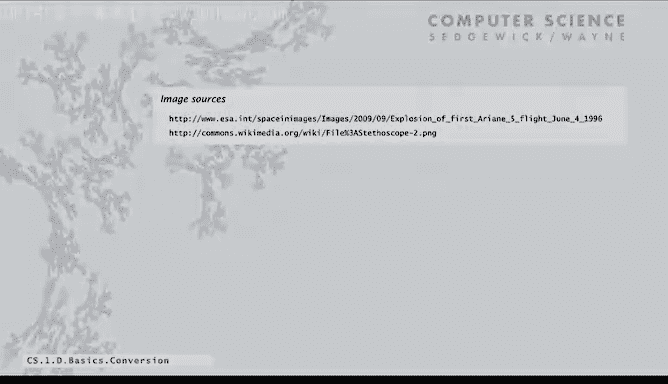

# 004：类型转换 🔄


在本节课中，我们将要学习Java编程中一个基础但至关重要的概念：类型转换。我们将探讨为什么需要转换数据类型、转换的不同方式，以及如何在实际编程中正确应用它们。

---

上一节我们介绍了Java中的基本数据类型及其操作。本节中我们来看看，当我们需要在不同类型之间进行计算或赋值时，该如何处理。

数据类型的概念意味着，参与特定操作的变量必须是正确的类型。Java编译器会检查代码中的类型错误，例如，尝试将整数与字符串相加，或将布尔值与双精度浮点数相乘，编译器都会报错。这有助于我们避免因自动转换而产生意外结果。

然而，在编程中，我们经常需要将一种类型转换为另一种类型，以使操作中的类型匹配。对于内置类型，转换是编程的一个基本方面。转换可以通过三种方式发生。

以下是三种主要的类型转换方式：

1.  **自动转换**：当操作涉及不同类型时，如果不会丢失精度，Java会自动进行转换。例如，在表达式 `11 * 0.25` 中，整数 `11` 会自动转换为浮点数以进行计算。另外，如果 `+` 运算符的一个操作数是字符串，另一个操作数是数字，该数字会自动转换为字符串以完成连接。
2.  **显式函数调用**：有时我们需要使用函数来明确地进行转换。例如：
    *   `Integer.parseInt(String)` 将字符串显式转换为 `int` 值。
    *   `Math.round(double)` 将浮点数四舍五入为最接近的 `long` 或 `int`。
3.  **强制类型转换（Cast）**：对于属于多种类型的值（如小整数可以视为 `short`、`int` 或 `long`），或者当我们想将浮点数截断为整数时，可以使用强制类型转换。其语法是在值前加上目标类型，并用括号括起来。

例如：
*   `(int) 2.71828` 会将值截断为 `2`。
*   `11 * (int) 0.25` 中，`0.25` 被截断为 `0`，因此结果为 `0`。

---

理解类型转换有时会带来反直觉的结果，但通过练习会变得容易。我们来看几个例子，这些可能会出现在测验中：

*   `(7 / 2) * 2.0` 的类型和值是什么？
    *   首先，`7 / 2` 是整数除法，结果为 `3`（类型为 `int`）。
    *   然后 `3 * 2.0` 中，`3` 自动转换为 `double`，两个 `double` 相乘，结果为 `6.0`（类型为 `double`）。
*   `(7 / 2.0) * 2` 呢？
    *   `7 / 2.0` 中，`7` 自动转换为 `double`，结果为 `3.5`（`double`）。
    *   `3.5 * 2` 中，`2` 自动转换为 `double`，结果为 `7.0`（`double`）。
*   字符串连接也需要注意：
    *   `"2" + 2` 结果为字符串 `"22"`，因为整数 `2` 被自动转换为字符串。
    *   `"2.0" + 2` 结果为字符串 `"2.02"`。

---

我们之所以有不同的数值类型（如 `int`, `double`, `short`），是因为需要在数值范围、精度和内存使用之间做出权衡。但这也带来了限制：有时转换是不可能的。

例如，尝试将 `70000` 强制转换为 `short`：`(short) 70000`。由于 `short` 类型的取值范围是 -32768 到 32767，这个转换无法正确表示原值。Java的处理方式是给出一个定义明确但可能不符合预期的结果（溢出），程序员需要自己确保值在有效范围内。忽略类型转换错误可能导致严重后果，历史上就有因控制变量类型转换错误导致火箭坠毁的案例。

---

最后，我们来看一个类型转换的实际应用示例：生成指定范围内的随机整数。

我们想要一个介于 `0` 和 `n-1` 之间的随机整数（例如，掷骰子时 `n=6`，抽牌时 `n=52`）。以下是实现思路：

1.  使用 `Math.random()` 获取一个 `[0, 1)` 区间的 `double` 类型伪随机数 `r`。
2.  计算 `r * n`。由于 `r` 小于1，结果在 `[0, n)` 区间，类型为 `double`。
3.  使用强制类型转换 `(int)` 将结果截断为整数。这样就得到了一个 `0` 到 `n-1` 之间的随机整数。

核心代码逻辑如下：
```java
double r = Math.random();
int result = (int) (r * n); // n 由用户输入或指定
```
这个技巧在本课程后续会经常用到。

---

本节课中我们一起学习了：
*   **数据类型** 是一组值及其上的一组操作。我们介绍了Java中常用的内置类型：用于输入输出的**String**（字符串）、用于科学计算的**int**（整数）和**double**（双精度浮点数），以及用于程序决策的**boolean**（布尔值）。
*   在Java中，**必须声明变量的类型**。
*   在必要时，**必须进行类型转换**。转换方式包括自动转换、显式函数调用和强制类型转换。
*   必须**识别并解决类型错误**才能编译代码。Java编译器是你的朋友，它会帮助你发现并修复类型不匹配的问题，从而编写出更健壮、可靠的程序。




下一节，我们将讨论如何编写具有更复杂控制结构、能执行更多有趣任务的程序。