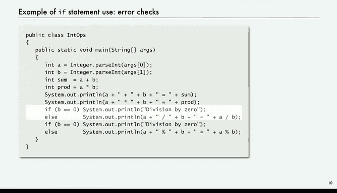
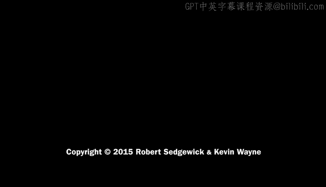

# 005：条件语句-if语句 🧠


在本节课中，我们将要学习条件语句，特别是 `if` 语句。这是控制程序执行流程的基础工具，允许程序根据特定条件做出决策，从而执行不同的代码块。

上一节我们介绍了基本数据类型和操作，本节中我们来看看如何通过条件语句让程序具备“思考”和“选择”的能力。

## 控制流与条件语句

在之前的课程中，程序遵循**直线控制流**，即按顺序逐条执行语句。通过引入条件语句和循环，我们可以编排更复杂的控制流，实现更丰富的计算功能。

最简单的条件语句是 `if` 语句。它的核心思想是：根据某些变量的值来决定是否执行特定的语句。程序会评估一个布尔表达式，如果结果为真（`true`），则执行后续的语句。

以下是 `if` 语句的基本形式：
```java
if (布尔表达式) {
    // 如果表达式为真，则执行这里的语句
}
```

## `if` 语句示例

一个简单的例子是计算绝对值：
```java
if (x < 0) {
    x = -x;
}
```
这段代码检查变量 `x` 是否小于 0。如果条件为真，则将 `x` 设为其相反数（即取绝对值）；如果条件为假，则 `x` 保持不变。最终，`x` 的值是其绝对值。

## `if-else` 语句

`if` 语句还可以搭配 `else` 选项，用于在布尔表达式为假时执行另一组语句。

例如，以下代码用于计算两个数 `x` 和 `y` 的最大值：
```java
if (x > y) {
    max = x; // 如果 x 更大，则 max 等于 x
} else {
    max = y; // 否则，max 等于 y
}
```
这段代码判断 `x` 是否大于 `y`，并根据结果将较大的值赋给变量 `max`。

## 程序实例：模拟抛硬币

以下是 `if` 语句在一个完整程序中的应用，用于模拟抛硬币：
```java
public class CoinFlip {
    public static void main(String[] args) {
        if (Math.random() < 0.5) {
            System.out.println("Heads");
        } else {
            System.out.println("Tails");
        }
    }
}
```
程序使用 `Math.random()` 生成一个随机双精度浮点数。如果该数小于 0.5，则输出“Heads”（正面）；否则输出“Tails”（反面）。每次运行都可能得到不同结果。

## 程序实例：两数排序

让我们分析一个名为“TwoSorts”的程序。它的功能是从命令行读取两个整数，并按数值顺序打印它们。

以下是程序的核心逻辑：
```java
int a = Integer.parseInt(args[0]);
int b = Integer.parseInt(args[1]);

if (b < a) {
    // 交换 a 和 b 的值
    int t = a;
    a = b;
    b = t;
}

System.out.println(a + " " + b);
```
程序首先读取两个整数 `a` 和 `b`。然后，`if` 语句检查 `b` 是否小于 `a`。如果是，则通过一个临时变量 `t` 交换 `a` 和 `b` 的值。无论是否交换，最终 `a` 都小于或等于 `b`，从而实现了排序输出。

基于此，你可以思考如何对三个整数 `a`、`b`、`c` 进行排序。以下是实现思路：
1.  使用一个 `if` 语句确保 `a` 小于 `b`。
2.  使用另一个 `if` 语句确保 `a` 小于 `c`（此时 `a` 已是最小值）。
3.  使用第三个 `if` 语句确保 `b` 小于 `c`。
经过这三个步骤，`a`、`b`、`c` 将按升序排列。

## 避免运行时错误

`if` 语句的一个重要用途是检查并避免程序运行时错误，从而编写更健壮的程序。



例如，在我们之前进行整数运算的程序中，除法或取余操作的分母可能为零，导致程序崩溃。更优的做法是预先检查该条件：

```java
if (b == 0) {
    System.out.println("Division by zero");
} else {
    // 安全地进行除法或取余运算
    int quotient = a / b;
    int remainder = a % b;
}
```
通过 `if` 语句检查分母 `b` 是否为零，我们可以提前捕获错误，打印提示信息，并避免执行会导致崩溃的操作。这是一种良好的编程实践。




本节课中我们一起学习了 `if` 语句的基本概念和应用。我们了解了如何通过布尔表达式控制程序流程，如何用 `if-else` 处理不同情况，并看到了在排序和错误处理中的实际用例。掌握条件语句是编写动态、智能程序的关键一步。