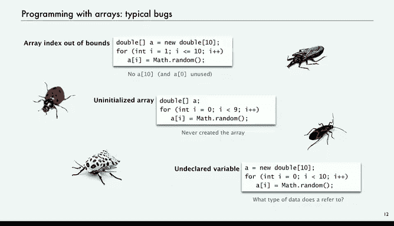

# 010：数组基础概念


在本节课中，我们将学习Java中的一个重要语言结构——数组。数组能帮助我们编写处理大量数据的程序，并且使用起来非常简便。我们将从数组的基本概念开始，了解它是什么以及如何使用。

## 概述

数组是我们编程基础构建块中的新成员。在学习了条件和循环之后，数组是我们今天要讨论的下一个结构。它赋予我们存储和处理海量数据的能力。在本课程中，我们将看到数组的许多应用。幸运的是，这是一个非常自然且易于使用的结构。它是我们的第一个数据结构。

那么，什么是数据结构呢？数据结构是一种数据排列方式，它能帮助我们在程序中高效地处理数据。

## 数组的定义

数组被定义为**相同类型值的索引序列**。让我们逐一理解这些概念的含义。

以下是一个数组的例子：一副52张的扑克牌。这是我们本节课将大量使用的示例。第一张牌在第一个位置，第二张牌在第二个位置，红桃A在第三个位置，依此类推。给定一个索引，我们可以立即获取到牌堆中该位置的牌。

但数组还有许多其他应用场景。例如，你可能有一个在线课程中的大量学生，同样可以通过索引快速访问每个学生。或者，在处理数字图像时，图像中可能有十亿个像素，我们需要能够快速访问每一个像素。生物学家研究DNA时，DNA链中可能有大量的核苷酸。这些例子都表明，当你拥有大量相同类型的数据元素，并且需要结构化它们以便高效处理时，数组就派上用场了。

因此，数组的主要目的是**促进这类数据的存储和操作**。

## 处理大量同类型数据

让我们看看“处理大量同类型数据”意味着什么。以下是一个例子，我们可以在不使用数组的情况下，仅用第一节课的知识来编写代码。

假设我们有10个数据项，我们只是将它们命名为a0到a9。如果我们想引用第五个，可以说 `a4 = 3.0`；引用第九个，可以说 `a8 = 8.0`，依此类推，甚至可以在算术表达式中使用它们。

然而，很快你就会发现，编写这种代码会非常繁琐且容易出错。使用数组是一种更简单的方法。以下是使用数组的等效代码，我们不再需要单独声明所有同类型的变量。

我们只需在一个语句中声明要创建一个数组。我们稍后会详细讨论前两个语句的工作原理。然后，如果我们想引用第五个元素，只需将索引放在方括号内，例如 `a[4]`；引用第八个元素，就用 `a[7]`。我们可以使用数组名后跟方括号内的索引，就像使用该类型的任何其他变量一样。由于它们都是相同类型，Java编译器可以跟踪它们并检查类型。

对于少量数据，这已经足够方便。但数组的真正优势在于其可扩展性。假设有100万个值，拥有海量数据，为每个数据取一个不同的名字确实非常繁琐。使用数组，我们只需使用方括号这种简写方式来引用数据的各个部分，它能够扩展到处理海量数据。

## 数组在内存中的表示

那么，数组在计算机内存中是什么样子的呢？由于数组是相同类型值的序列，利用计算机内存也是位置的索引序列这一事实是合理的。我们稍后会对此进行更详细的讨论，但现在可以简单地将计算机内存视为一个很长的位置序列。我们将数组**连续地**存储在内存中。

对于像`double`和`int`这样的基本类型，每个值将占用固定数量的位置，具体取决于数据类型。将数组值存储在连续的位置，为我们提供了进行高效处理所需的条件。

关键思想是，我们从**索引0**开始计数。这只是一个约定，它使计算稍微容易一些。但真正关键的概念是，如果我们有索引 `i`，我们可以快速访问 `a[i]` 的值。我们只需要知道每个元素的大小，乘以 `i`，再加上起始内存地址，就能找到它。

为了简单起见，在本节课中，我们将用数组名加一个箭头指向其起始位置来表示数组。实际上，在Java中，情况稍微复杂一点，我们将在课程后期讨论这一点。

由此衍生出的一个非常关键的概念是：如果你使用一个名称来引用数组，并且你进行赋值 `b = a`，那么 `b` 和 `a` 将指向或引用**同一个数组**。我们稍后会详细讨论这一点。但在一开始就指出这一点很重要。你可能会认为它会像处理基本类型变量值那样复制数组，但实际上并非如此。

## Java对数组的内置支持

Java对数组有一些内置的语言支持，因为它们非常有用。Java语言中内置了一些直接支持数组的方面。

以下是使用数组的基本语法：

**声明数组**：我们必须声明一个变量及其类型。在这种情况下，我们必须声明它是一个数组，然后声明所有值的类型。所以 `double[]` 表示它是一个`double`值的数组，方括号表示它是一个数组。

**创建数组**：对于基本类型的变量，我们实际上不需要创建任何东西。但对于数组，我们必须告诉系统是时候为该数组分配内存了。我们使用关键字 `new` 来实现这一点。`new` 关键字表示创建一个新数组。`double` 再次表示类型，方括号内是数组的长度。

因此，变量 `a` 被声明为一个`double`数组，然后 `new double[1000]` 这个语句创建了一个长度为1000的新数组，并将其赋值给 `a`。

**通过索引引用数组元素**：我们之前已经介绍过，只需使用数组名，然后在方括号内放入任何计算结果为`int`的表达式即可。

**引用数组长度**：只需使用 `a.length`。在我们编写的许多程序中，我们希望直接引用数组的长度。

最复杂的部分是初始化数组。我们将仔细看看你可能想要初始化数组的各种方式。

Java的一个重要特性是，对于像`double`、`int`、`short`或`long`这样的数值类型，它会将数组元素**默认初始化为零**。所以如果你写 `a = new double[1000]`，你会得到一个全新的数组，所有元素都初始化为 `0.0`。你不需要像使用`for`循环那样编写代码为每个数组元素赋值 `0.0`。在许多语言中，你需要编写那样的代码。

实际上，大多数时候，为了代码更紧凑，我们在一个语句中完成声明、创建和初始化。就像我们处理变量一样，`double[] a = new double[1000]` 这一行代码表示 `a` 是一个`double`数组，然后右边表示创建一个大小为1000的新数组，并将所有元素初始化为 `0.0`。

需要记住的是，这是一个紧凑的语句，但它需要的时间与数组长度成正比，因为Java必须遍历并将所有元素初始化为零。因此在某些情况下，我们必须意识到这个事实。你可能编写了少量代码，但它可能需要很长时间，因为Java必须遍历并将所有内容初始化为零。

这就是Java对数组的语言支持。为了能够编写有趣且有效的使用数组的代码，你真正需要知道的代码就这些了。

哦，还有一件事：**使用字面值初始化**。你可以这样写：`double[] x = {0.3, 0.6, 0.1};`，在大括号内放入一堆值，它会创建一个恰好是那个长度的数组，并用这些值初始化数组。这对于不长或不大的数组来说很有用，可以快速开始。

## 复制数组

现在，让我们谈谈复制数组的概念。如果我们有一个包含一些值的数组，并且我们可能需要该数组的一个副本，因为我们要对它执行一些操作，但之后仍然需要原始值。

你需要做的是创建一个新数组。在这种情况下，我们创建一个新数组 `b`。我们声明它将是一个`double`数组，然后在等号右边创建一个新数组。数组 `b` 应该有多大？它应该是 `a` 的长度。所以我们在方括号内放入 `a.length`，创建一个长度为 `a.length` 的新`double`数组。

它会被初始化为 `0.0`。我没有写出来，因为我们会立即覆盖它们。我们要做的是，对于 `i` 从 `0` 到 `a.length-1`，我们只需写 `b[i] = a[i]`。所以我们依次将 `a` 的第一个值赋给 `b[0]`，第二个值赋给 `b[1]`，依此类推。我们遍历并显式地将 `a` 中的每个值复制到 `b` 中。一旦完成，我们就有了一个新数组。

再次强调，如果你写代码 `b = a`，它不会这样做。它只是让 `b` 和 `a` 引用同一个数组。你可以写 `b = new double[a.length];`，它会创建一个新数组。但如果你随后写 `b = a`，它只是将 `b` 重置为与 `a` 相同，并忘记它创建的那个新数组。

这就是复制数组。

## 数组编程典型示例

以下是一些使用数组编程的典型示例。实际上，我们已经使用过一个，那就是访问命令行参数。有一个名为 `args` 的系统数组，它包含你键入的命令行参数，我们一直通过将第一个参数 `args[0]` 等放在方括号内来访问它们。我们在上次的赌徒破产模拟中使用了它。

为了保持代码简洁，对于以下所有代码，我们假设变量 `n` 被设置为 `a.length` 和 `b.length`。

**复制数组**：这就是我刚才给出的代码，附带那个注意事项。

**创建包含n个随机值的数组**：我们创建一个大小为 `n` 的新`double`数组 `a`，然后对于 `i` 从 `0` 到 `n-1`，我们用 `Math.random()` 填充它，为每个数组条目生成一个不同的`double`值。

**逐行打印数组元素**：这是我们在`for`循环中做的事情。我们经常使用一个`for`循环遍历索引 `i`，然后使用该索引 `i` 来访问数组的第 `i` 个元素。

我们稍后会看更复杂的代码，这只是为了习惯使用数组的想法。

**计算数组值的平均值**：将 `sum` 初始化为零，遍历数组，将每个数组元素相加，然后声明一个`double`变量 `average`，它是 `sum` 除以 `n`。

**类似地，查找最大值**：将变量 `max` 初始化为 `a[0]`，然后对于其余元素，如果找到一个比当前最大值更大的值，则重置 `max`。

这些是你可能想用数组执行的简单计算的典型示例，只是为了让你习惯编写这类代码。

## 快速测验

研究这段代码，试着弄清楚它会打印出什么。

```java
int[] a = new int[10];
int[] b = new int[10];
for (int i = 0; i < 10; i++) {
    a[i] = 9 - i;
}
for (int i = 0; i < 10; i++) {
    b[i] = a[i];
}
for (int i = 0; i < 10; i++) {
    b[i] = a[b[i]];
}
// 打印 a 和 b
```

这又是一个关于复制的快速测试。我不得不反复强调，但每个人都会在这里犯错。如果你写 `b = a`，`b` 和 `a` 引用的是同一个数组。所以无论你对 `a` 做什么，你都会对那个数组（也就是 `b`）做同样的事情，因为它是同一个数组。所以当你打印出来时，你会得到相同的结果。它们指向同一个数组。

## 使用数组时的典型错误

以下是一些使用数组编程时的典型错误。

**数组索引越界**：当你定义一个大小为10的数组时，它只创建从0开始的10个元素。因此索引必须在0到9之间。如果索引不在0到9之间，那么你将得到一个数组索引越界异常。在这个例子中，`i` 到了10，而这个特定的代码中没有索引10。它应该从 `i=0` 到 `i<10`，这样就能用正确的索引获取10个元素。所以，如果索引是负数，或者大于等于数组长度，就会越界。

**另一个我们都会犯的错误**：在第一行，我们说 `a` 是一个声明为`double`数组类型的变量，但这就是我们所做的一切，我们从未真正创建数组。所以在这段代码中，引用 `a[i]` 时会出现错误，因为数组从未被创建。

**另一个极端是忘记声明数组**：只是写 `a = new double[10];`，它应该知道 `a` 是什么。但在Java中，每个变量在使用前都必须声明其类型，这样编译器才能知道 `a` 引用的数据类型，以便检查你是否在做你想做的事情。

这些是我们在编程时必须克服的典型错误。鼓励你将这些代码输入并查看尝试编译时得到的错误信息。在受控条件下查看错误信息总是一个好主意，而不是在它们意外发生时试图弄清楚它们是什么。

## 总结




本节课我们一起学习了Java数组的基础知识。我们了解了数组的定义——它是相同类型值的索引序列，以及它在内存中的表示方式。我们学习了如何声明、创建、初始化和复制数组，并看到了使用数组进行一些基本操作的典型代码示例。我们还讨论了使用数组时常见的错误，例如数组索引越界和忘记初始化。掌握这些基础概念是编写高效处理大量数据程序的关键。