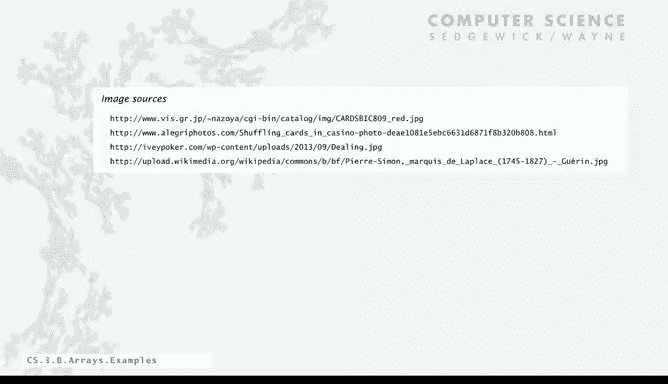

# 计算机科学：以目的为导向的编程（Java）：11：典型数组处理代码 🃏


在本节课中，我们将学习如何使用数组进行一些有趣的计算。我们将从创建一副扑克牌开始，然后探索如何洗牌、随机抽牌，并最终通过一个经典的“优惠券收集问题”来深入理解数组在模拟和概率计算中的应用。

---

## 创建一副扑克牌 🃏

首先，我们来看如何创建一副标准的52张扑克牌。这需要定义两个数组：一个表示所有可能的点数（Rank），另一个表示所有可能的花色（Suit）。

以下是创建牌组的代码：

```java
String[] ranks = {"2", "3", "4", "5", "6", "7", "8", "9", "10", "J", "Q", "K", "A"};
String[] suits = {"♣", "♦", "♥", "♠"};
String[] deck = new String[52];
```

接下来，我们需要用嵌套循环来填充 `deck` 数组，将每种花色和点数的组合放入数组中。

```java
for (int j = 0; j < suits.length; j++) {
    for (int i = 0; i < ranks.length; i++) {
        deck[i + 13 * j] = ranks[i] + suits[j];
    }
}
```

这段代码的工作原理是：外层循环遍历花色，内层循环遍历点数。索引计算 `i + 13 * j` 确保了每张牌被放置在数组的正确位置。例如，当 `j=0`（梅花）时，内层循环会将所有梅花牌（2♣ 到 A♣）放入数组的前13个位置。

运行此程序，我们将得到一个按花色排序的完整扑克牌数组。

---

## 改变牌组的顺序 🔄

上一节我们创建了按花色排序的牌组。本节中，我们来看看如何改变循环顺序，以生成按点数排序的牌组。

如果我们交换嵌套循环的顺序，牌组仍将包含所有52张牌，但填充顺序会发生变化。

```java
for (int i = 0; i < ranks.length; i++) {
    for (int j = 0; j < suits.length; j++) {
        deck[4 * i + j] = ranks[i] + suits[j];
    }
}
```

在这个版本中，外层循环遍历点数，内层循环遍历花色。索引计算 `4 * i + j` 会先将所有花色的“2”放入数组，然后是所有花色的“3”，依此类推。最终，牌组将按点数排序。

这两种方法都是有效的，具体选择取决于后续处理的需求。

---

## 随机抽取一张牌 🎲

现在我们已经有了牌组，接下来看看如何从中随机抽取一张牌。这是一个简单但重要的操作，可以应用于任何数组。

方法如下：生成一个介于0到51之间的随机整数作为索引，然后打印该索引对应的牌。

```java
int n = Integer.parseInt(args[0]); // 要抽取的牌数
for (int i = 0; i < n; i++) {
    int r = (int) (Math.random() * 52);
    System.out.println(deck[r]);
}
```

代码 `(int) (Math.random() * 52)` 会生成一个在 `[0, 52)` 区间内均匀分布的随机整数。每次运行程序，只要 `n` 大于1，就可能抽到重复的牌，因为这是“有放回”抽样。

---

## 洗牌与发牌 🃏➡️🃏

在实际游戏中，我们通常需要“无放回”地抽取牌，即洗牌后发牌。本节介绍一种高效的洗牌算法。

算法的核心思想是遍历数组，对于每个位置 `i`，在 `[i, 51]` 范围内随机选择一个位置 `r`，然后交换 `deck[i]` 和 `deck[r]` 的牌。

```java
// 洗牌
for (int i = 0; i < deck.length; i++) {
    int r = i + (int) (Math.random() * (deck.length - i));
    String temp = deck[i];
    deck[i] = deck[r];
    deck[r] = temp;
}

// 发前 n 张牌
int n = Integer.parseInt(args[0]);
for (int i = 0; i < n; i++) {
    System.out.println(deck[i]);
}
```

这个算法为什么有效？
1.  它只进行交换操作，因此洗牌后牌组依然是那52张牌。
2.  对于位置 `i` 的牌，它有 `(52 - i)` 个同样可能的目的地。将所有可能性相乘，恰好得到 `52!` 种排列，这正是所有可能的洗牌结果数量。

洗牌完成后，发牌就只是按顺序取出数组前 `n` 个元素。

---

## 优惠券收集问题 🎫

最后，我们来看一个经典的“优惠券收集问题”，它展示了如何使用数组（特别是布尔数组）来跟踪状态和进行概率模拟。

**问题描述**：假设有 `m` 种不同类型的优惠券（例如13种不同的扑克牌点数）。每次你随机获得一张优惠券（每种类型概率相同）。问：平均需要收集多少张优惠券，才能集齐所有 `m` 种类型？

我们将使用一个布尔数组 `found[]` 来跟踪已经收集到的类型。

```java
int m = Integer.parseInt(args[0]); // 优惠券类型总数
boolean[] found = new boolean[m]; // 默认初始化为 false
int cardcnt = 0; // 已抽取的总券数
int valcnt = 0;  // 已收集到的不同券的类型数

while (valcnt < m) {
    int r = (int) (Math.random() * m); // 随机获得一张券
    cardcnt++;
    if (!found[r]) {
        valcnt++;
        found[r] = true; // 标记此类型已收集
    }
}
System.out.println(cardcnt);
```

程序会持续随机生成优惠券，直到 `found` 数组的所有条目都为 `true`（即集齐所有类型）。`cardcnt` 记录了所需的总次数。

根据数学分析，集齐所有 `m` 种类型所需的平均次数约为 **`m * (ln m + 0.57721)`**。
例如：
*   集齐4种花色（m=4），平均需要约 **8** 张牌。
*   集齐13种点数（m=13），平均需要约 **41** 张牌。

我们可以通过多次运行上述模拟程序来验证这个数学公式，将模拟结果的平均值与理论值进行比较。

---

## 总结 📚

本节课中我们一起学习了数组的几个典型应用：
1.  **创建和填充数组**：使用嵌套循环和索引计算来构建数据结构（如扑克牌组）。
2.  **随机访问**：使用随机数生成器从数组中随机选取元素。
3.  **数组重排（洗牌）**：通过交换操作实现数组元素的随机排列，这是一种高效且正确的算法。
4.  **状态跟踪与模拟**：利用布尔数组跟踪事件发生状态，并以此解决“优惠券收集”这类经典概率问题。




这些例子展示了数组作为基础数据结构，在组织数据、实现算法和进行科学计算模拟方面的强大能力。