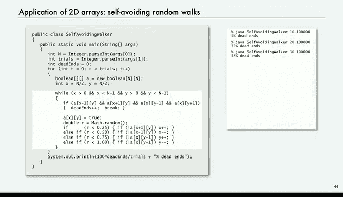

# 012：二维数组 📊


在本节课中，我们将学习二维数组，这是一种用于存储和操作表格形式数据的重要数据结构。我们将了解其声明、创建、初始化方法，并通过向量计算和随机游走模拟等实例来探索其应用。

---

## 二维数组简介

上一节我们介绍了一维数组，本节中我们来看看二维数组。二维数组是一个双重索引的、由相同类型值组成的序列。你可以将其想象成一个矩阵或一个表格。

例如，在数学计算中处理矩阵，或者记录学生的成绩（行代表学生，列代表科目）时，都会用到二维数组。在科学实验中，数据可能按时间和实验编号索引；在银行交易中，数据可能按客户和交易序号索引；在数字图像中，每个像素由x和y坐标索引。二维数组为这类需要双重索引的数据提供了灵活的存储和操作方式。

Java语言对二维数组提供了基础支持，其方式自然地扩展了一维数组的语法。

---

## 声明、创建与访问

要声明一个二维数组，我们使用两对方括号。例如，`double[][] a;` 声明了一个名为 `a` 的二维双精度浮点数数组。

要创建一个指定大小的二维数组，我们使用 `new` 关键字。例如，`a = new double[1000][1000];` 创建了一个1000行、1000列的数组。

访问数组元素时，我们使用两个索引：`a[i][j]`。其中，`i` 是行索引，`j` 是列索引。

要获取数组的行数，使用 `a.length`。要获取特定行的列数（在Java中，二维数组的每一行可以有不同的长度，这被称为“锯齿数组”），使用 `a[i].length`。要引用整个第 `i` 行，使用 `a[i]`。Java中没有直接引用整列的内置语法。

以下是一个3行10列的数组示例，其元素按“行主序”排列，即先存储第一行的所有元素，然后是第二行，依此类推。

```java
double[][] a = new double[3][10];
```

---

## 初始化二维数组

与一维数组类似，二维数组在创建时会被自动初始化。数值类型初始化为 `0.0`，布尔类型初始化为 `false`。

我们可以在声明的同时创建并初始化数组。也可以使用字面量直接初始化，这需要嵌套的大括号来分别定义每一行。

```java
// 声明、创建并初始化一个2x3的数组
int[][] matrix = new int[][] {
    {1, 2, 3},
    {4, 5, 6}
};

// 或者更简洁的写法
int[][] matrix = {{1, 2, 3}, {4, 5, 6}};
```

需要注意的是，创建数组的成本与其大小成正比。对于大型数组，初始化操作（即使是默认初始化）也可能有显著开销。

---

## 应用：向量与矩阵计算

二维数组的一个自然应用是进行向量和矩阵计算。这对于许多数学和工程问题至关重要。

**向量加法**：对于两个长度均为 `n` 的一维数组（向量）`a` 和 `b`，它们的和 `c` 可以通过逐元素相加得到。

```java
double[] c = new double[n];
for (int i = 0; i < n; i++) {
    c[i] = a[i] + b[i];
}
```

**矩阵加法**：对于两个 `m x n` 的二维数组（矩阵）`a` 和 `b`，它们的和 `c` 需要对每个元素进行相加。

```java
double[][] c = new double[m][n];
for (int i = 0; i < m; i++) {
    for (int j = 0; j < n; j++) {
        c[i][j] = a[i][j] + b[i][j];
    }
}
```

**向量点积**：两个一维向量 `x` 和 `y` 的点积是它们对应元素乘积的总和。

```java
double sum = 0.0;
for (int i = 0; i < n; i++) {
    sum += x[i] * y[i];
}
// sum 即为点积结果
```

**矩阵乘法**：矩阵 `a`（`p x m`）和矩阵 `b`（`m x n`）的乘积 `c`（`p x n`）中，每个元素 `c[i][j]` 是 `a` 的第 `i` 行与 `b` 的第 `j` 列的点积。

```java
double[][] c = new double[p][n];
for (int i = 0; i < p; i++) {
    for (int j = 0; j < n; j++) {
        // 计算点积
        for (int k = 0; k < m; k++) {
            c[i][j] += a[i][k] * b[k][j];
        }
    }
}
```

矩阵乘法需要三重嵌套循环，因此两个 `n x n` 矩阵相乘的计算复杂度是 **O(n³)**，总共需要进行大约 **n³** 次乘法运算。

---

## 应用：自避随机游走模拟 🐕

现在，让我们通过一个有趣的模拟问题来进一步理解二维数组的应用：自避随机游走。

假设一只狗在城市方格式的街区中迷路并随机游走。这只狗很聪明，它不会重复访问任何一个十字路口。问题是：这只狗最终能走出城市，还是会在某个死胡同里被困住？

我们可以使用蒙特卡洛模拟和二维布尔数组来解决这个问题。数组用于标记狗已经访问过的位置。



以下是模拟的核心步骤：

1.  创建一个 `n x n` 的布尔数组 `visited`，所有元素初始为 `false`。
2.  将狗的起始位置 `(x, y)` 设置在网格中心 `(n/2, n/2)`。
3.  进入循环，只要狗还在网格内部（即 `x` 和 `y` 都不在边界上），就继续移动。
4.  在每一步：
    *   检查当前位置的所有四个邻居（东、西、南、北）是否都已被访问。如果是，则狗陷入死胡同，记录一次“死胡同”结果并结束本次实验。
    *   否则，将当前位置标记为已访问（`visited[x][y] = true`）。
    *   随机选择一个方向（东、西、南、北）。如果该方向上的邻居未被访问，则移动到该邻居位置。
5.  如果狗移动到了网格边界（`x==0` 或 `x==n-1` 或 `y==0` 或 `y==n-1`），则视为成功逃脱。
6.  重复以上实验多次（例如10万次），计算陷入死胡同的实验所占的比例。

通过运行这个程序，我们可以得到不同网格大小下陷入死胡同的概率。例如，对于10x10的网格，概率约为5%；对于30x30的网格，概率上升到约58%；对于100x100的网格，概率超过99%。这意味着在大的网格中，狗几乎肯定会被困住。

这个看似 whimsical 的问题实际上有深刻的科学背景，被用于模拟聚合物在溶剂中的行为、磁性材料的物理现象等。令人惊讶的是，对于这个概率曲线的精确数学形式，科学家们至今没有完全的理论解，计算机模拟成为了研究此类复杂现象不可或缺的强大工具。

---

## 总结

本节课中我们一起学习了二维数组。数组是编程中非常基础且强大的构建块，它允许我们存储大量同类型数据，并能通过索引快速访问任意元素。二维数组扩展了这一概念，使其能够方便地处理矩阵、表格等结构化数据。

我们学习了如何声明、创建、初始化和访问二维数组，并通过向量/矩阵计算和自避随机游走模拟两个例子，看到了二维数组在数学计算和科学模拟中的实际应用。特别是模拟案例表明，即使对于初学者，利用简单的编程技巧也能探索复杂的科学问题，而这常常是理论研究难以替代的。


在后续课程中，我们还将看到数组在更多领域的应用，例如密码学中的移位寄存器、数字音频处理、数字图像处理以及物理实体模拟等。