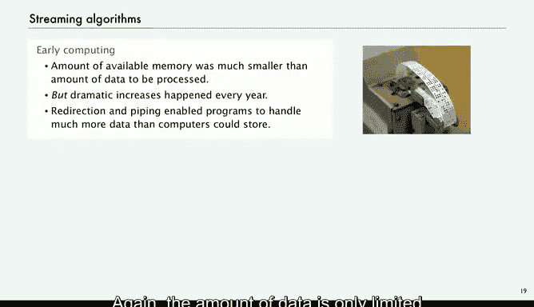

# 计算机科学：以目的为导向的编程（Java）：13：标准输入与输出 📥📤


在本节课中，我们将学习如何让Java程序与外部世界进行交互，重点是理解和使用**标准输入**与**标准输出**这两个核心抽象概念。我们将探讨如何从键盘或文件读取数据，以及如何将结果输出到屏幕或文件，甚至如何将多个程序连接起来处理海量数据。

---

## 概述

到目前为止，我们编写的Java程序大多是“内向”的，例如生成随机数并计算统计量。然而，在现实世界中，程序需要处理来自外部的数据，进行计算，并产生有意义的结果。本节课将介绍Java中用于实现这一目标的机制，特别是**标准输入**和**标准输出**，以及我们为此编写的一些库函数。

## 输入与输出的抽象概念

我们的目标是编写能够通过连接到计算机的输入/输出设备，以有意义的方式与外界交互的Java程序。输入设备包括键盘、存储设备、网络、摄像头、麦克风等；输出设备包括显示器、存储设备、网络、打印机、扬声器等。

为了连接Java程序与各种实际设备，我们采用的方法是定义**输入和输出的抽象**，并依赖操作系统基于这些抽象提供的功能来实现连接。

**抽象**在理解计算中扮演着至关重要的角色。它指的是一种仅作为概念存在的事物。以“打印”为例，从程序的角度看，它只是产生文本输出的概念，而不关心文本具体如何、在哪种设备上显示。一个好的抽象（如打印）简化了我们对世界的看法，因为它统一了多种多样的现实世界设备。程序只需与“打印”这个抽象打交道，而由操作系统根据实际设备来实现这个抽象。

## 回顾：命令行输入与标准输出

在深入之前，我们先快速回顾已学过的内容。

### 命令行输入

命令行输入是一种为程序提供字符串的抽象。
*   **属性**：在程序名后键入的字符串在运行时作为 `args[0]`, `args[1]` 等可用。
*   **时机**：这些参数在程序开始执行时即可用。
*   **转换**：我们使用系统转换方法（如 `Integer.parseInt()`）将这些字符串转换为整数、双精度浮点数或其他数据类型。

**示例**：一个名为 `RandomInt` 的程序从命令行获取其值 `n`，然后生成该范围内的随机整数。

### 标准输出

在讨论标准输出之前，需要理解“无限”这个概念，它本身也是一个抽象，描述没有限制的事物。**标准输出流**就是一个用于**无限输出序列**的抽象。从程序的角度看，写入标准输出的数据量没有限制。

我们使用 `System.out.println()` 等方法将字符串添加到标准输出流的末尾，操作系统默认将其连接到终端应用程序。

**示例**：一个打印随机整数序列的程序。它从命令行获取一个整数 `n`，然后在标准输出上打印 `n` 个随机数。理论上，你可以打印一百万个数字，程序只使用名为“标准输出流”的抽象。

## 引入：标准输入

现在，我们来看一个改进：添加一个**无限输入流**。

标准输入与标准输出类似，也是一个**无限输入序列**的抽象。与命令行输入（所有参数在开始时一次性提供，且可能有长度限制）相比，标准输入的主要优势在于：**新数据可以在程序执行时源源不断地提供**。同样，我们提供给程序的数据量也没有限制。

此外，我们为本课程编写的库会显式处理向基本类型（如 `int`, `double`）的转换。

### 标准输入库 (StdIn)

我们为这门课程构建了一个库来实现标准输入抽象。这个抽象自20世纪70年代就已存在，我们认为对于有效的Java编程，能够方便地使用标准输入至关重要。该库基于基本的Java机制构建，旨在让每个Java程序员都能轻松读取无限数量的整数、双精度数或字符串。

您从课程开始时的书籍网站下载的软件中包含这个库，名为 `StdIn`。

它支持以下方法：
*   `isEmpty()`: 检查输入流是否为空。
*   `readInt()`: 读取一个 `int` 类型的值。
*   `readDouble()`: 读取一个 `double` 类型的值。
*   `readLong()`, `readBoolean()`, `readString()`: 读取相应类型的值。
*   `readAll()`: 读取所有内容。

您可以通过查阅书籍或网站上的文档找到其他一些方法。

### 标准输出库 (StdOut)

为了与标准输入匹配，我们也开发了 `StdOut`。它与 `System.out` 非常相似，但从现在起，我们将使用 `StdOut` 而不是 `System.out`。这样做是为了将我们所有的输入/输出抽象集中在一处，方便使用和理解。此外，由于 `StdOut` 是我们自己的库，我们可以提供更一致的控制，不受系统语言环境和依赖项的影响。

`StdIn` 和 `StdOut` 是我们用于**无限输入流**和**无限输出流**的抽象。

## 程序示例

现在，让我们看一些使用这些方法的程序，它们在文档中非常直观。

### 示例1：交互式输入（两数相加）

第一个示例展示如何使用标准输入进行交互式输入。你可以编写代码提示用户键入输入，并可以将输入与输出流混合。

以下是求两数之和的简单示例代码：

```java
StdOut.print("Type the first integer: ");
int x = StdIn.readInt();
StdOut.print("Type the second integer: ");
int y = StdIn.readInt();
int sum = x + y;
StdOut.println("Their sum is " + sum);
```

运行此程序时，程序会先执行，然后等待用户输入。例如，用户输入 `1` 和 `2`，程序将输出 `Their sum is 3`。

### 示例2：计算平均值（处理数据流）

让我们看一个更有趣的例子：计算标准输入流中所有数字的平均值。

以下是实现代码：

```java
double sum = 0.0;
int n = 0;
while (!StdIn.isEmpty()) {
    double x = StdIn.readDouble();
    sum += x;
    n++;
}
double average = sum / n;
StdOut.println("Average is " + average);
```

**代码解释**：
1.  我们使用 `double` 变量 `sum` 来累计所有数字的总和，使用 `int` 变量 `n` 来计数。
2.  `while` 循环的条件是 `!StdIn.isEmpty()`，只要标准输入不为空就继续读取。
3.  在循环内，读取一个 `double` 值到变量 `x`，更新总和 `sum` 和计数 `n`。
4.  当输入流为空时（例如用户输入结束信号），循环结束，计算并打印平均值 `sum / n`。

**如何结束输入流？**
一个常见问题是：如何告诉标准输入流已经结束？几十年来，标准做法是键入 `Ctrl+D`（在Unix/Linux/Mac终端）。在Windows系统上，通常是 `Ctrl+Z`。具体方式可能因系统而异。

**关键点**：这个程序**不依赖**于标准输入流中具体有多少个数字。从程序的角度看，这个流是无限长的。这意味着我们今天编写的程序，多年后即使数据量增长到百万甚至十亿级别，也**无需任何修改**即可使用。这正是标准输入抽象的威力所在。

同样，输入和输出可以是交错的。

## 文件重定向与管道连接

一个自然的问题是：我必须总是在终端窗口键入输入数据和查看输出吗？答案当然是否定的。人们通常希望将数据和结果保存在计算机的文件中，或者使用更强大的**管道**机制直接连接程序。

### 文件重定向

操作系统支持一种称为**重定向**的机制。

*   **重定向标准输出到文件**：在命令行中，使用大于号 `>`。
    *   **命令示例**：`java RandomSeq 1000000 > data.txt`
    *   **效果**：程序 `RandomSeq` 生成的100万个数字不会显示在终端窗口，而是被**保存**到名为 `data.txt` 的文件中。
*   **从文件重定向标准输入**：在命令行中，使用小于号 `<`。
    *   **命令示例**：`java Average < data.txt`
    *   **效果**：程序 `Average` 不从键盘读取输入，而是从 `data.txt` 文件中读取那100万个数字作为输入，然后计算并输出平均值。

这是一种极其方便的计算方式，我们将看到许多这样的例子。

### 管道连接

然而，文件重定向仍然有一个小问题：我们并没有完全实现“无限”的概念，因为最大文件大小在实际情况下会限制我们。

因此，我们引入了**管道**的概念。管道允许我们不保存任何中间数据，直接将一个程序的输出作为另一个程序的输入。

*   **使用方法**：在命令行中，使用竖线 `|` 连接两个命令。
*   **命令示例**：`java RandomSeq 1000000 | java Average`
*   **效果**：
    1.  `RandomSeq` 程序生成100万个数字，但它不打印到终端，也不保存到文件。
    2.  这些数字通过管道**直接**流入 `Average` 程序的标准输入。
    3.  `Average` 程序读取这些数字并计算平均值。
    4.  最终，只有平均值被打印出来。

通过管道，我们可以在不保存中间数据的情况下，处理海量数据（例如十亿个数字），唯一的限制可能是时间。两个程序都不关心要处理的数据量，但它们有能力处理无限量的数据。操作系统的职责就是临时收集一个程序的输出，并将其提供给另一个程序的输入，从而为程序维持这个“无限流”的抽象。

## 历史背景与现代意义

许多古老的程序正是以这种方式编写的，得益于标准输入/输出抽象，它们至今仍然有用。

在早期计算中，可用内存非常少，但需要处理的数据量可能远超内存容量。这促使了这些抽象机制的发展。通过重定向和管道，程序可以处理远超计算机存储能力的数据。

在现代计算中，情况依然如此。我们拥有网络和信息的海洋，在许多应用中，你想要处理的数据量远远超过任何可用计算机的内存。每年数据量仍在急剧增长。现在，这类算法被称为**流式算法**，它们允许程序处理比计算机能存储的数据多得多的数据，而其基础正是始于标准输入和标准输出这样的抽象。

## 总结



本节课我们一起学习了Java中输入与输出的核心概念：

1.  **抽象的重要性**：我们通过定义**标准输入**和**标准输出**作为无限数据流的抽象，使程序能够独立于具体的物理设备（键盘、文件、网络等）进行数据交互。
2.  **StdIn 与 StdOut 库**：我们介绍了为本课程定制的 `StdIn` 和 `StdOut` 库，它们简化了从流中读取各种类型数据和向流中写入数据的过程。
3.  **数据处理模式**：我们看到了两种典型应用：使用 `StdOut` **生成**数据流（如随机数），以及使用 `StdIn` **处理**数据流（如计算平均值）。关键在于两个流都被视为**无限**的。
4.  **强大的外部连接**：我们学习了如何通过**重定向** (`>`, `<`) 将程序的输入/输出与文件关联，以及如何通过**管道** (`|`) 直接将一个程序的输出连接到另一个程序的输入，从而构建更复杂的数据处理流程，并高效处理远超内存容量的数据集。


核心的启示是：**只要可能，我们应努力避免在程序中设置数据量的限制**，充分利用流式抽象的强大能力来构建健壮、可扩展的程序。