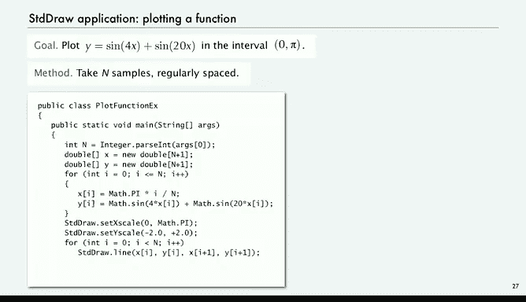

# 计算机科学：以目的为导向的编程（Java）：P14：标准绘图 📊

在本节课中，我们将学习一个极其灵活且非常有用的输出抽象工具——标准绘图库。通过它，我们可以让程序生成直观有用的图形化输出。

## 标准绘图库简介

上一节我们介绍了基本的输入输出抽象。本节中，我们来看看如何扩展我们的I/O抽象，增加创建绘图的能力。我们将使用一组相对简单的命令，但你会发现，即使是一个小型Java程序，也能产生非常有趣的输出。

这个库是我们为本课程开发的，但具有广泛的实用性。它可以在课程网站上找到，并已包含在你已下载的`introcs`软件包中。

标准绘图库本质上是一系列静态方法的集合，你可以直接调用它们。以下是其主要功能：

*   **绘制几何图形**：有绘制线条、点的方法。
*   **指定坐标**：在一个抽象的绘图区域内指定坐标。
*   **添加文本**：可以在特定位置绘制文本。
*   **绘制形状**：可以绘制给定半径的圆或正方形。
*   **填充颜色**：可以用黑色、白色、灰色或其他颜色填充这些形状。
*   **插入图片**：可以将文件（如GIF、JPEG或PNG格式）中的图片放置在特定位置。
*   **样式设置**：可以设置线条的粗细（笔触半径）和颜色。
*   **缩放方法**：提供了一些缩放方法。

我们将逐一学习如何使用这些功能。

这是一个相对小巧的函数库，我们将用它来为Java程序产生许多有趣的效果。其中最关键的一个方法是`show()`，它将显示我们在绘图中绘制的所有内容。

## 入门示例：绘制三角形 🎨

让我们通过一个“Hello World”程序来了解标准绘图库。所谓“Hello World”程序，是指一个能展示使用该库所需所有步骤的简单程序。我们将绘制一个三角形。

绘图区域是一个抽象的画布，左下角的坐标是`(0, 0)`。

以下是程序的核心步骤：

1.  计算`Math.sqrt(3)/2`的值，并存储在变量`c`中。
2.  将笔触半径设置为`0.01`，以定义绘图尺寸。
3.  从`(0, 0)`到`(1, 0)`画一条线，这会在画布底部画一条线。
4.  从`(1, 0)`到三角形的顶点`(0.5, c)`画一条线。
5.  从顶点`(0.5, c)`画一条线回到原点`(0, 0)`。

这个程序绘制了一个三角形。为了增加变化，我们还会在三角形中心画一个点，并在那里添加一些文本。

这就是在标准绘图窗口中绘制线条和点的基本方法。绘制三角形是我们的入门程序。

从操作上看，我们通常有两个终端窗口：一个用于编辑程序，另一个用于命令行。编译并运行该程序后，会弹出一个新的窗口，显示标准绘图结果。

为了进行绘图，你需要知道的是：你可以在任意位置绘制线条和点。这在许多情况下是一种非常有效的输出方式。

## 应用：数据可视化 📈

正如前面提到的，我们经常需要处理海量数据，而数据可视化是理解数据行为或含义的一种重要技术。下面是一个例子。

这是一个简单的过滤器程序，它从标准输入读取数据，并将其绘制在标准绘图上。

程序逻辑如下：

1.  数据格式约定：前四个数字给出了所有后续点的边界框坐标，即最小和最大的X、Y坐标。
2.  读取这四个坐标。
3.  使用这些坐标重新缩放绘图窗口，使所有点都能恰好适应绘图区域。这通过调用`StdDraw.setXscale(xMin, xMax)`和`StdDraw.setYscale(yMin, yMax)`实现。
4.  然后，程序从标准输入循环读取成对的X、Y坐标（这些坐标应在边界框内）。
5.  对于每一对坐标，在绘图中的对应位置绘制一个点。

这个程序非常简单。我们获取关于点的边界信息，然后获取所有点。点的数量可以是巨大的，因为程序从标准输入读取，所以点的数量没有限制。

例如，有一个名为`USA.txt`的文件可供下载。它的前四个坐标是该文件中所有点的边界框坐标，例如`xMin`是`66.99`，`xMax`是`124.74`等。这个特定文件包含`13,509`个点。

你可以随意查看这些数据并编写程序处理它。但我们现在要说明的是，仅仅使用这个简单的程序，如果我们运行它并从标准输入读取该文件，我们就能更直观地看到数据的全貌，从而学到更多东西。

无论你是想研究城市附近的聚类，还是想展示你的发现，数据可视化在现代计算中都非常重要。而使用像标准绘图这样的工具，实现可视化也非常容易。

## 应用：函数绘图 📉

另一个常见的应用是绘制函数图像。同样，简单的方法是：从函数中采样，然后在规则间隔的采样点之间绘制连线。

使用标准绘图库编写这样的程序非常容易。我们通过命令行参数指定要采集的样本点数量`N`。

程序步骤如下：

1.  创建两个大小为`N`的数组，分别用于存储X和Y坐标。
2.  对于`i`从`0`到`N-1`的每个样本：
    *   计算X坐标：我们希望这些点在`0`到`π`之间均匀分布，因此`x[i] = Math.PI * i / (N-1)`。
    *   计算Y坐标：在对应的X点处求函数值，例如`y[i] = Math.sin(4*x[i]) + Math.sin(20*x[i])`。
3.  设置绘图的X轴范围为`0`到`π`，Y轴范围根据函数特性设置为`-2`到`2`。
4.  遍历数组，依次绘制连接这些点的线段。

当然，我们也可以设置为逐个绘制点，但这个程序展示了更常见的场景：你的函数值已经存储在数组中，你只想将其绘制出来。

这里有一个用`20`个点绘制上述函数的例子。不过，这里有一个重要的教训（我们将在下一讲中再次提到）：你必须确保采集足够多的样本，以捕捉函数的所有变化。在这个例子中，由于采样点太少，我们错过了函数在采样点之间的许多波动。

尽管如此，标准绘图库为我们提供了足够的灵活性，可以为各种科学应用创建所需的图表，以理解我们正在处理的函数。从此刻起，我们将广泛使用标准绘图。

## 总结 🎯

本节课中，我们一起学习了Java标准绘图库的基本用法。我们了解了如何通过简单的命令绘制线条、点、形状和文本，以及如何设置样式和缩放。通过数据可视化和函数绘图的实例，我们看到了这个工具在将抽象数据转化为直观图形方面的强大能力。掌握标准绘图，将为你的程序输出增添一个非常有力的维度。