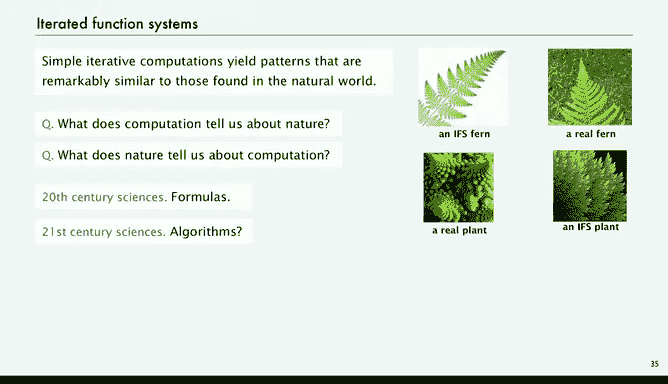
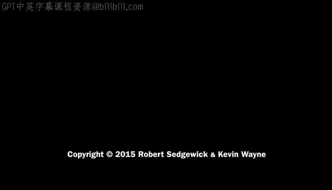

# 计算机科学：以目的为导向的编程（Java）：P15：分形绘图


在本节课中，我们将探索一些绘制分形的程序。这些程序旨在说明，即便是比我们之前看过的程序复杂不了多少的简单程序，也能带领我们进入一个理解自然本质的全新世界。

上一节我们介绍了递归绘图，本节中我们来看看如何通过简单的随机规则生成复杂的分形图案。

## 一个简单的随机游戏

我们将从一个非常简单的应用开始，它类似于一个随机游戏。

以下是该游戏的基本规则：
*   我们有一个三角形，其顶点标记为 0、1 和 2。
*   我们将点 0 设为当前点，并在其上画一个圆。
*   然后，我们的过程是随机选择一个顶点。
*   在该顶点与当前点之间的中点处画一个点。
*   重复此过程。

在这个例子中，我们从顶点 0 开始。这里有一个小表格解释了规则：每个点被选中的概率是三分之一，如果某个点被选中，这些公式给出了我们需要执行的操作。我们暂时不必过于担心这些公式，先来看过程本身。

如果我们当前在点 0，然后我们选择了点 2，那么我们就在点 0 和点 2 的中点画一个点。接着我们选择点 1，然后移动到点 0 和点 1 的中点。同样，这里的小方程告诉我们如何更新坐标。

对于点 0，计算很简单。如果我们在这里，我们只需取 x 坐标的一半和 y 坐标的一半。对于其他点，你可能需要加上二分之一或其他必要的操作。

我们只是迭代这个过程，看起来相当随机。

## 实现程序

让我们来看一个实现这个过程的程序，这同样很容易做到。然后我们可以运行它绘制大量点，看看会发生什么。

这个程序我们暂时称之为 `Chaos`，它看起来是随机的。我们将从命令行获取想要绘制的点的数量，通常称之为 `trials`。然后，我们需要一些变量来帮助我们进行计算。

以下是程序的核心部分：
```java
int trials = Integer.parseInt(args[0]); // 从命令行获取迭代次数
double x = 0.0, y = 0.0; // 初始点坐标
double[] cx = {0.000, 1.000, 0.500}; // 三角形顶点 x 坐标
double[] cy = {0.000, 0.000, 0.866}; // 三角形顶点 y 坐标

StdDraw.setPenRadius(0.01);
for (int t = 0; t < trials; t++) {
    int r = StdRandom.uniformInt(3); // 随机选择 0, 1 或 2
    x = (x + cx[r]) / 2.0; // 更新 x 坐标为当前点与选中顶点的中点
    y = (y + cy[r]) / 2.0; // 更新 y 坐标为当前点与选中顶点的中点
    StdDraw.point(x, y); // 绘制该点
}
```
我们设置画笔半径，从点 0 开始。在一个 `for` 循环中，迭代命令行指定的次数，计算一个 0、1 或 2 的随机整数，然后更新 X 和 Y 坐标，使其移动到当前点与数组中给定点之间的中点。一旦获得更新后的 X 和 Y，我们就绘制它。

这是一个非常简单的程序，使用 `StdDraw` 库很容易实现。

## 观察结果

现在让我们看看如何在三角形内获得随机点。这是用该程序绘制 10，000 个点的结果。

实际上，结果一点也不随机。一个令人惊叹且有趣的图案很快就浮现出来了。虽然过程看起来随机，但这引出了分形和混沌计算的概念，科学家们至今仍在从各种角度研究它。

也许你以前见过这个图案，它被称为**谢尔宾斯基三角形**。有很多不同的方式来看待它，甚至在自然界中也能看到它。你可以从帕斯卡三角形中取出奇数，就能得到这个图案。也许你在流行文化中见过它，可以用可乐罐、硬币、饼干或糖果玉米来构建它。这是该图案的多种现实体现，在数学和应用数学中也有许多应用。

通过一个简单的随机混沌程序，我们得到了谢尔宾斯基三角形。这很有趣，但如果我们改变规则，可以得到更有趣的图案。

## 改变规则

对于谢尔宾斯基三角形，我们的规则是每个点被选中的概率是三分之一。我们可以调整这些概率。对于谢尔宾斯基三角形，我们总是取当前点和下一个点的平均值来得到中点，但你可以使用当前点的任何函数。这只是一个不同的例子。

如果我们编写一个程序来改变规则，使其与我们刚写的程序没有太大或非常小的差别，会发生什么？书和课程网站上有这样一个程序，它从标准输入读取系数，然后运行迭代，但除此之外，它与我们刚才看到的程序相同。它通常从文件中获取数据。

这是一个示例文件，其中包含了如何进行迭代的系数，即如何更新坐标。这实际上只是用数字编码了那些表格。你可以在书中研究那个程序。

对于本讲座，核心思想是一个简单的程序：我们玩一个游戏，从一个点开始，随机移动到另一个点，只是变换规则由文件决定。这里有一个文件，它稍微复杂一点，但并没有复杂太多，仍然只有三个点等等。让我们运行这个。

这是一个完全不同的随机图案，仍然来自一个相当简单的程序。从名字可以看出，这是一个模拟自然界珊瑚行为的想法。

这个随机过程的某些方面似乎与现实世界中发生的事情有关。实际上，科学家们有兴趣了解可能支配我们在现实世界中观察到的现象的简单规则。通过这类程序，我们可以研究这一点。

## 更多示例

这是另一个改变规则的例子。这次有四个点，其中一个点被选中的概率非常小，另一个点被选中的可能性非常大。让我们运行这个。

再次强调，这几乎是同一个程序，我们只是给了它稍微不同的数据。

你可能会认为自然界就是以这种方式运作的，许多人确实这么认为。相对较少数量的简单规则创造了我们周围的世界。

这个程序创造了一个看起来有点像蕨类植物的东西，它被称为**巴恩斯利蕨**。

实际上，不仅是科学家，娱乐行业的人们也使用这样的过程来构建自然模型。他们可以创造世界，如今你在电子游戏或电影中经常体验到这一点。你所看到的通常是由类似这样的过程产生的。

通过简单的迭代计算，我们得到的图案与我们在自然界中发现的图案极其相似。

这里有一个蕨类植物，就像我刚才生成的那个，不过是绿色的，还有一个真实的蕨类植物。我可以比较它们。哪个是真的，哪个是生成的？那个实际上是真的。这个呢？那是一株真实的植物。而那个是由迭代函数系统生成的。

这确实引出了一个深刻的问题：计算告诉我们关于自然的什么？或者自然告诉我们关于计算的什么？我们通过相对简单的程序，使用标准输出和一点点随机性，就能触及这些深刻的问题。

在本课程中，我经常会强调这一点：在 20 世纪，科学主要是关于数学模型和公式。许多人相信，在 21 世纪，科学将真正围绕算法和程序展开，以帮助我们理解现实世界中发生的事情。

## 在娱乐产业中的应用



你已经在电影和游戏中看到了迭代函数系统的许多应用。也许你记得这个场景，那是一个完整的世界，没有一样东西是真实的，它全部是使用像我们刚刚演示的迭代函数系统这样的技术构建的。



本节课中我们一起学习了如何通过简单的随机迭代规则生成复杂的分形图案，如谢尔宾斯基三角形和巴恩斯利蕨。我们看到了一个简单的程序如何通过不断取中点并绘图，从混沌中产生有序。通过调整规则和概率，我们可以模拟自然界中的各种形态。这展示了计算在理解和模拟自然现象方面的强大能力，并暗示了算法和程序可能成为21世纪科学探索的核心工具。