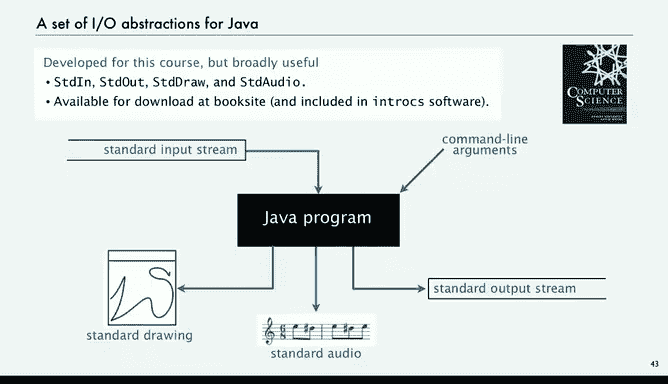

# 计算机科学：以目的为导向的编程（Java）：P16：动画实现 🎬


在本节课中，我们将学习如何为程序输出的图形添加动画效果。动画能让物体在屏幕上“动起来”，这为我们程序的输出能力打开了一个全新的世界。

## 动画的基本原理

上一节我们介绍了静态图形的绘制，本节中我们来看看如何让图形动起来。实现动画的核心思想是：让物体看起来在移动。使用标准绘图库（Standard Draw）实现这一点并不困难。

动画的基本步骤如下：
1.  清空屏幕。
2.  更新物体的位置。
3.  在新位置重新绘制物体。
4.  短暂停留并显示。

由于计算机速度很快，即使每帧图像只显示很短时间，人眼也能获得物体连续运动的错觉。只要显示时间大于清屏和重绘的时间，我们就能创造出运动的假象。

## 弹跳球示例：动画的“Hello World”

弹跳球是动画编程中最经典的入门示例。我们将实现一个小球在屏幕边界内不断弹跳的效果。

### 核心概念与公式

要实现弹跳球，我们需要定义几个核心变量：
*   **位置**：用 `(rx, ry)` 表示球的中心坐标。
*   **速度**：用 `(vx, vy)` 表示球在水平和垂直方向上每单位时间的移动量。
*   **半径**：用 `radius` 表示球的大小。

球的运动遵循以下规则：
*   **移动**：在每个时间步长，球的位置更新为 `(rx + vx, ry + vy)`。
*   **碰撞检测**：
    *   如果球撞到**垂直**墙壁（左或右），则水平速度反向：`vx = -vx`。
    *   如果球撞到**水平**墙壁（上或下），则垂直速度反向：`vy = -vy`。

### 代码实现

以下是弹跳球程序的完整代码，它非常简洁，只有约15行：

```java
public class BouncingBall {
    public static void main(String[] args) {
        // 初始化球的位置、速度和半径
        double rx = 0.480, ry = 0.860;
        double vx = 0.015, vy = 0.023;
        double radius = 0.05;

        // 设置坐标范围为[-1, 1]以简化计算
        StdDraw.setXscale(-1.0, 1.0);
        StdDraw.setYscale(-1.0, 1.0);

        // 主动画循环
        while (true) {
            // 1. 清屏：用浅灰色填充整个屏幕
            StdDraw.setPenColor(StdDraw.LIGHT_GRAY);
            StdDraw.filledSquare(0, 0, 1.0);

            // 2. 碰撞检测与速度更新
            if (Math.abs(rx + vx) + radius > 1.0) vx = -vx; // 撞到垂直墙
            if (Math.abs(ry + vy) + radius > 1.0) vy = -vy; // 撞到水平墙

            // 3. 更新位置
            rx = rx + vx;
            ry = ry + vy;

            // 4. 在新位置绘制球
            StdDraw.setPenColor(StdDraw.BLACK);
            StdDraw.filledCircle(rx, ry, radius);

            // 5. 显示并暂停20毫秒
            StdDraw.show(20);
        }
    }
}
```

运行这段代码，你将看到一个黑色小球在灰色背景的窗口中永无止境地弹跳。

## 动画的扩展与思考

现在你不仅可以绘制静态图形，还能绘制动态图形。这在模拟现实世界中的许多现象时非常有用，例如后续课程中会演示的多个球体碰撞等复杂现象。

### 一个小实验

作为一个小测验，如果我们把清屏的代码移出循环，会发生什么？

```java
// 将清屏移到循环外
StdDraw.setPenColor(StdDraw.LIGHT_GRAY);
StdDraw.filledSquare(0, 0, 1.0);
while (true) {
    // ... 碰撞检测、更新位置、绘制球
    StdDraw.show(20);
}
```

结果是，程序将绘制出小球运动过的**完整轨迹**，而不是一个移动的球。这本身也是一种有趣的可视化效果，你可以观察到弹跳球的整个路径。

### 更多可能性

标准绘图库的功能远不止于此。我们可以进行更多增强：
*   **更换图像**：将黑色实心圆替换为一张网球图片。
*   **添加音效**：使用标准音频库（Standard Audio），在球撞击墙壁时播放一个反弹音效。这会让动画体验更加生动有趣。

通过这些简单的工具，你可以创造出无穷的娱乐和教育应用。

## 总结




本节课中我们一起学习了如何使用Java的标准绘图库为程序添加动画效果。我们掌握了动画的基本原理，并通过实现经典的“弹跳球”示例，深入理解了如何通过循环、清屏、更新位置和重绘来创造运动错觉。我们还探讨了动画的扩展可能性，例如绘制运动轨迹和结合音效。这些库极大地扩展了我们所能编写的程序类型，从简单的文本交互升级到了丰富的图形和动画世界。下一讲，我们将介绍标准音频库，学习如何编写可以操作声音的程序。