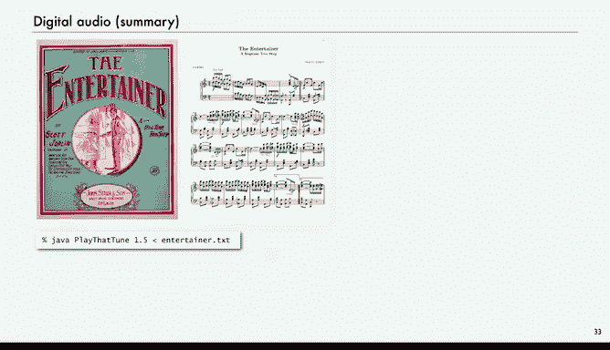
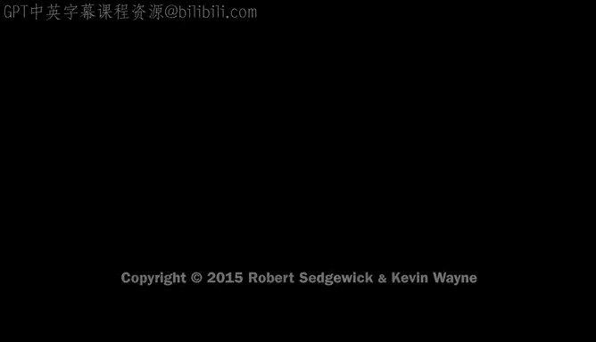

# 018：案例研究-数字音频 🎵


在本节课中，我们将学习如何利用自定义函数来处理数字音频。这是一个展示函数强大实用性的绝佳案例。我们将从声音的基本概念讲起，学习如何用数组表示声波，并使用Java库来播放和合成声音。通过本教程，你将能够编写程序来生成和操作简单的音乐。

## 声音与数字音频基础 🔊

上一节我们介绍了函数的基本概念，本节中我们来看看如何将其应用于数字音频领域。首先，我们需要理解声音是什么。

声音是分子振动的感知。我们主要处理**乐音**，即稳定、周期性的声音。一个纯音是一个正弦波。在音乐中，正弦波的**频率**决定了不同的音符。例如，440赫兹是标准音A。西方音乐音阶有12个音符，它们按**对数**关系排列。

这意味着，高于标准音A的第`i`个音符的频率计算公式为：
**频率 = 440 × 2^(i/12)**

当`i=12`时，频率翻倍（880赫兹），我们得到一个高八度的A音。

## 数字音频的表示 💾

在数字音频中，我们通过在固定时间间隔对声波进行**采样**，并将采样值存储在数组中来表示它。这与我们在上一讲中绘制函数图像的方法类似。

例如，标准CD音质采用每秒44100次采样。这意味着，对于一秒钟的音频，我们需要一个包含44100个双精度浮点数的数组。采样率越高，对声波的描绘就越精确。

## 使用标准音频库 🎛️

为了播放和处理声音，我们将使用一个类似于“标准绘图库”的**标准音频库**。这个库的核心功能是播放一个由双精度浮点数数组表示的声波。

以下是该库提供的主要方法：
*   `play(double[] a)`: 播放数组`a`中的声波。
*   `play(String filename)`: 播放指定`.wav`文件。
*   `save(String filename, double[] a)`: 将数组`a`保存为`.wav`文件。
*   `read(String filename)`: 从`.wav`文件中读取声波到数组。

这个库允许我们通过编程来操纵声音，并将其作为程序的输出。

## 生成一个纯音 🎶

现在，让我们动手编写第一个程序来生成一个纯音。我们将创建一个函数，根据给定的音高（频率）和持续时间生成对应的声波数组。

以下是一个生成纯音的函数的代码示例：
```java
public static double[] tone(double hz, double duration) {
    int n = (int) (StdAudio.SAMPLE_RATE * duration);
    double[] a = new double[n+1];
    for (int i = 0; i <= n; i++) {
        a[i] = Math.sin(2 * Math.PI * i * hz / StdAudio.SAMPLE_RATE);
    }
    return a;
}
```
这个函数通过采样正弦波来创建数组。参数`hz`是频率，`duration`是持续时间（秒）。`StdAudio.SAMPLE_RATE`是采样率（44100）。

一个简单的“Hello World”程序可以从命令行读取音高和时长，然后播放它：
```java
public static void main(String[] args) {
    double hz = Double.parseDouble(args[0]); // 频率
    double duration = Double.parseDouble(args[1]); // 时长
    double[] a = tone(hz, duration);
    StdAudio.play(a);
}
```

## 演奏一首简单的曲子 🎹

有了生成单个音符的能力，我们可以更进一步，演奏一首完整的曲子。我们将创建一个数据驱动的程序，从标准输入读取一系列音符（音高和相对时长）来演奏。

以下是实现思路：
1.  从命令行控制**速度**（tempo）。
2.  从标准输入循环读取音符。每行数据包含两个值：音高编号（相对于标准音A的半音数）和相对时长（如0.5代表八分音符）。
3.  根据音高编号，使用公式 `440 * Math.pow(2, pitch / 12.0)` 计算实际频率。
4.  用`tone()`函数生成该音符的声波数组并播放。

通过准备一个包含音符序列的文件，我们就可以演奏任何歌曲。

## 合成和弦与添加谐波 🎼

单个音符听起来可能有些单调。我们可以通过合成**和弦**来让声音更丰富。合成和弦的原理很简单：将两个（或更多）音符的声波数组**平均**。

假设我们有两个相同长度的声波数组`a`和`b`，它们的和弦数组`c`可以通过以下方式计算：
```java
double[] c = new double[a.length];
for (int i = 0; i < a.length; i++) {
    c[i] = (a[i] + b[i]) / 2.0;
}
```

为了让单个音符听起来更自然、更像真实乐器，我们可以为其添加**谐波**。谐波是频率为基频整数倍的声音成分。例如，在生成标准音A（440Hz）的同时，我们可以混合一个高八度的A（880Hz）和一个低八度的A（220Hz），然后将混合后的声波再与原始声波平均。这样得到的声波不再是纯粹的正弦波，包含了谐波成分，音色会更加丰满。

## 总结 📚



本节课中我们一起学习了数字音频处理的基本原理。我们了解到：
*   声音可以用双精度浮点数数组来表示。
*   通过编写函数（如`tone`），我们可以生成特定频率和时长的音符。
*   利用标准音频库，我们可以轻松地播放、保存和读取声音数据。
*   通过平均声波数组，我们可以合成和弦。
*   通过混合基频的倍频（谐波），我们可以让合成的声音更加真实、悦耳。



本案例的核心在于展示了**函数**如何帮助我们以模块化的方式组织复杂的计算。我们将音频生成、和弦合成等任务封装成独立的函数，使得主程序逻辑清晰，易于理解和扩展。这正是以目的为导向的编程思想的体现：通过构建可靠的抽象（函数）来解决复杂问题。在后续的作业中，你将有机会运用这些知识进行更有趣的音乐创作和声音处理。