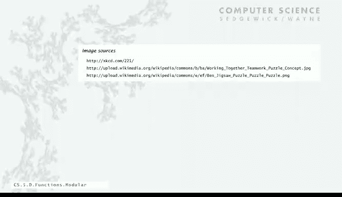

# 020：模块化编程与库 📚

在本节课中，我们将通过一个综合示例来学习模块化编程的核心概念与强大之处。我们将了解如何将程序分解为独立的模块（客户端、API、实现），以及如何利用库来构建更清晰、更易维护的代码。

## 概述：模块化编程的基本理念

上一节我们介绍了模块化编程的基本思想，本节中我们来看看一个具体的应用示例。模块化编程的核心包含三个部分：**客户端**、**API**（应用程序编程接口）和**实现**。

*   **客户端**：调用库中方法的模块。
*   **API**：定义了库中可用的函数签名及其功能描述，是客户端与实现之间的契约。
*   **实现**：包含实现API中声明的函数的具体代码。

这种分离允许实现独立开发，也允许各种客户端使用它。只要遵守API，即使后续改进或更改实现，也无需重写客户端代码。

## 库的构建与使用：以随机数库为例

为了更好地组织程序，程序员应构建自己的库。例如，在本课程中，我们将所有生成随机数的方法集中到一个库中。

以下是构建库时需要考虑的一些常用功能：

*   生成 `0` 到 `n-1` 之间的均匀随机整数。
*   生成两个给定双精度值之间的随机实数。
*   以概率 `p` 返回 `true` 的抛硬币函数。
*   生成符合高斯（正态）分布的随机数，可以指定均值和标准差。
*   根据给定的离散概率数组，返回对应索引。
*   随机打乱数组。

构建库的第一步是明确API，即定义你希望库能做什么。即使某些功能实现起来很简单（甚至只有一行代码），将它们集中到库中的价值在于，它表达了我们思考问题的方式，使程序表达更紧凑、更统一。

## 最佳实践与设计原则

在模块化编程中，遵循一些最佳实践至关重要。

*   **模块应相对小巧**：将大型程序分解为更小的、任务分类清晰的模块。
*   **实现抽象层**：像随机数库那样，在更高层次上工作。
*   **独立开发**：最好先编写客户端代码，再考虑实现，以确保客户端代码简洁、易读。
*   **预见未来需求**：设计API时，尽可能考虑未来潜在客户端的需要。
*   **包含测试客户端**：每个模块都应有一个主测试客户端，至少运行一次所有代码，以便快速验证功能。

随着课程深入，我们会进行更多此类设计活动，构建越来越大的程序。

## 综合示例：测试二项分布 📊

现在，让我们看一个使用多个库的客户端程序示例。该程序通过实验验证抛硬币的“二项分布”是否符合理论上的高斯分布。

程序逻辑自然地分为几个部分：

1.  **获取参数**：从命令行获取控制实验的参数 `n`（每次实验抛硬币次数）和 `trials`（实验重复次数）。
2.  **运行实验**：循环 `trials` 次，每次进行 `n` 次抛硬币，统计正面朝上的次数，并记录每个结果出现的频率。
3.  **数据归一化**：将频率除以总实验次数 `trials`，得到介于 `0` 和 `1` 之间的概率。
4.  **可视化与理论对比**：使用 `plotBars` 函数绘制实验结果的条形图。同时，使用高斯概率密度函数 `Gaussian.pdf` 计算理论正态分布曲线，并用 `plotLines` 绘制，以对比实验与理论。

这个程序虽然功能复杂，但得益于模块化，每个部分都相对简单独立。这些模块不仅可用于此应用，还可用于许多其他程序。

## 总结：模块化编程的力量

本节课中我们一起学习了模块化编程的核心价值与实践方法。

*   **独立性**：允许小型程序的独立开发和抽象层的共享。
*   **自文档化**：通过清晰的API，使客户端代码更易于理解。
*   **灵活性**：分离客户端与实现，使双方受益，包括尚未出现的未来客户端。API作为契约，保证了向后兼容性。

将程序分解为独立、内聚的模块，能极大地提升代码的可理解性、可调试性、可维护性和可复用性。如何为特定任务设计模块和API，是应用程序编程艺术的一部分，也是我们后续课程中会反复探讨的主题。没有模块化编程，构建复杂有趣的程序将非常困难。