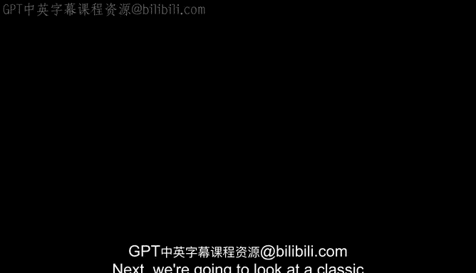
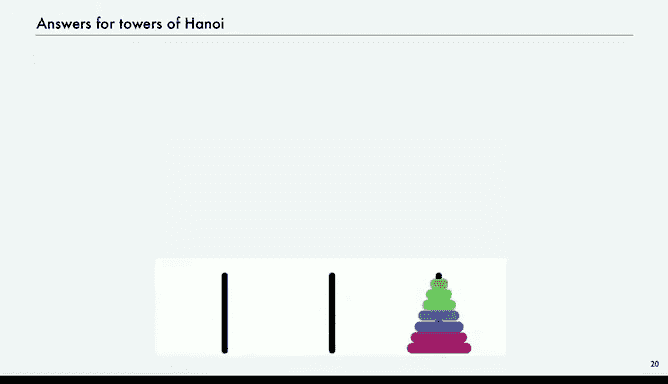
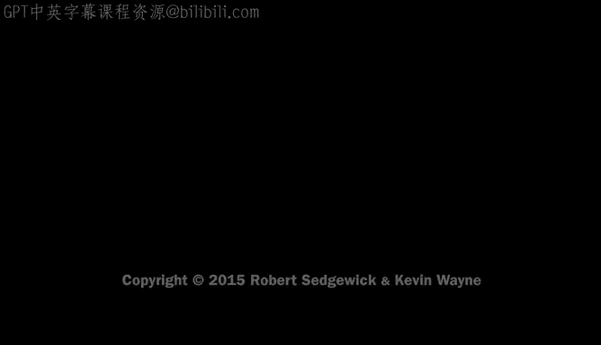

# 计算机科学：以目的为导向的编程（Java）：P22：经典示例



在本节课中，我们将学习递归的两个经典应用示例：标尺刻度生成和汉诺塔问题。我们将通过分析递归调用的结构来深入理解递归的工作原理，并探讨如何将递归思想转化为简洁的代码。

## 标尺刻度问题

上一节我们介绍了递归的基本概念，本节中我们来看看一个经典的递归应用：生成标尺刻度。

问题描述是：我们希望打印出标尺的细分刻度，直到 1/2^n 英寸。我们之前曾用循环解决过这个问题，但递归提供了另一种更简洁的解决方案。

以下是递归解决方案的核心思想：

*   要生成刻度为 `n` 的标尺字符串，如果 `n` 为 0，则返回一个空格。
*   否则，将整数 `n` 夹在两个 `n-1` 级标尺字符串的副本之间。

用代码可以表示为：

```java
public static String ruler(int n) {
    if (n == 0) return " ";
    return ruler(n-1) + n + ruler(n-1);
}
```

对于较小的 `n` 值，这个递归方法能产生与循环方法相同的结果。当然，如果 `n` 值过大，递归调用会消耗大量内存，导致内存溢出错误。

## 理解递归调用：调用树

为了深入理解递归计算的结构，我们可以通过绘制递归调用树来追踪程序的执行过程。

这种方法适用于任何调用函数的程序，但对于递归函数尤其有用。我们将为每个递归调用创建一个节点，并在其所有子节点计算完成后，用返回值来标记该节点。

以 `ruler(4)` 为例：
1.  `ruler(4)` 调用 `ruler(3)`。
2.  `ruler(3)` 调用 `ruler(2)`。
3.  `ruler(2)` 调用 `ruler(1)`。
4.  `ruler(1)` 调用 `ruler(0)`，后者返回空格 `" "`。
5.  `ruler(1)` 进行第二次递归调用 `ruler(0)`，同样返回空格。
6.  当两次调用都完成后，`ruler(1)` 返回 `" 1 "`。
7.  此过程逐级向上返回，最终 `ruler(4)` 返回完整的刻度字符串。

调用树动态地展示了计算过程，静态地显示了所有函数调用，是可视化递归程序执行过程的自然方式。

## 汉诺塔问题

理解了标尺问题的递归结构后，我们来看一个更复杂也更有趣的经典谜题：汉诺塔。

传说中有 64 个大小不同的圆盘和 3 根柱子。所有圆盘最初按从大到小的顺序堆叠在一根柱子上。预言称，僧侣们需要遵循特定规则将所有圆盘移动到另一根柱子上，当任务完成时，世界将会终结。

规则如下：
1.  一次只能移动一个圆盘。
2.  不能将较大的圆盘放在较小的圆盘之上。

我们的问题是：如何生成移动圆盘的指令序列？

为了使指令简单，我们使用循环环绕的表述：总是说将圆盘“向右移”或“向左移”。“向右移”意味着从柱1到柱2、柱2到柱3，或柱3环绕到柱1。“向左移”则相反。这样，每条指令只需包含圆盘编号和移动方向（L 或 R）。

## 汉诺塔的递归解决方案

现在，我们来看汉诺塔问题的递归解决方案。

要移动 N 个圆盘，我们可以遵循以下步骤：
1.  递归地将上面 N-1 个圆盘移动到**左边**的柱子。
2.  将最大的第 N 个圆盘移动到**右边**的柱子。
3.  递归地将那 N-1 个圆盘再次移动到**左边**的柱子，叠放在最大的圆盘上。

这样，我们就完成了整个堆的移动。这是一个典型的递归分解。

让我们以 N=3 为例观察这个过程：
1.  将最小的圆盘（1号）向右移。
2.  将中间的圆盘（2号）向左移。
3.  将最小的圆盘（1号）向右移（此时，上面两个圆盘已移动到左边柱子）。
4.  将最大的圆盘（3号）向右移。
5.  将最小的圆盘（1号）向右移。
6.  将中间的圆盘（2号）向左移（环绕）。
7.  将最小的圆盘（1号）向右移。

通过这 7 步，我们成功将三个圆盘从中心柱移动到了右边柱。

## 汉诺塔的递归代码

根据上述方案，我们可以编写打印移动指令的递归代码。

代码如下：
```java
public static String hanoi(int n, boolean left) {
    if (n == 0) return " ";
    String move;
    if (left) move = n + "L";
    else move = n + "R";
    return hanoi(n-1, !left) + move + hanoi(n-1, !left);
}
```
*   如果 `n` 为 0，返回空格。
*   否则，生成移动第 N 号圆盘的指令（根据 `left` 参数决定方向 L 或 R）。
*   最终返回的字符串是：`(移动N-1个圆盘的指令) + (移动第N号圆盘的指令) + (再次移动N-1个圆盘的指令)`。

递归函数需要第二个参数 `direction`（此处用 `left` 布尔值表示），用于指示移动最大圆盘的方向，而在递归调用移动小圆盘堆时则切换方向。

## 分析递归调用树与深入洞察

汉诺塔的递归调用树与标尺问题非常相似，只是增加了左右方向的记录和切换。

观察调用树和生成的指令，我们可以得到两个有趣的发现：
1.  **每个圆盘始终朝同一个方向移动**。例如，1号圆盘总是向右移动，2号圆盘总是向左移动。
2.  **每隔一步移动的都是最小的圆盘**。如果你只是移动最小的圆盘，那么下一步不涉及最小圆盘的移动必然是唯一合法的移动（因为另外两根柱子上，必有一个较大的圆盘可以移动到另一个柱子上）。

这意味着，我们甚至不需要完整的指令表。只需告诉僧侣们：“总是将最小的圆盘向右移动，然后做出唯一必要的那一步移动。” 这是一个通过研究递归程序而得到的深刻见解。

在许多情况下，我们使用递归形式来理解计算，然后找到更好的实现方法。

## 扩展与世界末日预言



你或许已经想到，可以很容易地为这个程序添加声音，根据圆盘的大小播放不同的音调。

回到最初的预言，我们能为僧侣们生成指令列表。但更简洁的形式（或许可以刻在石头上的）就是上述洞察得出的简单规则。

那么，世界何时会终结？对于 64 个圆盘，需要 **2^64 - 1** 次移动。这很容易从递归程序中证明（同样需要证明没有更优的方法）。如果僧侣每秒移动一次，大约需要 **580亿个世纪**。即使他们每秒能移动10亿次，也仍然需要 **584个世纪**。所以，世界暂时还不会终结。

---



本节课中我们一起学习了递归的两个经典示例。我们通过标尺刻度问题理解了递归的基本结构和调用树，并通过汉诺塔问题展示了如何用递归优雅地解决复杂问题。我们还看到，分析递归程序本身能带来对问题更深刻的洞察，有时甚至能发现更优的非递归解决方案。递归是计算机科学中一个强大而优美的工具。