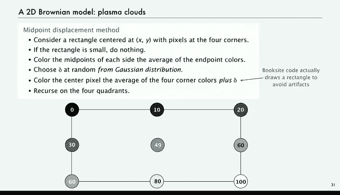

# 023：递归图形 🎨


在本节课中，我们将学习如何将递归与图形编程相结合，创造出有趣且实用的图像。我们将探讨几种经典的递归图形算法，包括H树、中点位移法以及二维等离子云模型，并理解它们背后的原理和代码实现。

---

## 概述

我们已经掌握了递归和图形编程的知识，将它们结合起来会产生一些有趣且实用的应用。递归图形在艺术、文学和流行文化中随处可见。本节课，我们将学习如何创建这类图像，并了解其背后的简单递归原理。

---

## H树：空间填充曲线 🌳

上一节我们介绍了递归图形的基本概念，本节中我们来看看一个既简单又实用的例子——H树。H树是一种递归图形，其基础结构是一个居中的“H”形。要绘制一个n阶的H树，我们需要在原始H的四个端点处，分别绘制一个尺寸减半的n-1阶H树。

以下是绘制H树的关键步骤：

1.  **绘制基础H**：首先，在给定中心点`(x, y)`和尺寸`size`的情况下，绘制一个居中的H。
2.  **递归调用**：如果阶数`n`大于0，则在H的四个端点处，分别以`size/2`为尺寸，递归绘制四个n-1阶的H树。
3.  **终止条件**：当阶数`n`降至0时，停止递归。

以下是绘制H树的伪代码实现：

```java
public static void drawH(int n, double x, double y, double size) {
    // 终止条件
    if (n == 0) return;

    // 计算H的四个角点坐标
    double x0 = x - size/2;
    double x1 = x + size/2;
    double y0 = y - size/2;
    double y1 = y + size/2;

    // 绘制H的三条线段
    StdDraw.line(x0, y, x1, y); // 横杠
    StdDraw.line(x0, y0, x0, y1); // 左竖杠
    StdDraw.line(x1, y0, x1, y1); // 右竖杠

    // 在四个端点处递归绘制更小的H树
    drawH(n-1, x0, y0, size/2);
    drawH(n-1, x0, y1, size/2);
    drawH(n-1, x1, y0, size/2);
    drawH(n-1, x1, y1, size/2);
}
```

H树不仅是一个有趣的图形，它在集成电路布线或城市有线电视网络规划等场景中，作为一种“空间填充曲线”有着重要的实际应用。

---

## 中点位移法：模拟自然现象 ⛰️

了解了H树的结构后，我们来看看另一种递归模型——中点位移法。这种方法可以用来模拟多种自然现象，如股票价格曲线、山脉轮廓等。其核心思想是通过递归地扰动线段的中点来生成不规则的曲线。

以下是中点位移法的实现步骤：

1.  **终止条件**：如果线段的两个端点`(x0, y0)`和`(x1, y1)`足够接近，则直接绘制该线段。
2.  **计算中点**：计算线段的中点坐标 `(xm, ym)`，公式为：
    `xm = (x0 + x1) / 2`
    `ym = (y0 + y1) / 2`
3.  **随机扰动**：从高斯（正态）分布中随机生成一个扰动值`delta`，将其加到中点的y坐标上：`ym = ym + delta`。
4.  **递归绘制**：对左半段`(x0, y0)`到`(xm, ym)`和右半段`(xm, ym)`到`(x1, y1)`分别递归调用此过程。

以下是其伪代码：

```java
public static void drawMountain(double x0, double y0, double x1, double y1, double variance) {
    // 终止条件：线段足够短
    if (Math.abs(x1 - x0) < 0.01) {
        StdDraw.line(x0, y0, x1, y1);
        return;
    }

    // 计算中点
    double xm = (x0 + x1) / 2;
    double ym = (y0 + y1) / 2;

    // 添加随机扰动（高斯分布）
    double delta = StdRandom.gaussian(0, Math.sqrt(variance));
    ym = ym + delta;

    // 递归绘制两半
    drawMountain(x0, y0, xm, ym, variance / 2);
    drawMountain(xm, ym, x1, y1, variance / 2);
}
```

通过调整`variance`（方差）参数，可以控制曲线的粗糙程度，从而模拟出从平滑山脉到剧烈波动的股价等不同形态。

---

## 二维等离子云：从线到面 ☁️

中点位移法可以扩展到二维，用于生成类似云彩、地形纹理的图像，这被称为“等离子云”模型。其思路是在一个矩形区域内，递归地计算并扰动每个子矩形中心点的颜色值。

以下是生成等离子云的关键步骤：

1.  **初始化**：给定一个矩形，为其四个角点分配初始颜色值（例如灰度值或RGB值）。
2.  **终止条件**：如果矩形区域足够小（例如只有一个像素），则直接为其着色。
3.  **计算边中点**：计算矩形四条边中点的颜色，通常取两端点颜色的平均值。
4.  **计算中心点并扰动**：计算矩形中心的颜色，取四个角点颜色的平均值，然后加上一个来自高斯分布的随机扰动值`delta`。
5.  **递归细分**：此时，原矩形被中心点和边中点分割为四个更小的子矩形。对这四个子矩形递归地重复上述过程。

这个过程会持续进行，直到所有像素都被赋予颜色。最终生成的图像具有丰富的细节和自然的不规则性，非常接近真实的云层或某些自然纹理。该技术被广泛用于电影和电子游戏中的场景生成。

---



## 总结

本节课中，我们一起学习了三种经典的递归图形算法。

*   **H树**展示了如何通过简单的递归规则生成复杂的空间填充结构，并具有实际工程应用价值。
*   **中点位移法（一维）** 揭示了如何用极简的递归和随机扰动来模拟股票价格、山脉轮廓等多种自然或经济现象。
*   **等离子云模型（二维）** 将中点位移法扩展到二维平面，用于生成逼真的云彩、纹理等图像，是计算机图形学中的重要技术。


这些例子有力地证明了，递归作为一种强大的编程范式，能够用简洁的代码创造出高度复杂和逼真的模式与模拟。