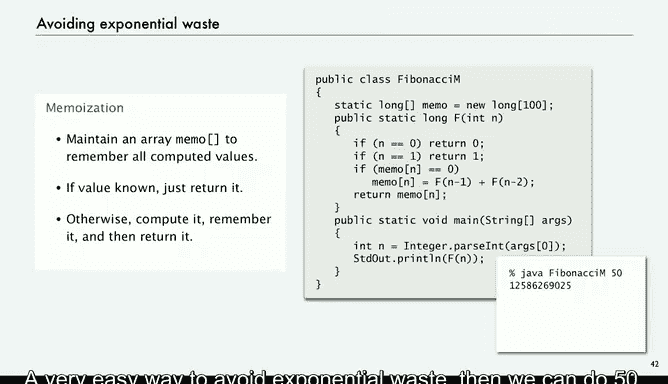

# 计算机科学：以目的为导向的编程（Java）：P24：避免指数级浪费 💥


在本节课中，我们将要学习递归编程中一个常被忽视但至关重要的性能陷阱——指数级浪费。我们将以斐波那契数列的计算为例，揭示问题的根源，并介绍一种名为“记忆化”的通用编程技巧来高效地解决它。最后，我们会引出“动态规划”这一重要编程范式。

## 斐波那契数列简介

上一节我们探讨了递归的基本概念，本节中我们来看看一个经典的递归应用案例：斐波那契数列。这是一个在数学、艺术和自然界中广泛存在的序列。

斐波那契数列的定义如下：
*   **F(0) = 0**
*   **F(1) = 1**
*   **F(n) = F(n-1) + F(n-2)** （当 n > 1 时）

以下是该序列的前几项：
0, 1, 1, 2, 3, 5, 8, 13, 21, 34, ...

## 递归实现的陷阱

面对计算第n个斐波那契数的问题，一个直观的想法是直接根据定义编写递归程序。

以下是一个简单的递归实现代码：
```java
public static long fibonacci(int n) {
    if (n == 0) return 0;
    if (n == 1) return 1;
    return fibonacci(n-1) + fibonacci(n-2);
}
```
这个程序逻辑清晰，对于较小的n（如10或20）能快速得出正确结果。然而，当我们尝试计算较大的n（如50或60）时，程序会变得异常缓慢，甚至看似“卡死”。

## 剖析指数级浪费

问题出在递归调用树的结构上。为了计算`F(6)`，程序需要计算`F(5)`和`F(4)`；而计算`F(5)`又需要计算`F(4)`和`F(3)`。请注意，`F(4)`被计算了两次。

让我们分析计算`F(60)`时的情况：
*   计算`F(60)`需要调用`F(59)`和`F(58)`。
*   计算`F(59)`又需要调用`F(58)`和`F(57)`。此时`F(58)`已经被重复调用了。
*   这种重复会像滚雪球一样增长。实际上，计算`F(60)`会导致`F(1)`被调用`F(59)`次，`F(0)`被调用`F(61)`次。而`F(61)`是一个巨大的数字。

**核心问题**：程序在递归过程中丢弃了已经计算过的中间结果，导致大量完全相同的子问题被重复计算，造成了**指数级的时间浪费**。计算量大致与**φ^n**（φ为黄金比例）成正比，这是不可接受的。

## 解决方案：记忆化

避免这种浪费的方法非常简单，即“记忆化”。其核心思想是：将已经计算过的结果保存起来，当再次需要时直接查表返回，避免重复计算。

以下是应用了记忆化技术的斐波那契函数实现：
```java
public class FibonacciMemo {
    private static long[] memo; // 记忆数组

    public static long fibonacci(int n) {
        memo = new long[n+1]; // 初始化数组
        return fib(n);
    }

    private static long fib(int n) {
        if (n == 0) return 0;
        if (n == 1) return 1;
        // 检查是否已经计算过
        if (memo[n] == 0) {
            // 如果没有，则计算并保存结果
            memo[n] = fib(n-1) + fib(n-2);
        }
        // 返回已保存的结果
        return memo[n];
    }
}
```
这个简单的改动带来了质的飞跃。计算`F(60)`或`F(80)`瞬间即可完成，因为每个子问题`F(k)`都只被计算一次。



## 总结与前瞻

本节课中我们一起学习了递归中常见的指数级浪费问题。我们以斐波那契数列为例，看到了朴素的递归实现为何在解决大规模问题时效率低下。更重要的是，我们掌握了“记忆化”这一强大而简单的技巧，通过保存中间结果来避免重复计算，从而将指数级复杂度降为线性复杂度。


这种“用空间换时间”，通过存储子问题解来避免重复计算的思想，正是**动态规划**这一重要算法设计范式的核心。在接下来的课程中，我们将进一步探索动态规划，看看如何系统性地应用这种思想来解决更复杂的优化问题。