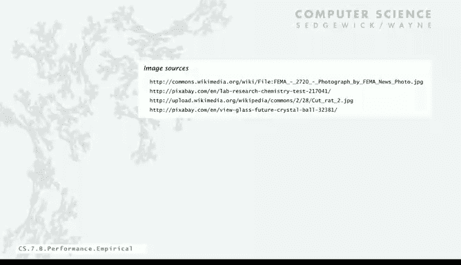

# 027：实证分析 🧪


在本节课中，我们将学习如何通过实证分析来研究程序的性能。我们将通过运行程序、收集数据、分析结果，并最终预测程序在不同输入规模下的运行时间。

---

## 生成代表性输入数据

上一节我们介绍了程序性能分析的重要性，本节中我们来看看如何为分析准备输入数据。为了进行受控的性能研究，我们需要代表性的输入数据。

以下是两种获取输入数据的方法：
1.  收集程序实际要处理的真实数据。
2.  编写一个程序来生成具有代表性的输入数据。

在本例中，我们选择第二种方法，因为它提供了更大的灵活性。下面是一个为“三数之和”程序生成输入的程序。它从命令行接收两个参数：整数范围 `M` 和整数数量 `n`，然后生成 `n` 个在 `-M` 到 `M` 之间均匀分布的随机整数。

```java
// 示例代码：生成输入数据
int M = Integer.parseInt(args[0]); // 整数范围
int n = Integer.parseInt(args[1]); // 整数数量
for (int i = 0; i < n; i++) {
    int a = StdRandom.uniformInt(-M, M);
    System.out.println(a);
}
```

例如，设置 `M=1000000` 和 `n=10`，会生成10个在正负一百万之间的整数。这种输入下，找到三数之和为零的概率较低，可能代表某些实际问题。反之，如果设置较小的范围（如 `M=10`），则找到三数之和的概率会大大增加，这可以模拟另一种输入场景。使用这个输入生成器，我们可以对程序进行大量测试，不仅用于性能分析，也用于调试。

---

## 运行实验与测量时间

有了可运行的程序和输入生成器后，我们就可以开始运行实验了。首先，我们将从一个适中的输入规模开始，测量并记录运行时间。输入规模需要足够大，以便我们能观察到运行时间。然后，我们将输入规模加倍，重复此过程，并观察结果。当程序运行变得非常缓慢时，我们可以停止实验，并将结果制成表格或绘制成图。

我们通过调用Java的 `System.currentTimeMillis()` 函数来测量运行时间，该函数返回以毫秒为单位的当前时间。除以1000即可得到以秒为单位的时间。

测量步骤如下：
1.  在调用目标函数前，将当前时间保存在变量 `start` 中。
2.  调用目标函数。
3.  函数执行完毕后，将当前时间保存在变量 `now` 中。
4.  计算 `now - start`，这就是函数执行所花费的时间。

以下是实验数据示例：
*   当 `n=1000` 时，程序找到59个三数之和，耗时极短（无法以秒计量）。
*   当 `n=2000` 时，程序找到522个三数之和，耗时4秒。
*   当 `n=4000` 时，程序找到约4000个三数之和，耗时31秒。
*   当 `n=8000` 时，程序找到31000个三数之和，耗时约248秒（4分钟）。

---

## 分析实验数据

现在，我们准备分析这些实验结果。我们将时间与问题规模的关系绘制成图，得到一条曲线，这就是实证分析的结果。

需要强调的是，在计算机科学中进行实验的成本极低，与其他科学（如化学实验或解剖动物）相比几乎免费。因此，我们没有理由不通过实验来理解程序的成本。我们可以轻松生成大量数据来进行分析。

接下来，我们将使用**双对数坐标**来分析数据。这在理解实验数据时很常见。我们计算问题规模 `n` 和运行时间 `T` 的以2为底的对数，然后将这些对数值绘制在图上。

当我们这样做时，得到了一条**直线**。如果数据点在双对数坐标图上呈直线分布，这意味着数据符合 `T = A * n^B` 形式的曲线，其中 `A` 和 `B` 是常数。

在本例中，直线的斜率为3。这意味着指数 `B` 等于3，因此运行时间与 `n^3` 成正比，即 `T ∝ n^3`。

---

## 建立数学模型与预测

我们可以利用数据来求解常数 `A`。直线斜率为3意味着：
`log(T) = log(A) + 3 * log(n)`

这只是一个斜率为3的直线方程。对等式两边取2的幂次方，我们得到：
`T(n) = A * n^3`

现在，例如对于 `n=8000`，`T=248` 秒，代入公式：
`248 = A * (8000^3)`
解出 `A ≈ 4.84 × 10^(-10)`

因此，我们根据数学推导认为，对于规模为 `n` 的输入，解决问题的时间约为 `4.84 × 10^(-10) * n^3` 秒。将不同的 `n` 值代回该曲线公式，可以发现它与实验数据高度吻合。

这提供了大量信息。我们的实验让我们能够预测程序在未实验过的 `n` 值下的运行时间。这就是科学方法：我们形成一个假设，认为无论 `n` 是多少，运行时间都将遵循此规律。

例如，我们可以用它来预测：
*   当 `n=16000` 时，预测时间 `T = 4.84e-10 * (16000^3) ≈ 1982` 秒（约半小时）。
*   实际运行后，耗时1985秒，很好地验证了我们的假设。

基于此，我们可以进一步预测：
*   当 `n=1,000,000` 时，预测时间 `T = 4.84e-10 * (1,000,000^3) ≈ 4.84亿秒`，约等于**15年**。

因此，通过运行一些实验，我们能够预测程序在处理一百万个点的问题时需要约15年。这个问题的答案很明确：除非你愿意等待15年，否则无法使用此程序解决百万级规模的问题。

---

## 关于计算设备的假设

最后，我想提出另一个假设。如果你在20世纪70年代一台速度慢得多的旧计算机（如VAX-11）上运行此实验，你可能会得到一个不同的公式，因为计算机速度慢得多。那时的公式可能是 `T = 5 × 10^(-6) * n^3` 秒。

而我们刚刚讨论的实验是在一台快约10，000倍的计算机上进行的，常数项是 `10^(-10)` 量级。但**曲线的形状看起来是相同的**。这里隐含了一个假设：我们认为在不同计算机上，程序的运行时间通常只相差一个**常数因子**。

因此，这种分析并不十分依赖于具体的计算机硬件，只有常数 `A` 会因计算机而异。当我们稍后使用数学分析来验证这类结果时，会再次回到这个思想。

---

## 总结




本节课中，我们一起学习了如何进行程序的实证分析。我们首先学习了如何生成代表性的输入数据，然后通过运行实验、测量并记录运行时间来收集数据。接着，我们使用双对数坐标图分析数据，发现运行时间与输入规模 `n` 的三次方成正比，并建立了数学模型 `T(n) = A * n^3`。利用这个模型，我们成功预测了程序在更大规模输入下的运行时间，并认识到不同计算机上的运行时间差异主要体现为常数因子的不同。通过实证分析，我们能够在实际运行前，对程序的性能表现做出有价值的预测和评估。